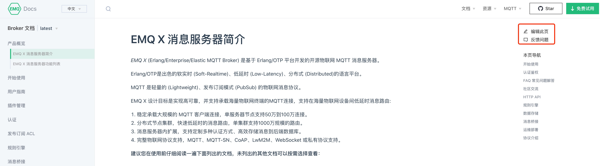

# EMQX 文档贡献指南

欢迎您的参与，以帮助改善 EMQX 文档。当您反馈问题，编辑、新增、翻译文档内容时，可以为 EMQX 开源社区提供非常有价值的帮助。


## 目录

- [文档编写指南](#文档编写指南)
- [如何贡献文档](#如何贡献文档)
  - [反馈问题](#反馈问题)
  - [线上编辑](#线上编辑)
  - [本地编辑](#本地编辑)
  - [文档翻译](#文档翻译)
- [PR 自动检查](#pr-自动检查)
- [如何寻求帮助](#如何寻求帮助)
  

## 文档编写指南

为了确保文档的一致性，我们要求所有贡献者参考我们的 [文档编写指南](./DOCS-WRITING-GUIDE-CN.md)，该指南对文档**目录配置**及 **Markdown 书写规范**进行了详细的说明。


## 如何贡献文档

EMQX 的文档发布在 [https://docs.emqx.cn/](https://docs.emqx.cn/)，您可以通过以下几种方式贡献文档。

> 注：以下几种方式都需要 GitHub 帐号进行操作，如果您还没有 GitHub 帐号，请点击 [GitHub 注册页面](https://github.com/join) 进行创建。

### 反馈问题

点击文档站点 [https://docs.emqx.cn/](https://docs.emqx.cn/ ) 每个页面右上角的 `编辑此页` 或 `反馈问题`，可直接跳转到 GitHub 网站的编辑或 Issue 页面，这意味着此种方式不需要您了解有关 Git 甚至 Markdown 的很多知识。

您也可以直接访问文档仓库的 [https://github.com/emqx/emqx-docs/issues](https://github.com/emqx/emqx-docs/issues) 页面提交 Issue 反馈文档问题，这类似于点击文档站点右上角的 `反馈问题`。

> 如果您在文档仓库里直接提交 Issue 反馈问题，需要在 Issue 内容里写明待完善文档页面的链接。



### 线上编辑

#### Fork

如上图，点击文档站点右上角的 `编辑此页` 后，会跳转到 GitHub 的如下页面，请按照提示点击 `Fork this repository`。


#### Commit

点击 `Fork this repository` 跳转到文档编辑页面，即可开始文档编辑。编辑完成后，在页面底部输入本次提交的标题及描述完成提交。

> 下图的标题及描述即是 Git commit message，我们对 commit message 格式无严格的规范，只需确保 commit message 为英文且能清晰说明本次修改内容即可。


#### Pull request

点击上图的 `Propose changes` 后会跳转到如下页面，直接点击 `Create pull request` 提交。


跳到如下页面后，确定 Pull request 信息，再次点击 `Create pull request` 完成本次提交。


### 本地编辑

本地编辑需要贡献者具有熟练的 Git 基础，我们建议初次接触 Git 的贡献者直接使用以上 [线上编辑](#线上编辑) 的方式贡献文档。

1. 打开文档仓库 [https://github.com/emqx/emqx-docs](https://github.com/emqx/emqx-docs) 进行 Fork。

2. 将 Fork 的仓库 Clone 到本地，然后进入本地目录，添加上游仓库。

   ```
   git remote add upstream https://github.com/emqx/emqx-docs.git
   ```

3. 确定贡献文档的分支，对应规则：latest 对应 develop 分支、v4.1 对应 release-4.1、v4.0 对应 release-4.0，依此类推。

4. 切换到相应的分支进行编辑，完成后提交至 Fork 的仓库。

   > 目前我们对 commit message 格式无严格的规范，只需确保 commit message 为英文且能清晰说明本次修改内容即可。

5. 从 Fork 的仓库创建一个 Pull request 至上游仓库。

### 文档翻译

EMQX 中文文档一般会先于英文文档发布，所以文档翻译大多数情况下都是中译英。目前，我们通过文档仓库的 PR Label 来追踪翻译任务状态。您可通过如下几个简单步骤来翻译并提交文档。

1. 查看待翻译 PR。

   打开 [EMQX 文档待翻译 PR 列表](https://github.com/emqx/emqx-docs/pulls?q=is%3Apr+is%3Aclosed+label%3Atranslation%2Ftodo)，即可看到所有已合并且打上了 `translation/todo` Label 的 PR，这些 PR 都是待翻译的。

2. 认领 PR。

   在想认领的 PR 底部依次添加 2 条评论：`/unlabel translation/todo` 及 `/label translation/doing`，即可将右侧 Label 栏中的 `translation/todo` 改为 `translation/doing`。Label 修改成功后，您就可以开始翻译了。

3. 翻译并提交 PR。

   翻译完成后，提交 PR 至相应的分支，并在 PR 底部添加一条评论 `/label translation/from-docs-cn` 或者 `/label translation/from-docs-en`，表明此 PR 由中文或是英文翻译而来。

4. 修改步骤 2 里认领的 PR 的标签。

   回到步骤 2 里认领的 PR 里，依次添加 2 条评论：`/unlabel translation/doing` 及 `/label translation/done`，表明翻译已完成。


## PR 自动检查

文档项目将会根据 [文档编写指南](./DOCS-WRITING-GUIDE-CN.md) 里的规则进行自动检查，检查通过的 PR 才能被合并。假如你提 PR 时遇到了 markdownlint check 失败，报错信息里会明确提示哪一个文件的哪一行出了什么问题，请根据提示修改后再更新到 PR 里。


## 如何寻求帮助

在进行文档贡献时遇到任何问题，都可以通过以下方式联系我们获取帮助。

- 扫码添加 EMQ 小助手微信（并备注：文档贡献）。

  

- 直接提交 GitHub Issue：[https://github.com/emqx/emqx-docs/issues/new](https://github.com/emqx/emqx-docs/issues/new)。

