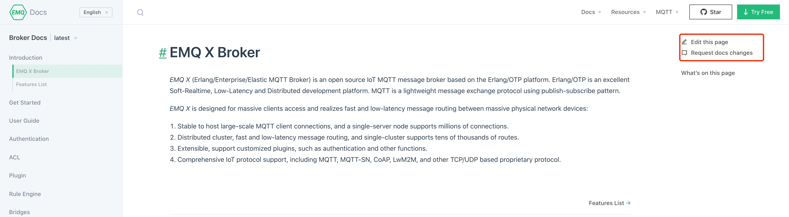
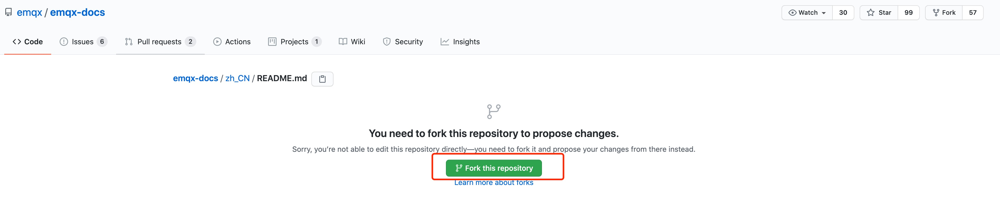
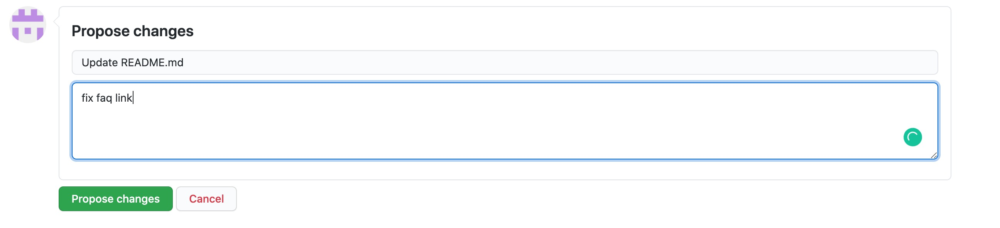
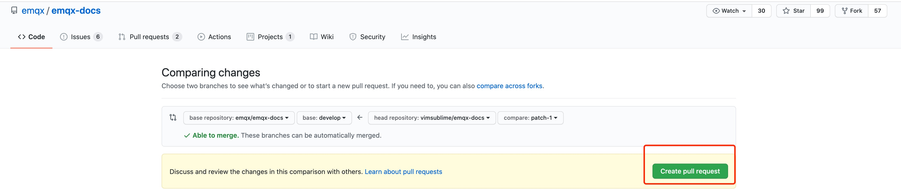
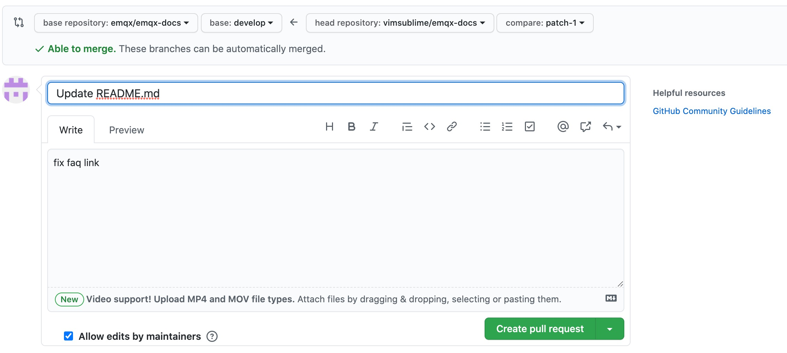

# EMQ X Documentation Contributing Guide

Thank you for your contributions to EMQ X open-source project.

## Table of Contents

- [Documentation Writing Guide](#documentation-writing-guide)
- [How to contribute](#how-to-contribute)
  - [Feedback questions](#feedback-questions)
  - [Online editing](#online-editing)
  - [Local editing](#local-editing)
- [PR automatic check](#pr-automatic-check)
- [How to get help](#how-to-get-help)


## Documentation Writing Guide

To ensure consistency throughout all EMQ documentation,
we kindly request all contributors reference our [Documentation Writing Guide](./DOCS-WRITING-GUIDE-EN.md).
This guideline provides detailed instructions on document **directory configuration** and **Markdown writing specifications**.


## How to contribute

EMQ X's documentation is published at [https://docs.emqx.io/](https://docs.emqx.io/).
You can make contributions in several different ways listed below.

> **Note:** You will need a GitHub account to make contributions.
In case you do not have one, you may follow the instructions in [GitHub registration page](https://github.com/join) to create one.

### Request a change

Click on `Edit this page` or `Request docs changes` on the top right corner of each page of the documentation site
[https://docs.emqx.io/](https://docs.emqx.io/) will take you directly to the Edit or Issue pages on the GitHub site,
which means you don't need to know much about Git or Markdown.

You can also directly submit an issue here from this repo's [issues](https://github.com/emqx/emqx-docs/issues) page.

> This is similar to clicking **Request doc changes** on a published docs page,
but if you manually file an issue you need to fill in links to the related pages.



### Online editing

#### Fork

As you can see above, when you click on `Edit this page` in the top right corner of the documentation site,
you will be taken to the following page on GitHub, follow the instructions, and click `Fork this repository`.



#### Commit

Click `Fork this repository` to jump to the document editing page and then you can start editing your document.
After completing editing, you need to enter the title and description of this submission at the bottom of the page to complete your submission.

> You need to ensure that the title and description clearly describe what you are modifying.



#### Pull request

Click on `Propose changes` above and you will be redirected to the following page, click on `Create pull request` to submit.



After you have jumped to the following page, confirm the pull request information and click `Create pull request` again to complete this submission.



### Local editing

Local editing requires contributors to have some Git knowledge.
We recommend first-time contributors to directly use the [Online editing](#online-editing) method above to contribute documents.

1. Open the document repository [https://github.com/emqx/emqx-docs](https://github.com/emqx/emqx-docs) for Fork.

1. Clone the forked repository into your local workspace and then go to the local directory and add the upstream repository.
   ```
   git remote add upstream https://github.com/emqx/emqx-docs.git
   ```

1. Checkout the earliest branch which is subject to the change.
   e.g. if an issue is found in EMQ X 4.3, checkout `release-4.3` with command `git checkout --track upstream/release-4.3`

1. Optional: Checkout a work-branch `git checkout -b my-first-pr-branch-for-emqx-4.3`

1. Edit, commit, and push the branch to your fork
   ```
   git commit -a -m 'docs(WHICH_DOC): fix xxxx in WHICH_DOC'
   git push origin my-first-pr-branch-for-emqx-4.3
   ```

1. Create a Pull request from your forked repository to the upstream repository.


## PR automatic check

Document projects will be automatically checked according to the rules in the [Documentation Writing Guide](./DOCS-WRITING-GUIDE-EN.md).
Only the PRs that passed the checks can be merged.
If you encounter a `markdownlint check` failure when submitting PR, the error message will indicate which line in which file is the problem,
so please follow the instructions to modify and update the PR.

## How to get help

If you encounter any problems when contributing to the documentation, you can contact us for getting help in the following methods.

- Slack: [https://slack-invite.emqx.io/](https://slack-invite.emqx.io/)

- Submit the GitHub Issue directly: [https://github.com/emqx/emqx-docs/issues/new](https://github.com/emqx/emqx-docs/issues/new).

