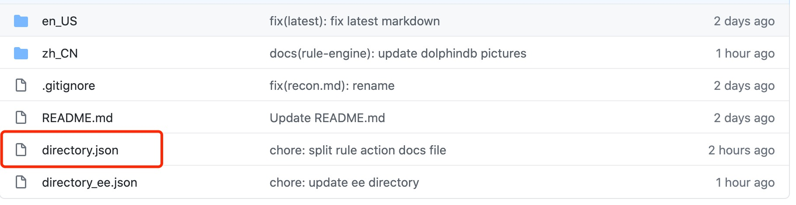

# EMQ 文档编写指南

## 目录

- [简介](#简介)
- [左侧目录配置](#左侧目录配置)
  - [配置文件](#配置文件)
  - [配置示例](#配置示例)
  - [注意事项](#注意事项)
- [Markdown 书写规范](#markdown-书写规范)
  - [必须有一级标题](#必须有一级标题)
  - [标题遵守层级关系](#标题遵守层级关系)
  - [代码块](#代码块)
  - [特殊转义](#特殊转义)
  - [资源引用](#资源引用)
  - [特殊语法](#特殊语法)
  - [差异化编译](#差异化编译)


## 简介

EMQ 文档使用 Markdown 格式编写，并使用 [Vuepress](https://vuepress.vuejs.org/) 将 Markdown 文件编译为 HTML 文件。

文档的最终展现可以分为三部分：

- 左侧菜单目录。

  该部分需要由文档编辑者手动进行配置。配置包含三部分：目录名称、目录层级、目录顺序。

- 中间文档内容。

  该部分将显示 Markdown 文件内的具体内容。

- 右侧页内索引。

  该部分将会自动显示 Markdown 文件内所有的二级标题。因此，合理的 Markdown 二级标题将能使用户更快速的了解文档内容大纲，并在页内进行跳转。


## 左侧目录配置

### 配置文件

目录配置文件为文档根目录下的 `directory.json`（企业版为 `directory_ee.json`）。如下所示：



### 配置示例

我们以配置如下 Introduction 为例进行说明。


对应的配置为：

```json
{
  "en": [
    {
      "title": "Introduction",
      "children": [
        {
          "title": "EMQ X Broker",
          "path": "./"
        },
        {
          "title": "Features List",
          "path": "introduction/checklist"
        }
      ]
    },
    ...
  ]
  "cn": [
    ...
  ]
}
```

对应文件结构：

```bash
.
├── en_US
│   ├── README.md
│   └── introduction
│       └── checklist.md
```

文件结构对应的页面路由：

| 文件的相对路径             | 页面路由地址                 |
| -------------------------- | ---------------------------- |
| /README.md                 | /                            |
| /introduction/checklist.md | /introduction/checklist.html |

### 注意事项

* `path` 配置项内容不能重复;
* `path` 只需指定到 Markdown 文件即可，不能使用带锚点的路径；
* 嵌套下一级目录使用 `children` ，支持多级嵌套；
* 使用 `children` 时不能同时指定其 `path`（也就是如果一个目录有子目录时，不能为其本身设置 `path`）；


## Markdown 书写规范

EMQ 文档支持标准的 Markdown 规范语法，但是在编写文档过程中需要遵守以下约定。

### 必须有一级标题

每个 Markdown 文件必须有全局唯一的一级标题，并能清晰表示该文件的内容。

### 标题遵守层级关系

文档会读取二级标题作为右侧导航，遵守层级关系以保证目录结构清晰。

```markdown
# h1
  ## h2
    ### h3
  ## h2
    ### h3
```

### 代码块

- 文档中的代码块统一使用**三个反引号** ` ``` ` 进行包裹，**禁止**使用**缩进**风格的代码块。
- 使用代码块时尽量附加一个有效的语言别名，以显示正确的语法高亮。

### 特殊转义

- 需要原文输出 `<xxx>` 标签，并且该标签不在代码块或行内代码时，请在标签前添加反斜杠 `\`；

  使用 `### log set-level \<Level> `，而不是 `### log set-level <Level>`；

- 需要原文输出  `{{ xxx }}` 双大括号时，需要使用 v-pre 进行包裹（代码块内时不需要包裹）。

  Input

  ```markdown
  ::: v-pre
  {{ This will be displayed as-is }}
  :::
  ```

  Output

  {{ This will be displayed as-is }}

### 资源引用

- 图片名称必须使用英文且不包含空格；

- 图片引用必须使用相对路径。

  例如使用 `` ，而不是 ``

### 特殊语法

文档支持如下特殊语法。

```markdown
::: tip
This is a tip
:::

::: warning
This is a warning
:::

::: danger
This is a dangerous warning
:::
```

输出效果如下。


### 差异化编译

Broker 和 Enterprise 之间共用一个文档仓库，使用如下语法可实现差异化编译。

```markdown
# Broker Docs

  contents


# Enterprise Docs

  contents

```

正确写法

```markdown

  contents


or

 contents 
```

错误写法

```markdown
 contents


or


contents 
```

