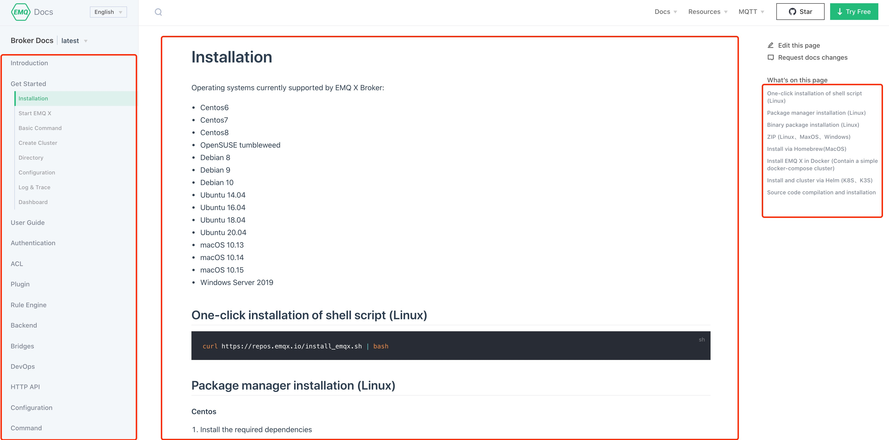
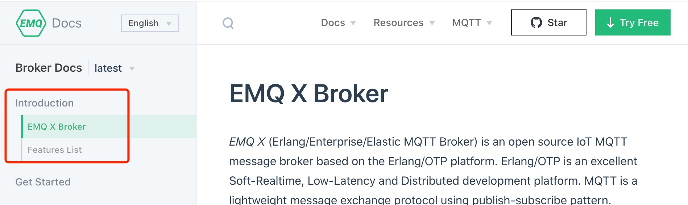

# EMQ Documentation Writing Guide


## Table of Contents

- [Introduction](#introduction)
- [Left menu configuration](#left-menu-configuration)
  - [Configuration files](#configuration-files)
  - [Configuration examples](#configuration-examples)
  - [Notes](#notes)
- [Markdown writing specifications](#markdown-writing-specifications)
  - [Must have a level 1 heading](#must-have-a-level-1-heading)
  - [Headings must obey the hierarchy](#headings-must-obey-the-hierarchy)
  - [Code block](#code-block)
  - [Escape special characters](#escape-special-characters)
  - [Resource reference](#resource-reference)
  - [Special grammars](#special-grammars)
  - [Differentiated compilation](#differentiated-compilation)


## Introduction

EMQ documents are written in Markdown format and use [Vuepress](https://vuepress.vuejs.org/) compiling the Markdown file to HTML file.

The final presentation of the documentation can be divided into three parts:

- Left menu.

  This part needs to be configured mutually by the document writer. The configuration contains three parts: directory name, directory hierarchy, and directory order.

- Intermediate document content.

  This part will display the specific content of the Markdown file.

- In-page index on the right hand.

  This part will automatically display all level 2 headings within the Markdown file. Therefore, a sensible Markdown heading will allow users to quickly understand the outline of document content and jump around the page.




## Left menu configuration

### Configuration files

The menu configuration file is `dir.yaml` in the document root directory. This is shown below:

### Configuration examples

We take the following configuration for `Introduction`  as an example.



The corresponding configuration is:

```json
{
  "en": [
    {
      "title": "Introduction",
      "children": [
        {
          "title": "EMQX Broker",
          "path": "./"
        },
        {
          "title": "Features List",
          "path": "introduction/checklist"
        }
      ]
    },
    ...
  ]
  "cn": [
    ...
  ]
}
```

Corresponding file structure:

```bash
.
├── en_US
│   ├── README.md
│   └── introduction
│       └── checklist.md
```

The corresponding page routing of the file structure:

| Relative path to the file  | Page routing address         |
| -------------------------- | ---------------------------- |
| /README.md                 | /                            |
| /introduction/checklist.md | /introduction/checklist.html |

### Notes

* The contents of the `path` configuration item must not be duplicated;
* `path` only need to specify the Markdown file, and can not use paths with anchors;
* Nested next-level directories using `children`, supporting multiple levels of nesting; 
* When using `children`, you cannot also specify their `path` (i.e. if a directory has subdirectories, you cannot set  `path` for itself);


## Markdown writing specifications

EMQ documents support standard Markdown specification syntax, but the following conventions need to be adhered to when writing documents.

### Must have a level 1 heading

Each Markdown file must have a globally unique level 1 heading that clearly represents the content of the file.

### Headings must obey the hierarchy

The document will read the level 2 heading as the right-hand navigation, obeying the hierarchical relationship to ensure a clear directory structure.

```markdown
# h1
  ## h2
    ### h3
  ## h2
    ### h3
```

### Code block

- Code blocks in documents are uniformly wrapped in **three backquotes**  ` ``` ` and using **indentation** style blocks is **forbidden**.
- Try to append a valid language alias when using code blocks to show correct syntax highlighting.

### Escape special characters

- If you need the original article to output the `<xxx>` tag and this tag is not in a code block or in-line code, you need to add a backslash `\` before the tag.

  Use `### log set-level \<Level> ` instead of `### log set-level <Level>`;

- If you need the original article to output the double curly braces `{{ xxx }}`, you need to wrap it with v-pre (you don't need to wrap it when inside a code block).

  Input

  ```markdown
  ::: v-pre
  {{ This will be displayed as-is }}
  :::
  ```

  Output

  {{ This will be displayed as-is }}

### Resource reference

- The name of the image must be in English and contain no spaces.

- Relative paths must be used for image references.

  For example, using `` instead of ``

### Special grammars

The documentation supports the following special syntax.

```markdown
::: tip
This is a tip
:::

::: warning
This is a warning
:::

::: danger
This is a dangerous warning
:::
```

The output is as follows.


### Differentiated compilation

Broker and Enterprise share the same document repository and the differentiated compilation can be implemented by using the following syntax.

```markdown
# Broker Docs

  contents


# Enterprise Docs

  contents

```

Correct

```markdown

  contents


or

 contents 
```

Incorrect

```markdown
 contents


or


contents 
```

### OpenAPI

EMQX API document is generated.
The document is essentially an OpenAPI 3.0 specification in JSON format.

With the help of vue.js plugin, an OpenAPI specification can be inserted anywhere in a markdown document like below.

```markdown
<ClientOnly>
  <OpenApi path="swagger.json" />
</ClientOnly>
```

The path is the OpenAPI specification file,
and the file needs to be placed in the `swagger` sub-directory of the document root.

#### EMQX API doc

For EMQX API specification, the wrapping markdown file is `admin/api.md`.

`swagger.json` is originally generated by the HTTP server component runngin in EMQX,
and then downloaded into this repo with some rewrites.

To update the file:

* Start EMQX v5 node
* Execute the script `./rewrite-swagger.sh`
* Commit the changed swagger.json file to this git repo
* Send a pull request
