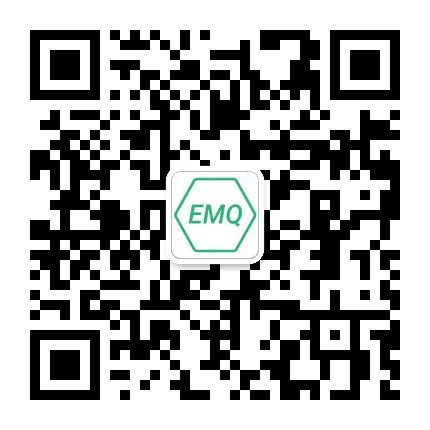

# EMQ X 文档

[English](./README.md) | 简体中文

---

欢迎来到 [EMQ X](https://github.com/emqx/emqx) 文档仓库，这里存放的是 [EMQ X 中文文档]( https://docs.emqx.cn/cn/broker/latest/) 的源文件。

EMQ X 是一款完全开源，高度可伸缩，高可用的分布式 [MQTT](https://www.emqx.cn/mqtt) 消息服务器，适用于 IoT、M2M 和移动应用程序，可处理千万级别的并发客户端。

关于 EMQ X 的更多信息，可访问 [EMQ 官网](https://www.emqx.cn/) 进行了解。

## 贡献文档

如果您发现或遇到了 EMQ X 文档的问题，可随时向我们提交 Issue 或 Pull request。EMQ X 的文档是完全开源的，我们非常感谢社区的贡献！

在开始贡献前，您需要了解 EMQ X 文档版本与文档仓库分支的对应关系：latest 对应 develop 分支、v4.1 对应 release-4.1、v4.0 对应 release-4.0，依此类推。

文档编写时需要注意的相关事项，可查看我们的 [文档贡献指南](./CONTRIBUTING-CN.md)。

## 联系我们

在使用 EMQ X 或进行文档贡献时遇到任何问题，都可以通过以下方式联系我们获取帮助。

<table>
  <tbody>
    <tr>
      <td>EMQ 小助手微信</td>
      <td></td>
    </tr>
    <tr>
      <td>EMQ 官方公众号</td>
      <td></td>
    </tr>
    <tr>
      <td>EMQ 官方 QQ 群</td>
      <td>937041105</td>
    </tr>
    <tr>
      <td>Email</td>
      <td><a href="mailto:contact@emqx.io">contact@emqx.io</a></td>
    </tr>
  <tbody>
<table>
