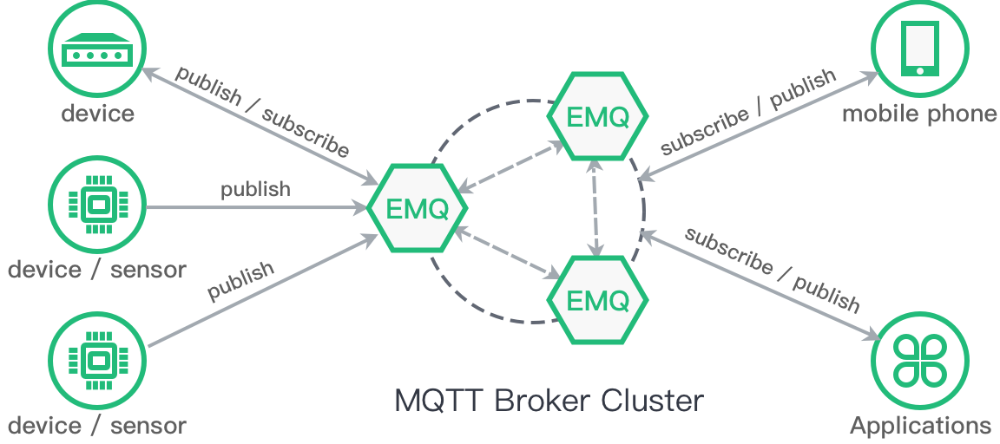

# EMQ X Broker - High Performance MQTT Message Broker 

*EMQ X Broker* R3.2 is a distributed, massively scalable, highly extensible MQTT message broker written in Erlang/OTP. 

EMQ X Broker is previously known as emqtt, since R3.1, the name is officially changed to EMQ X Broker. 

*EMQ X Broker* supports MQTT V3.1/V3.1.1 and V5.0 protocol standards. With the plugins, it can support MQTT-SN, WebSocket, CoAP, LwM2M, Stomp and other proprietary protocols based on TCP/UDP. 

*EMQ X* works as single broker node or cluster. It provides scalable, reliable, MQTT message interconnection for IoT, IoV, M2M, Smart Hardware and Mobile Messaging Applications. 

::: tip Tip
MQTT-SN and CoAP plugins are released in 2.0-RC.1, LwM2M and LoRaWan are released in 3.0. 
:::

Please visit [ emqx.io ](https://www.emqx.io) for more service. Follow us on Twitter: [ @emqtt ](https://twitter.com/emqtt)

*EMQX* Support and Contact: 

| Homepage | [https://www.emqx.io](https://www.emqx.io/)                  |
| -------- | ------------------------------------------------------------ |
| Project  | [https://github.com/emqx/emqx](https://github.com/emqx/emqx) |
| Forum    | [https://www.emqx.io/forum/](https://www.emqx.io/forum/)     |
| Youtube  | [Youtube Channel](https://www.youtube.com/channel/UC5FjR77ErAxvZENEWzQaO5Q) |
| Twitter  | [@EMQTech](https://twitter.com/EMQTech)                      |
| Company  | [EMQ Technologies Inc.](https://www.emqx.com/en/about)       |
| contact  | [Contact Us](https://www.emqx.com/en/contact)                |
