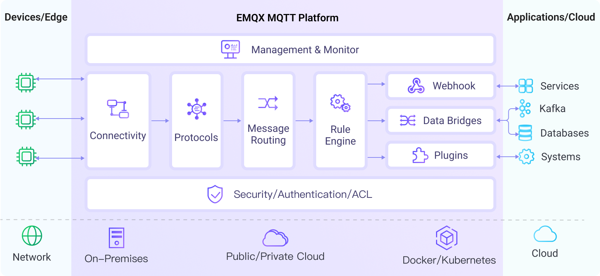

# Introduction



[EMQX](https://www.emqx.com/en/products/emqx) is an Open-source [MQTT](https://mqtt.org/) broker with a high-performance real-time message processing engine, powering event streaming for IoT devices at massive scale.

As the most scalable MQTT broker, EMQX can help you connect any device, at any scale. Move and process your IoT data anywhere.





EMQX Enterprise is the world’s most scalable and reliable MQTT messaging platform to connect, move and process your data in business-critical scenarios for the IoT era.



## Benefits



- **[Massive Scale](https://www.emqx.com/en/blog/how-emqx-5-0-achieves-100-million-mqtt-connections)**: Scale to 100 million concurrent MQTT connections with a single EMQX 5.0 cluster.
- **High Performance**: Move and process millions of MQTT messages per second in a single broker.
- **Low Latency**: Guarantee sub-millisecond latency in message delivery with the soft real-time runtime.
- **[Fully MQTT 5.0](https://www.emqx.com/en/blog/introduction-to-mqtt-5)**: 100% compliant with MQTT 5.0 and 3.x standard for better scalability, security, and reliability.
- **[High Availability](./deploy/cluster/mria-introduction)**: Achieve high availability and horizontal scalability through a masterless distributed architecture.
- **[Cloud-Native & K8s](https://www.emqx.com/en/emqx-kubernetes-operator)**: Easy to deploy on-premises or in public clouds with Kubernetes Operator and Terraform.





- **[Massive Scale](https://www.emqx.com/en/blog/how-emqx-5-0-achieves-100-million-mqtt-connections)**: Scale horizontally to 20+ nodes in a single cluster for 100M MQTT connections.

- **Business-Critical Reliability**: Up to 99.99% SLA. Ensure no data loss with built-in RocksDB data persistence.

- **Data Security**: End-to-end data encryption and fine-grained access control to protect your data.

- **High Performance**: Ingest and process millions of MQTT messages efficiently per second per node.

- **Low Latency**: Guarantee sub-millisecond latency in message delivery with the soft real-time runtime.

- **Complete Observability**: Monitoring, alerting, and advanced end-to-end analysis with real-time MQTT tracing.



## Feature List

The following is a list of features of EMQX Open Source and Enterprise Edition.



| **Items**                         | **EMQX Open Source**                                        | **EMQX Enterprise**                                         |
| :-------------------------------- | :---------------------------------------------------------- | :---------------------------------------------------------- |
| **Positioning**                   | The world’s #1 open source MQTT broker                      | The reliable and scalable enterprise MQTT platform          |
| **Scalability**                   | < 1M MQTT connections per cluster                           | Up to 100M MQTT connections per cluster                     |
| **Performance**                   | < 100k MQTT messages per second                             | 5M+ MQTT messages per second                                |
| **Reliability**                   | Data storage in memory                                      | Data persistence in RocksDB                                 |
| **Latency**                       | 1~5 millisecond                                             | 1~5 millisecond                                             |
| **SLA**                           | 99.99%                                                      | Up to 99.999%                                               |
| **Integrations (Out-of-the-box)** | 3                                                           | 40+                                                         |
| **License Model**                 | Apache Version 2.0                                          | Commercial License (Business Source License)                |
| **Technical Support**             | Open Source Community                                       | 24/7 Global Support                                         |
| **MQTT 5.0 Broker**               |  |  |
| **MQTT over QUIC**                |  |  |
| **MQTT Add-ons**                  |  |  |
| **Multi-protocol Gateways**       |  |  |
| **Multi-tenancy**                 |   |  |
| **Geo-replication**               |   |  |
| **Data Persistence**              |   |  |
| **Schema Registry**               |   |  |
| **Message Codec**                 |   |  |
| **Rule Engine**                   |   |   |
| **Flow Editor**                   |   |   |
| **File Transfer**                 |   |   |
| **Kafka Integration**             |   |   |
| **Enterprise Integrations**       |   |   |
| **Troubleshooting**               |   |   |
| **Cloud-Native & K8s**            |   |   |
| **Edge Computing**                |   |   |





| **Items**                         | **EMQX Open Source**                                        | **EMQX Enterprise**                                         |
| :-------------------------------- | :---------------------------------------------------------- | :---------------------------------------------------------- |
| **Positioning**                   | The reliable and scalable enterprise MQTT platform          | The world’s #1 open source MQTT broker                      |
| **Scalability**                   | Up to 100M MQTT connections per cluster                     | < 1M MQTT connections per cluster                           |
| **Performance**                   | 5M+ MQTT messages per second                                | < 100k MQTT messages per second                             |
| **Reliability**                   | Data persistence in RocksDB                                 | Data storage in memory                                      |
| **Latency**                       | 1~5 millisecond                                             | 1~5 millisecond                                             |
| **SLA**                           | Up to 99.999%                                               | 99.99%                                                      |
| **Integrations (Out-of-the-box)** | 40+                                                         | 3                                                           |
| **License Model**                 | Commercial License (Business Source License)                | Apache Version 2.0                                          |
| **Technical Support**             | 24/7 Global Support                                         | Open Source Community                                       |
| **MQTT 5.0 Broker**               |  |  |
| **MQTT over QUIC**                |  |  |
| **MQTT Add-ons**                  |  |  |
| **Multi-protocol Gateways**       |  |  |
| **Multi-tenancy**                 |  |   |
| **Geo-replication**               |  |   |
| **Data Persistence**              |  |   |
| **Schema Registry**               |  |   |
| **Message Codec**                 |  |   |
| **Rule Engine**                   |   |   |
| **Flow Editor**                   |   |   |
| **File Transfer**                 |   |   |
| **Kafka Integration**             |   |   |
| **Enterprise Integrations**       |   |   |
| **Troubleshooting**               |   |   |
| **Cloud-Native & K8s**            |   |   |
| **Edge Computing**                |   |   |


