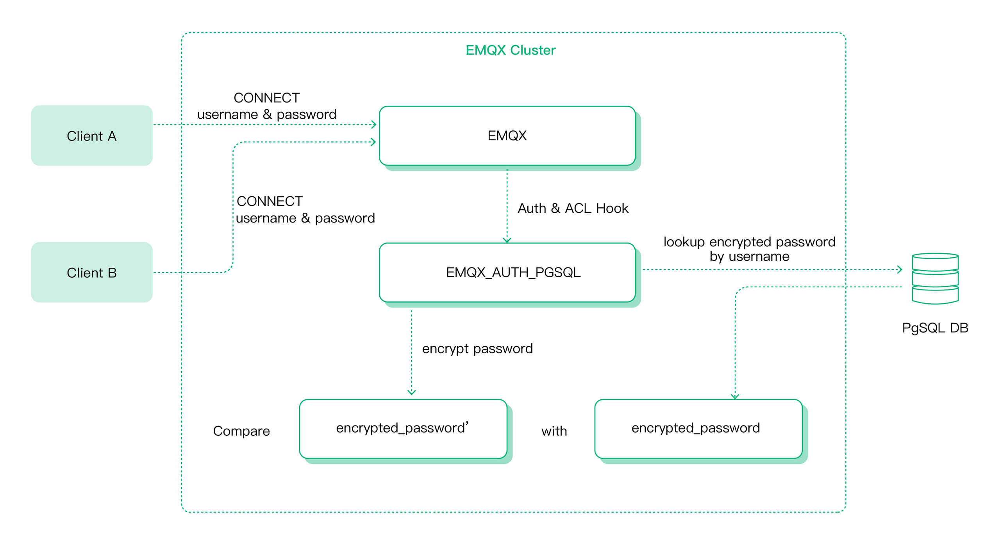
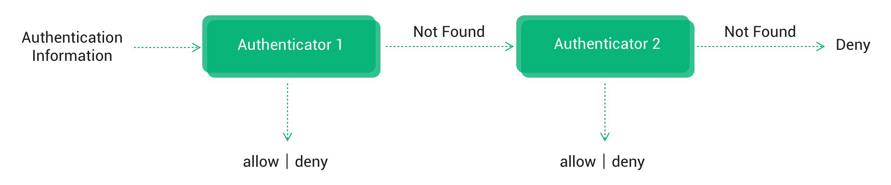
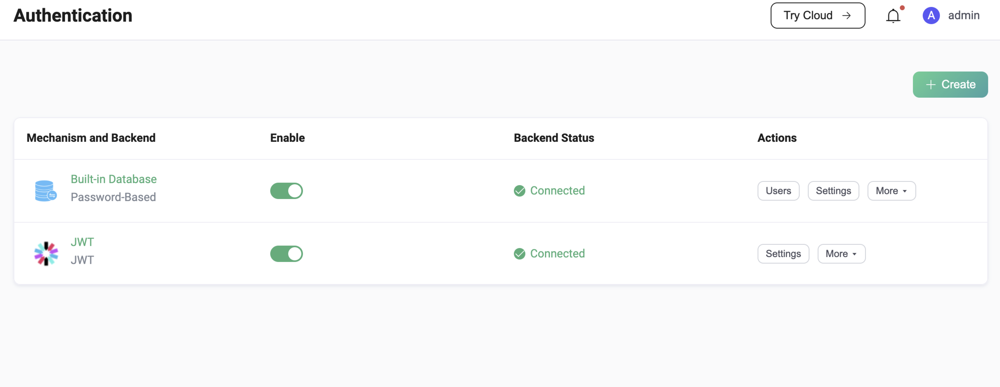

# Introduction

Authentication is the process of verifying the identity of a client. It is an essential part of most applications and can help to protect our services from illegal client connections. 

EMQX supports several authentication mechanisms to better protect our clients, including:

- Username/password authentication
- JWT authentication
- Enhanced authentication of MQTT 5.0

EMQX also supports [TLS X.509 certificates](https://www.mongodb.com/docs/manual/core/security-x.509/) and [TLS-PSK](https://www.rfc-editor.org/rfc/rfc4279) protocols, which offers an option for the authentication request between the client and the server side. 

This section covers the basic concepts of identity authentication and the settings. 

## Authentication mechanism

### Password authentication

EMQX supports the simplest and most popular password authentication, which requires the client to provide credentials that can indicate identities, such as username, client ID, and the corresponding password. In some cases, users may choose to use some fields in the TLS certificate (such as the certificate's Common Name) as the client's identity credentials. Either way, these credentials are stored in advance in a database, where passwords are usually stored in salted and hashed form.

The basic working principle of password authentication in EMQX is: The client carries the identity credentials when initiating a connect request. EMQX queries the database for the hashed password corresponding to the identity credentials provided by the client, and only accepts the connection after the match is successful.



Besides the built-in database, EMQX also supports integration with various backend databases for password authentication, including MySQL, PostgreSQL, MongoDB, and Redis.

EMQX can also be configured to delegate authentication work to external services, such as an HTTP server developed by our users.

### JWT authentication

[JSON Web Token (JWT)](https://jwt.io/) is a token-based authentication mechanism, which does not rely on the server to retain client authentication information or session information.

The client carries the JWT in the connection request, and EMQX uses the pre-configured secret or public key to verify the JWT signature. If the user configures a JWKS endpoint, the JWT authenticator verifies the JWT signature using the list of public keys queried from the JWKS endpoint.

### MQTT 5.0 enhanced authentication

[MQTT 5.0 enhanced authentication](https://www.emqx.com/en/blog/mqtt5-enhanced-authentication) extends the basic authentication to include challenge/response style authentication. It is more like an authentication framework that allows the use of various more secure authentication mechanisms, such as SCRAM authentication, Kerberos authentication, etc. EMQX supports SCRAM authentication and provides support for SCRAM user management through our built-in database.

## EMQX Authenticator

EMQX supports 8 authentication methods (referred to as authenticator hereafter) based on the authentication mechanism and backend database used: 

| Mechanism       | Database          | Description                                                  |
| --------------- | ----------------- | ------------------------------------------------------------ |
| Passsword-Based | Built-in Database | [Authentication with Mnesia database as credential storage](./mnesia.md) |
| Passsword-Based | MySQL             | [Authentication with MySQL database as credential storage](mysql.md) |
| Passsword-Based | PostgreSQL        | [Authentication with PostgreSQL database as credential storage](postgresql.md) |
| Passsword-Based | MongoDB           | [Authentication with MongoDB database as credential storage](./mongodb.md) |
| Passsword-Based | Redis             | [Authentication with Redis database as credential storage](./redis.md) |
| Passsword-Based | HTTP Server       | [Authentication using external HTTP API for credential verification](./http.md) |
| JWT             |                   | [Authentication using JWT](./jwt.md)                         |
| SCRAM           | Built-in Database | [Authentication using SCRAM](./scram.md)                     |

## Basic Concepts

The following part introduces the basic authentication concepts we commonly referred to.

### Authentication chain

EMQX allows the creation of authentication chain using multiple authenticators and follows the authenticator's position in the chain to perform the authentication. 

::: tip

Currently, EMQX only supports creating an authentication chain for MQTT clients. For gateways, it is recommended to use its own authenticator, and the authentication chain is also not supported. 

Besides, the authenticators for creating the authentication chain should be of different types.

:::

#### Authenticate flow

With authentication chain configured, EMQX first tries to retrieve the matching authentication information from the first authenticator, if fails, it switches to the next authenticator to continue the process. 

Taking the password-based authentication as an example, EMQX tries to retrieve the possible authentication information from the configured authenticators:

1. If the username is the same, and:
   - the authentication information matches, the client will be allowed to connect.
   - the authentication information does not match, the client will not be allowed to connect.

1. If multiple authenticators are configured, and EMQX fails to retrieve the information from the current authenticator, it will:
   - continue to retrieve the information from other authenticators.
   - refuse the connection if this is already the last authenticator.




#### Use case

Users have a large number of clients and a high connection rate, thus users can create an authentication chain with the Redis authenticator and the MySQL or PostgreSQL authenticator. With Redis as a caching layer, the query performance can be greatly improved. 

## Authentication of listeners

By default, EMQX adopts a global authentication method for all configured listeners. But for an EMQX cluster with multiple services connected, EMQX also supports customizing authentication methods for each access mode to meet various authentication requirements, for example:

- For clients connected through MQTT over WebSocket, the time-sensitive JWT authenticator rather than the permanent username/password authentication method is recommended to better protect the business security.
- For hardware devices connected via MQTT TCP, their user name and password or client certificates are burned during initialization. The authentication will not be changed throughout the life cycle, so the password authentication method can be used.
- The listeners used for backend service connections do not require authentication checks, as they usually listen to an intranet address with sufficient security assurance.

::: tip

Currently, EMQX only supports creating different listener authenticators for MQTT clients. For gateway listeners, EMQX only supports the use of the default global authenticator.

:::

The authentication configuration of the listener takes precedence over the global authentication configuration. Only when the listener removes its own authenticator configuration and enables authentication, the listener switches to using the global authentication configuration.

### Use case

For example, for listeners with TLS mutual authentication enabled, you may not want to apply the global password authentication method; or if your clients are from multiple different vendors, you need different authentication methods to solve the name duplication issue.

### Super User

Usually, authentication only verifies the client's identity credentials, and whether the client has the right to publish and subscribe to certain topics is determined by the authorization system. But EMQX also provides a super user role and a permission preset feature to facilitate the follow-up publish/subscribe authorization steps. 

::: tip

Permission preset is currently only supported in JWT authentication. The list of publish/subscribe permissions owned by the current client will be carried via the JWT Payload, and will be preset to the client after passing the authentication.

:::

You can check if a user is a superuser with the  `is_superuser` field in a database query, HTTP response, or JWT claims.

### Password hashing

Storing a password in plain text would mean that anyone who looked through the database would be able to just read the user’s passwords. Therefore it is recommended to use password hashing algorithms to store the password as the generated hash. EMQX supports a variety of password hashing algorithms to meet various security requirements.

Besides, EMQX also supports adding salt to hashing, the unique hash produced by adding the salt (password_hash) can protect us against different attacks. 

#### Workflow

The workflow of password hashing is as follows:

1. EMQX authenticator uses the configured query statement to query qualified identity credentials from the database, including hashed passwords and salt values;
2. When a client tries to connect, EMQX authenticator hashes the password provided by the client with the configured hash algorithm and the queried salt value;
3. EMQX authenticator compares the hash password queried from the database in step 1 with the hash value calculated in step 2. If they match, it allows the permission request.

Below is the hashing algorithms EMQX supports: 

```
# simple algorithms
password_hash_algorithm {
  name = sha256             # plain, md5, sha, sha512
  salt_position = suffix    # prefix, disable
}

# bcrypt
password_hash_algorithm {
  name = bcrypt
}

# pbkdf2
password_hash_algorithm {
  name = pbkdf2
  mac_fun = sha256          # md4, md5, ripemd160, sha, sha224, sha384, sha512
  iterations = 4096
  dk_length = 256           # optional
}
```

## Authentication placeholders

EMQX supports using placeholders in the query statements and HTTP requests. During the authentication step, these placeholders will be replaced with actual client information to construct a query or HTTP request that matches the current client.

For example, in EMQX MySQL authenticator, The default query SQL uses the placeholder `${username}`: 

```
SELECT password_hash, salt FROM mqtt_user where username = ${username} LIMIT 1
```

So, when a client (name: `emqx_u`) initiates a connect request, the constructed query statement is like: 

```
SELECT password_hash, salt FROM mqtt_user where username = 'emqx_u' LIMIT 1
```

EMQX currently supports the following placeholders:

- `${clientid}`:  It will be replaced by the client ID at runtime. The client ID is normally explicitly specified by the client in the `CONNECT` packet. If `use_username_as_clientid` or `peer_cert_as_clientid` is enabled, this field will be overridden by the username, fields in the certificate, or the content of the certificate. 
- `${username}`: It will be replaced with the username at runtime. The username comes from the `Username` field in the `CONNECT` packet. If `peer_cert_as_username` is enabled, it will be overridden by the fields or the content of the certificate. 
- `${password}`: It will be replaced with the password at runtime. The password comes from the `Password` field in the `CONNECT` packet.
- `${peerhost}`: It will be replaced with the client's IP address at runtime. EMQX supports [Proxy Protocol](http://www.haproxy.org/download/1.8/doc/proxy-protocol.txt), that is, even if EMQX is deployed behind some TCP proxy or load balancer, users can still use this placeholder to get the real IP address.
- `${cert_subject}`: It will be replaced by the subject of the client's TLS certificate at runtime, only applicable to TLS connections.
- `${cert_common_name}`: It will be replaced by the Common Name of the client's TLS certificate at runtime,  only applicable to TLS connections.

## Configure authentication mechanism

EMQX provides 3 ways to use authentication, namely: Dashboard, Configuration file and HTTP API.

### Configure with Dashboard

EMQX Dashboard is an intuitive way to configure EMQX authenticators, where you can check their status or customize the settings. For example, as shown in the screenshot below, we have configured 2 authenticators: password authentication based on built-in database and JWT authentication. 



### Configure with configuration file

You can also configure EMQX authenticators with our configuration file. 

For example, as shown in the `authentication` field below, we have created an authentication chain with multiple authenticators, these authenticators will run in the order as they are in the configuration file. 

```
# emqx.conf

# Specific global authentication chain for all MQTT listeners
authentication = [
  ...
]

listeners.tcp.default {
  ...
  # Specific authentication chain for the specified MQTT listener
  authentication = [
    ...
  ]
}

gateway.stomp {
  ...
  # Specific global authenticator for all STOMP listeners
  authentication = {
    ...
  }

  listeners.tcp.default {
    ...
    # Specific authenticator for the specified STOMP listener
    authentication = {
      ...
    }
  }
}
```

Different types of authenticators have different configuration item requirements. For more information, you may refer to the Configuration chapter.<!--后续插入到对应章节的超链接-->

### Configure with HTTP API

Compared with the configuration file, the HTTP API is more convenient to use and supports runtime updates, which can automatically synchronize configuration changes to the entire cluster.

You can manage EMQX authentication chains and authenticators via EMQX authentication API, for example, to create a global authenticator, or to update the configuration of a specific authenticator.

- `/api/v5/authentication`: API endpoint for managing global MQTT authentications;
- `/api/v5/listeners/{listener_id}/authentication`:  API endpoint for managing authentication of MQTT listener;
- `/api/v5/gateway/{protocol}/authentication`: API endpoint for managing global authentication for other access protocols;
- `/api/v5/gateway/{protocol}/listeners/{listener_id}/authentication`: API endpoint for managing authentication of listeners for other access protocols;

#### Authenticator ID

To operate on a specific authenticator, you need to append an authenticator ID to the above endpoints, such as `/api/v5/authentication/{id}`. To facilitate maintenance, the ID here is not automatically generated by EMQX and returned by the API, but follows a set of predefined specifications:

```
<mechanism>:<backend>
```

or:

```
<mechanism>
```

For example, 

1. `password_based:built_in_database`
2. `jwt`
3. `scram:built_in_database`

We have a similar set of conventions for the listener ID:

```bash
<transport_protocol>:<name>
```

The format of the gateway listener ID is to add the protocol name in front:

```bash
<protocol>:<transport_protocol>:<name>
```

Note that both authenticator IDs and listener IDs need to follow URL encoding conventions when they are used in URLs, for example, we need to replace `:` with `%3A`:

```bash
PUT /api/v5/authentication/password_based%3Abuilt_in_database
```

#### Data operation API

For authentication using [built-in database](./mnesia.md) and [MQTT 5.0 enhanced authentication](./scram.md), EMQX provides HTTP API to manage authentication data, including the operations such as creating, updating, deleting, and listing data. For more information, see [Manage authentication data with HTTP API](./user_management.md).

For more detailed API requests and parameters, see [HTTP API](../../admin/api.md).

