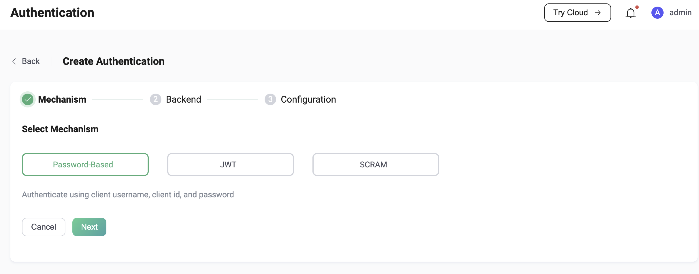
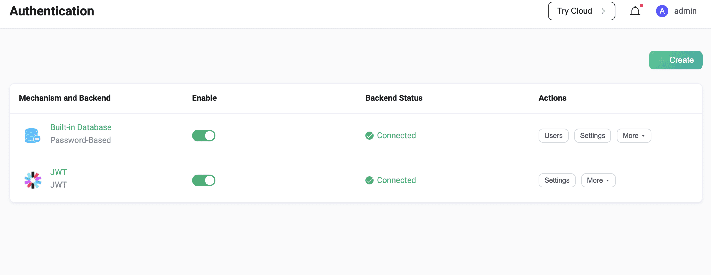

# Introduction

Authentication is an essential part of most applications. MQTT protocol supports username/password authentication as well as enhanced authentication such as SASL/SCRAM authentication. Enabling authentication can effectively prevent illegal client connections.

EMQX supports the simplest and most popular password authentication, which requires the client to provide credentials that can indicate identity, such as username, password or client identifier. In some scenarios, users may choose to use some fields in the TLS certificate (such as the certificate common name) as the client's identity credentials. Either way, these credentials are stored in advance in a database, where passwords are usually stored in salted and hashed form (which is also highly recommended).

The basic working principle of password authentication in EMQX is: when the client connects, EMQX will use the query statement you specify to query the database for the hashed password corresponding to the identity credentials provided by the client, and then match it with the hash value of the client's connection password. Once the match is successful, EMQX will allow the client to login.

EMQX provides integration with various backend databases, including MySQL, PostgreSQL, MongoDB and Redis. At the same time, EMQX also supports users to store their identity credentials in the built-in database (Mnesia). Compared with using an external database, this method provides a very simple configuration process and user management interface. For example, you can manage users from Dashboard UI, or batch import users from a CSV or JSON file. The built-in database is also the highest performance authentication data source, because the EMQX runtime will load the data for authentication from disk into memory.

In addition to the authentication completed by EMQX, EMQX can also be configured to delegate authentication work to other external services, such as HTTP server developed and deployed by users themselves.

As long as the HTTP server returns an authentication response that conforms to the specification, EMQX can allow or deny the client's login based on the response. Since there is far more client information that can be sent to the HTTP server than a simple combination of username and password, this will allow users to develop complex authentication services for themselves.

EMQX also supports the client to directly initiate an authentication request to the authentication service deployed by the user. The authentication service verifies the legitimacy of the client and issues a JWT, and then the client uses the JWT to login to EMQX. At this time, EMQX only verifies the legitimacy of the JWT and checks whether the information in the JWT claims are match the current client.

In addition, EMQX also supports enhanced authentication, which is an extension of MQTT 5.0 to password authentication. It is more like an authentication framework that allows the use of various more secure authentication mechanisms, such as SCRAM authentication, Kerberos authentication, etc. At present, EMQX already supports SCRAM authentication and provides support for SCRAM user management through the built-in database.

At the transport layer, EMQX supports TLS mutual authentication, which can meet the authentication requirements between the client and the server to a certain extent. Of course, EMQX also supports PSK-based TLS/DTLS authentication.

This chapter will mainly introduce the basic concepts and usage of authentication in EMQX.

## Authenticator

By default, EMQX will allow any client to connect until the user has created an authenticator. The authenticator will authenticate the client according to the authentication information provided by it, and the client can connect successfully only if the authentication is passed.

The authenticator in EMQX currently supports 3 authentication mechanisms, namely: Password-Based, JWT and SCRAM. The Password-Based mechanism also provides a variety of database types for selection, and the data stored in these databases will be used for authenticate the client's identity.

According to the authentication mechanism and backend used, there are currently 8 different types of authenticators in EMQX.

| Mechanism       | Backend           | Description                                                  |
| --------------- | ----------------- | ------------------------------------------------------------ |
| Passsword-Based | Built-in Database | [Authentication with Mnesia database as credential storage](./mnesia.md) |
| Passsword-Based | MySQL             | [Authentication with MySQL database as credential storage](mysql.md) |
| Passsword-Based | PostgreSQL        | [Authentication with PostgreSQL database as credential storage](postgresql.md) |
| Passsword-Based | MongoDB           | [Authentication with MongoDB database as credential storage](./mongodb.md) |
| Passsword-Based | Redis             | [Authentication with Redis database as credential storage](./redis.md) |
| Passsword-Based | HTTP Server       | [Authentication using external HTTP API for credential verification](./http.md) |
| JWT             |                   | [Authentication using JWT](./jwt.md)                         |
| SCRAM           | Built-in Database | [Authentication using SCRAM](./scram.md)                     |

## Authentication Chain

EMQX allows the creation of multiple authenticators, which will run in the order of their positions in the authentication chain. If no matching authentication information is retrieved in the current authenticator, it will switch to the next authenticator on the chain to continue the authentication process. Taking Password-Based authentication as an example, this usually results in the following 3 situations:

1. An authenticator retrieves possibly matching authentication information at runtime. For example, if the username is the same and the remaining authentication information completely matches, the client will be allowed to connect.
2. When an authenticator is running, it retrieves possibly matching authentication information, for example, the username is the same, but the remaining authentication information cannot be matched, for example, the password is inconsistent, then the client will be refused to connect.
3. If none of the authenticators on the chain retrieve any possible matching identity information, the client will be refused to connect.


For users with a large number of clients and a high connection rate, they may use the authenticator that uses Redis as the data source (hereinafter referred to as the xxx authenticator) in combination with the MySQL or PostgreSQL authenticator. That is, using Redis as a caching layer to improve query performance.

Currently, only MQTT client authentication supports the use of multiple sequentially running authenticators to form an authentication chain, and clients accessing through the gateway only support the use of a single authenticator.

It should be noted that multiple authenticators of the same type are not allowed in the authentication chain.

## Authentication of listener

EMQX supports all listeners under the same protocol to share a set of authentication configuration (we call it global authentication configuration, each access protocol can have its own global authentication configuration), and also supports a listener to use an independent authentication configuration. The authentication configuration of the listener takes precedence over the global authentication configuration. Only when the listener removes its own authenticator configuration and enables authentication, the listener will switch to using the global authentication configuration.

This feature is mainly used to meet the relatively complex authentication requirements of some users. For example, users may not expect to continue to use password authentication on listeners that have enabled TLS mutual authentication, or users' devices come from multiple different vendors. The username used by the device may be duplicated. In this case, the authentication information needs to be managed separately.

Also, currently only the MQTT listener supports the use of multiple authenticators, and the gateway listener only supports the use of a single authenticator.

## Super User

Usually, authentication only verifies whether the client's identity is legal, and whether the client has the right to publish and subscribe to certain topics needs to be judged by the authorization system. But EMQX also allows users to set super user permissions for some special clients, thus skipping all subsequent permission checks. Superuser determination occurs during the authentication phase, as indicated by the `is_superuser` field in the result of a database query, HTTP response, or JWT claims.

## How to use

EMQX provides 3 ways to use authentication, namely: Configuration file, HTTP API and Dashboard.

### Configuration file

The following example mainly shows the configuration method of global authentication and authentication of listener in the configuration file. As mentioned above, we can configure multiple authenticators for the MQTT client to form an authentication chain, the array format of the configuration item `authentication` also indicates this. The order of the authenticators in the array is the order in which they are run.

```
# emqx.conf

# Specific global authentication chain for all MQTT listeners
authentication = [
  ...
]

listeners.tcp.default {
  ...
  # Specific authentication chain for the specified MQTT listener
  authentication = [
    ...
  ]
}

gateway.stomp {
  ...
  # Specific global authenticator for all STOMP listeners
  authentication = {
    ...
  }

  listeners.tcp.default {
    ...
    # Specific authenticator for the specified STOMP listener
    authentication = {
      ...
    }
  }
}
```

Different types of authenticators have different configuration item requirements. Taking the Redis authenticator as an example, we usually have the following configuration:

```
authentication = {
  mechanism = password_based
  backend = redis
  enable = true

  server = "127.0.0.1:6379"
  redis_type = single
  database = 1
  password = public

  cmd = "HMGET mqtt_user:${username} password_hash salt is_superuser"
  password_hash_algorithm {
    name = plain
    salt_position = suffix
  }
}
```

> `authentication = {...}` is equivalent to `authentication = [{...}]`.

Among them, `mechanism` and `backend` define the type of authenticator. Configuration items such as `server` tell EMQX how to connect to Redis resources. The configuration item `cmd` tells EMQX how to query the hashed password, salt and other data based on the identity credentials. The configuration item `password_hash_algorithm` tells EMQX how passwords are hashed and salted in the database.

In contrast, the configuration of the password authenticator with the built-in database is simpler:

```
authentication = {
  mechanism = password_based
  backend = built_in_database
  enable = false

  user_id_type = username
  password_hash_algorithm {
    name = sha256
    salt_position = suffix
  }
}
```

In order to help users better configure the authenticators they need, we provide a configuration description document, which contains a detailed description of all the configuration fields of each authenticator.

### HTTP API

Compared with the configuration file, the HTTP API is more convenient to use and supports runtime updates, which can automatically synchronize configuration changes to the entire cluster.

The authentication API allows management of authentication chains and authenticators, such as creating an authenticator for global authentication, and updating the configuration of a specific authenticator.

The API endpoint for managing MQTT global authentication is `/api/v5/authentication`.

The API endpoint for managing authentication of MQTT listener is `/api/v5/listeners/{listener_id}/authentication`.

The API endpoint for managing global authentication for other access protocols is `/api/v5/gateway/{protocol}/authentication`.

The API endpoint for managing authentication of listeners for other access protocols is `/api/v5/gateway/{protocol}/listeners/{listener_id}/authentication`.

If you want to operate on a specific authenticator, you need to append an authenticator ID to the above endpoints, such as `/api/v5/authentication/{id}`. In order to facilitate maintenance, the ID here is not automatically generated by EMQX and returned by the API, but follows a set of predefined specifications:

```
<mechanism>:<backend>
```

or just:

```
<mechanism>
```

E.g:

1. `password_based:built_in_database`
2. `jwt`
3. `scram:built_in_database`

Similarly, for the listener ID, we have a similar set of conventions, the format of the MQTT listener ID is:

````
<transport_protocol>:<name>
````

The format of the gateway listener ID is:

````
<protocol>:<transport_protocol>:<name>
````

We can think of the MQTT listener ID as omitting the leading protocol name by default.

Note that both authenticator IDs and listener IDs need to follow URL encoding conventions when they are used in URLs. Most directly, we need to replace `:` with `%3A`, example:

````
PUT /api/v5/authentication/password_based%3Abuilt_in_database
````

### Dashboard

Although the bottom layer of Dashboard also calls the HTTP API, it provides a relatively easier-to-use visual operation page without investing too much learning cost.





## Password hashing

In order to meet the different security requirements of users, the password authenticator with database backend supports a variety of password hashing algorithms.

The password hashing algorithm configuration of the password authenticator using an external database (MySQL, Redis, etc.) is only used to let EMQX know how the password is stored in the external database, so that it can be used during authentication.

The password hashing algorithm configuration in the password authenticator using the built-in database is also used to add salt and hash passwords when storing newly added user data.

The role of password hash algorithm configuration in authentication is as follows:

1. The Authenticator uses the configured query statement to query the database for eligible hashed passwords and salts.
2. Hash the password provided by the client when connecting according to the configured hashing algorithm and the queried salt value.
3. Compare the hashed password queried from the database in step 1 with the hash value calculated in step 2. If they are consistent, the identity of the client is legal.

The following are the hash algorithms currently supported by EMQX:

```
# simple algorithms
password_hash_algorithm {
  name = sha256             # plain, md5, sha, sha512
  salt_position = suffix    # prefix, disable
}

# bcrypt
password_hash_algorithm {
  name = bcrypt
}

# pbkdf2
password_hash_algorithm {
  name = pbkdf2
  mac_fun = sha256          # md4, md5, ripemd160, sha, sha224, sha384, sha512
  iterations = 4096
  dk_length = 256           # optional
}
```

Although EMQX allows users to configure password storage without hashing or salting, this method has obvious security risks and is not recommended by us.

## Authentication placeholders

Most authenticators need to be used with placeholders, and are usually used for query statements (database backend), HTTP requests (HTTP Server backend), etc.

Placeholders are replaced with actual client information when authentication is performed to construct a query or HTTP request that matches the current client.

Currently EMQX supports the following placeholders:

- `${clientid}` - It will be replaced by the client identifier at runtime. The client identifier is normally specified explicitly by the client in the `CONNECT` packet. If `use_username_as_clientid` or `peer_cert_as_clientid` is enabled, it will be overridden by the username, fields in the certificate, or the content of the certificate when connecting. The client identifier automatically assigned to the client by EMQX is generally not suitable for authentication.

- `${username}` - It will be replaced with the username at runtime. The username comes from the `Username` field in the `CONNECT` packet. If `peer_cert_as_username` is enabled, it will be overridden by fields in the certificate or the contents of the certificate when connecting.

- `${password}` - It will be replaced with the password at runtime. The password comes from the `Password` field in the `CONNECT` packet.

- `${peerhost}` - It will be replaced with the client's IP address at runtime. EMQX supports [Proxy Protocol](http://www.haproxy.org/download/1.8/doc/proxy-protocol.txt), so even if EMQX is deployed behind some TCP proxy or load balancer, users can use this placeholder.

- `${cert_subject}` - It will be replaced at runtime with the subject of the client's TLS certificate, only for TLS connections.

- `${cert_common_name}` - It will be replaced at runtime with the Common Name of the client's TLS certificate, for TLS connections only.

Example of use (in Redis password-based authenticator):

```
{
  mechanism = password_based
  backend = redis

  ... other parameters ...

  cmd = "HMGET users:${clientid} password_hash salt is_superuser"
}
```

When a client with clientid `id2718` tries to connect, a Redis query `HMGET users:id2718 password_hash salt is_superuser` is performed to search credentials.

::: warning
If a value for a placeholder is absent then the placeholder is rendered as an empty string. For example, a template
`HMGET users:${username} password_hash salt is_superuser` will be rendered as `HMGET users: password_hash salt is_superuser` if a username is not provided by an MQTT client.
:::
