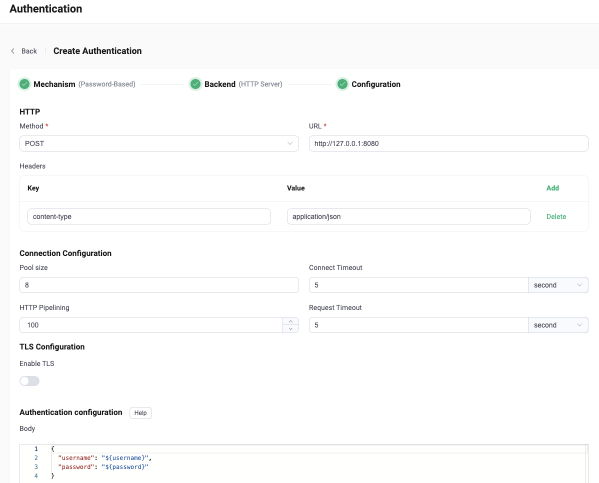

# Use HTTP Service

EMQX supports using external HTTP service for password authentication. After enabling, when a client initiates a connect request, EMQX will use the received information to construct an HTTP request and determine whether to accept the request based on the query result, achieving a complex authentication logic.

::: tip

- Knowledge about [basic EMQX authentication concepts](../authn/authn.md)

:::

## HTTP Request and Response

The authentication process is similar to an HTTP API call where EMQX, as the requesting client, constructs and initiates a request to the HTTP service in the format required by the "API", and the HTTP service returns the result as required by the "client".

- The response encoding format `content-type` must be `application/json`.
- The authentication result is marked by `result` in the body, option value: `allow`, `deny`, `ignore`.
- Superuser is marked by `is_superuser` in the body, option value: `true`, `false`.
- The HTTP response status code `Status Code` should be `200` or `204`, the `4xx/5xx` status code returned will ignore the body and determine the result to be `ignore` and continue with the authentication chain.

Example response:

```json
HTTP/1.1 200 OK
Headers: Content-Type: application/json
...
Body:
{
    "result": "allow", // options: "allow" | "deny" | "ignore"
    "is_superuser": true // options: true | fals, default value: false
}
```

::: tip 

EMQX 4.x Compatibility Notes

In EMQX 4.x, only HTTP status code is used, but body is discarded, for example, `200` for `allow` and `403` for `deny`.
Due to the lack of expressiveness, it has been redesigned to make use of HTTP body, and thus is not compatible with EMQX 5.0. 

:::

## Configure with Dashboard

You can use EMQX Dashboard to finish the relevant configuration. 

On [EMQX Dashboard](http://127.0.0.1:18083/#/authentication), click **Access Control** -> **Authentication** on the left navigation tree to enter the **Authentication** page. Click **Create** at the top right corner, then click to select **Password-Based** as **Mechanism**, and **HTTP Server** as **Backend**, this will lead us to the **Configuration** tab, as shown below. 




**HTTP**: 

- **Method**: Select HTTP request method, optional values: `get`, `post`

  :::tip 

  The `POST` method is recommended. When using the `GET` method, some sensitive information (such as plain text passwords) may be exposed via HTTP server logs. Also, for untrusted environments, please use HTTPS.
   :::

- **URL**: Enter the URL address of the HTTP service.

- **Headers** (optional): HTTP request header. 

**Connection Configuration**:

- **Pool size** (optional): Input an integer value to define the number of concurrent connections from an EMQX node to an HTTP server. Default: **8**. <!--有范围吗？-->
- **Connect Timeout** (optional): Specify the waiting period before EMQX assumes the connection is timed out. Units supported include milliseconds, second, minute, and hour. 
- **HTTP Pipelining** (optional): Input a positive integer to specify the maximum number of HTTP requests that can be sent without waiting for a response; default value: **100**.
- **Request Timeout** (optional): Specify the waiting period before EMQX assumes the request is timed out. Units supported include milliseconds, second, minute, and hour. 

**TLS Configuration**: Turn on the toggle switch if you want to enable TLS. 

**Authentication configuration**:

- **Body**: Request template; for `POST` requests, it is sent as a JSON in the request body; for `GET` requests, it is encoded as a Query String in the URL. Mapping keys and values support using [placeholder](./authn.md#authentication-placeholders).

Now we can click **Create** to finish the settings. 

## Configure with Configuration Items

You can configure the EMQX HTTP authenticator with EMQX configuration items. <!--For details, see [authn-http:post](../../configuration/configuration-manual.md#authn-http:post) and [authn-http:get](../../configuration/configuration-manual.md#authn-http:get). -->

Below are the HTTP `POST` and `GET` request examples:

:::: tabs type:card

::: tab POST request

```hocon
{
    mechanism = password_based
    backend = http
    enable = true

    method = post
    url = "http://127.0.0.1:8080/auth?clientid=${clientid}"
    body {
        username = "${username}"
        password = "${password}"
    }
    headers {
        "Content-Type" = "application/json"
        "X-Request-Source" = "EMQX"
    }
}
```

:::

::: tab GET request

```hocon
{
    mechanism = password_based
    backend = http
    enable = true

    method = get
    url = "http://127.0.0.1:32333/auth"
    body {
        username = "${username}"
        password = "${password}"
    }
    headers {
        "X-Request-Source" = "EMQX"
    }
}
```

:::

::::
