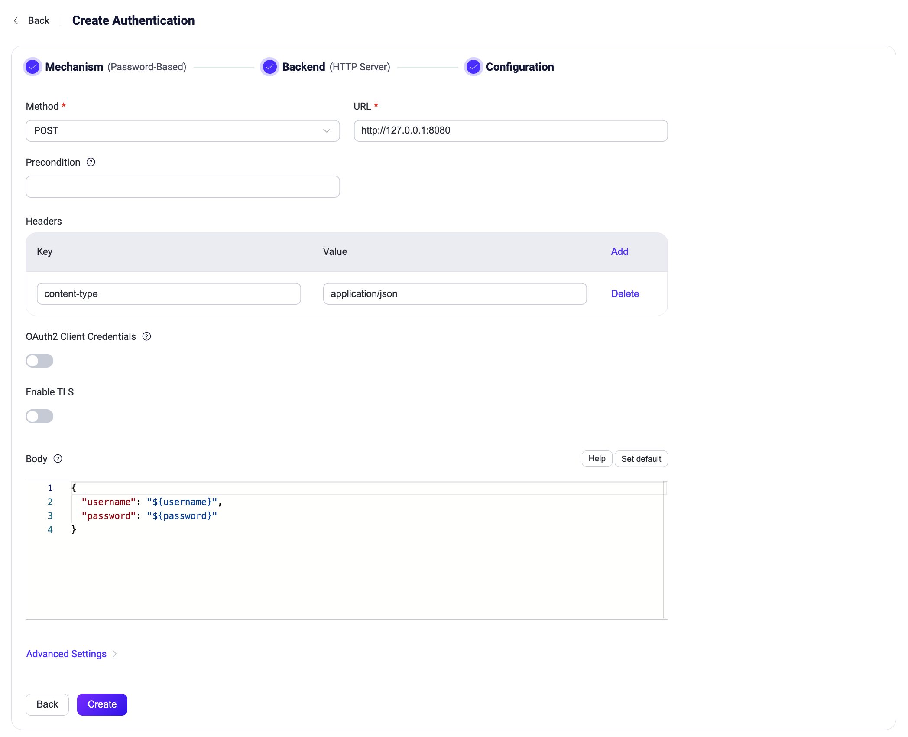

# Use HTTP Service

EMQX supports using an external HTTP service for password authentication. After enabling, when a client initiates a connect request, EMQX will use the received information to construct an HTTP request and determine whether to accept the request based on the query result, achieving a complex authentication logic.

::: tip Prerequisite

Knowledge about [basic EMQX authentication concepts](../authn/authn.md)

:::

## HTTP Request and Response

The authentication process is similar to an HTTP API call where EMQX, as the requesting client, constructs and initiates a request to the HTTP service in the format required by the "API", and the HTTP service returns the result as required by the "client".

- The response encoding format `content-type` must be `application/json`.
- The authentication result is marked by `result` in the body, with option value: `allow`, `deny`, `ignore`.
- Superuser is marked by `is_superuser` in the body, option value: `true`, `false`.
- Starting from EMQX v5.7.0, you can set [client attributes](../../client-attributes/client-attributes.md) using the optional `client_attrs` field. Note that both keys and values must be strings.
- Starting from EMQX v5.8.0, you can set an optional `acl` field in the response body to specify the client's permissions. See [Access Control List (ACL)](./acl.md) for more information.
- Starting from EMQX v5.8.0, you can set an optional `expire_at` field in the response body to specify the expiration time of the client's authenticity, forcing the client to disconnect and get reauthenticated at reconnection. The value is a Unix timestamp in seconds.
- The HTTP response status code `Status Code` should be `200` or `204`, the `4xx/5xx` status code returned will ignore the body and determine the result to be `ignore` and continue with the authentication chain.

Example response:

```js
HTTP/1.1 200 OK
Headers: Content-Type: application/json
...
Body:
{
    "result": "allow", // "allow" | "deny" | "ignore"
    "is_superuser": false, // options: true | false, default value: false
    "client_attrs": { // optional (since v5.7.0)
        "role": "admin",
        "sn": "10c61f1a1f47"
    }
    "expire_at": 1654254601, // optional (since v5.8.0)
    "acl": // optional (since v5.8.0)
    [
        {
            "permission": "allow",
            "action": "subscribe",
            "topic": "eq t/1/#",
            "qos": [1]
        },
        {
            "permission": "deny",
            "action": "all",
            "topic": "t/3"
        }
    ]
}
```

::: tip EMQX 4.x Compatibility Notes

In EMQX 4.x, only HTTP status code is used, but body is discarded, for example, `200` for `allow` and `403` for `deny`.
Due to the lack of expressiveness, it has been redesigned to make use of HTTP body, and thus is not compatible with EMQX 5.0.

:::

## Configure with Dashboard

You can use EMQX Dashboard to finish the relevant configuration.

1. In the EMQX Dashboard, click **Access Control** -> **Authentication** from the left navigation menu.
2. On the **Authentication** page, click **Create** in the top right corner.
3. Click to select **Password-Based** as **Mechanism**, and **HTTP Server** as **Backend** to go to the **Configuration** tab, as shown below. 

<!-- TODO: Replace or remove this screenshot after the Dashboard OAuth2 Client Credentials form is finalized. -->


4. Follow the instructions below to configure the authentication backend:

   - **Method**: Select HTTP request method, optional values: `get`, `post`

     :::tip

     The `POST` method is recommended. When using the `GET` method, some sensitive information (such as plain text passwords) may be exposed via HTTP server logs. Also, for untrusted environments, please use HTTPS.
      :::

   - **URL**: Enter the URL address of the HTTP service.
   - **Precondition**: A [Variform expression](../../configuration/configuration.md#variform-expressions) used to control whether this HTTP Server authenticator should be applied to a client connection. The expression is evaluated against attributes from the client (such as `username`, `clientid`, `listener`, etc.). The authenticator will only be invoked if the expression evaluates to the string `"true"`. Otherwise, it will be skipped. For more information about the precondition, see [Authenticator Preconditions](./authn.md#authenticator-preconditions).
   - **Headers** (optional): HTTP request header. You can add several headers. Keys and values support using [placeholders](./authn.md#authentication-placeholders).
   - **Enable TLS**: Turn on the toggle switch if you want to enable TLS. For more information on enabling TLS, see [Network and TLS](../../network/overview.md).
   - **Body**: Request template; for `POST` requests, it is sent as a JSON in the request body; for `GET` requests, it is encoded as a Query String in the URL. Mapping keys and values support using [placeholders](./authn.md#authentication-placeholders).
   - **Advanced Settings**:
     - **Pool size** (optional): Input an integer value to define the number of concurrent connections from an EMQX node to an HTTP server. Default: `8`. 

     - **Connect Timeout** (optional): Specify the waiting period before EMQX assumes the connection is timed out. Units supported include milliseconds, second, minute, and hour.

     - **HTTP Pipelining** (optional): Input a positive integer to specify the maximum number of HTTP requests that can be sent without waiting for a response; default value: `100`.

     - **Request Timeout** (optional): Specify the waiting period before EMQX assumes the request is timed out. Units supported include milliseconds, second, minute, and hour.

5. After you finish the settings, click **Create**.

### Configure OAuth2 Client Credentials

Starting from EMQX 6.0.4, an HTTP authenticator supports the OAuth 2.0 Client Credentials Grant. When OAuth2 is enabled, EMQX obtains, caches, and automatically refreshes an access token from the configured token endpoint. When EMQX calls the external HTTP authentication service, it sends the token in the `Authorization: Bearer <access_token>` request header so that the external service can authenticate EMQX.

Configure the following OAuth2 settings in Dashboard:

| Setting | Description |
| --- | --- |
| `enable` | Enables OAuth2 Client Credentials authentication. The default is `false`. |
| `grant_type` | OAuth2 grant type. Only `client_credentials` is supported. The default is `client_credentials`. |
| `token_endpoint` | URL of the OAuth2 token endpoint. The URL must use HTTP or HTTPS and must not contain user information. |
| `client_id` | Client ID used to request an access token. |
| `client_secret` | Client secret used to request an access token. |
| `scope` | Optional scope requested for the access token. |
| `timeout` | Timeout for connecting to and requesting the token endpoint. The default is `5s`. |
| `ssl` | TLS options for an HTTPS token endpoint. TLS is enabled by default. These options are independent of the TLS settings for the authentication service URL. |

EMQX sends a `POST` request with the `application/x-www-form-urlencoded` content type to the token endpoint. The request body contains `grant_type`, `client_id`, `client_secret`, and the optional `scope`. The token endpoint must return a `200` response with a JSON body containing an `access_token`. It can also return `token_type` and `expires_in`. If present, `token_type` must be `Bearer`, and `expires_in` must be a positive integer. For example:

```json
{
  "access_token": "eyJhbGciOi...",
  "token_type": "Bearer",
  "expires_in": 3600
}
```

::: warning Important Notice

- Do not configure an `Authorization` header for the HTTP authenticator when OAuth2 is enabled. EMQX rejects the configuration because it conflicts with the automatically generated Bearer authorization header.
- The token endpoint must accept the client ID and client secret as form fields in the request body. Authenticating to the token endpoint with an HTTP Basic `Authorization` header is not supported.

:::

## Configure with Configuration Items

You can configure the EMQX HTTP authenticator with EMQX configuration items. <!--For details, see [authn-http:post](../../configuration/configuration-manual.html#authn-http:post) and [authn-http:get](../../configuration/configuration-manual.html#authn-http:get). -->

Below are the HTTP `POST` and `GET` request examples:

:::: tabs type:card

::: tab POST request

```hcl
{
    mechanism = password_based
    backend = http

    method = post
    url = "http://127.0.0.1:8080/auth?clientid=${clientid}"
    body {
        username = "${username}"
        password = "${password}"
    }
    headers {
        "Content-Type" = "application/json"
        "X-Request-Source" = "EMQX"
    }
}
```

:::

::: tab GET request

Note: The "body" will be converted to a query string.

```hcl
{
    mechanism = password_based
    backend = http

    method = get
    url = "http://127.0.0.1:32333/auth"
    body {
        username = "${username}"
        password = "${password}"
    }
    headers {
        "X-Request-Source" = "EMQX"
    }
}
```

:::

::::

### OAuth2 Client Credentials Configuration

Starting from EMQX 6.0.4, add an `oauth2` block to the HTTP authenticator to enable OAuth2 Client Credentials:

```hocon
oauth2 {
    enable = true
    grant_type = client_credentials
    token_endpoint = "https://auth.example.com/oauth/token"
    client_id = "emqx-client"
    client_secret = "emqx-client-secret"
    scope = "device.read device.write"
    timeout = 5s
    ssl {
        enable = true
    }
}
```

Omit `scope` if the authorization server does not require it. For the request format and restrictions, see [Configure OAuth2 Client Credentials](#configure-oauth2-client-credentials).
