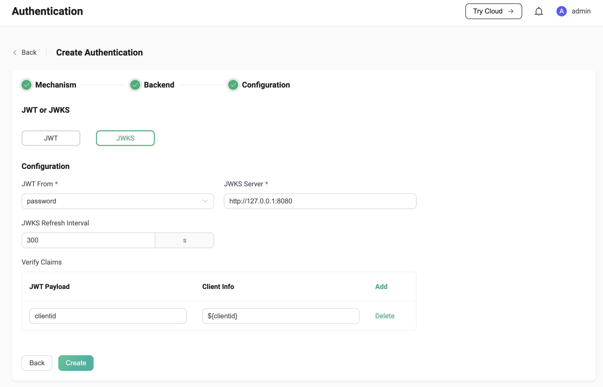

# JWT Authentication

[JSON Web Token (JWT)](https://jwt.io/) is a token-based authentication mechanism. It does not rely on the server to retain client authentication information or session information. EMQX supports using JWT for user authentication. 

::: tip

- Knowledge about [basic EMQX authentication concepts](../authn/authn.md)

:::

## Authentication Principle

The client carries the JWT in the connection request, and EMQX uses the pre-configured secret or public key to verify the JWT signature. If the user configures a JWKS endpoint, the JWT authenticator will verify the JWT signature using the list of public keys queried from the JWKS endpoint. 

If the signature verification is successful, the JWT authenticator proceeds to check the claims. If there are claims such as `iat`, `nbf` or `exp`, the JWT authenticator will actively check the validity of the JWT based on these claims. In addition to this, we also allow users to specify some additional claims checks. The client is finally allowed to login only if the signature verification and claims check pass together.

## Best Practice

The JWT authenticator essentially only checks the signature of the JWT, which means that the JWT authenticator does not guarantee the legitimacy of the client's identity.

The best practice is to deploy an independent authentication server. The client first accesses the authentication server, the authentication server verifies the identity of the client, and issues JWT for the legitimate client, and then the client uses the obtained JWT to connect to EMQX .

:::tip

Since the payload in the JWT is only Base64 encoded, anyone who gets the JWT can decode the payload to get the original information by Base64 decoding. Therefore, it is not recommended to store some sensitive data in the payload of JWT.

To reduce the possibility of JWT leakage and theft, it is recommended to set a reasonable validity period and also  enables TLS to encrypt client connections.

:::

## Authorization List (Optional)

This is an optional function, we define a private Claim `acl` to carry the access rules of publish/subscribe in the JWT as to control the permissions of the client after login.

::: tip
Authorization (ACL) rules returned by JWT will be checked before all Authorizers. For details, see [Authorization](../authz/authz.md).
:::

Claim `acl` defines 3 optional fields, `pub`, `sub` and `all`, which are used to specify the whitelist of publish, subscribe and publish-subscribe topics respectively. Wildcards and placeholders  (currently only `${clientid}` and `${username}` ) are allowed in topic entries.  Since there may be cases where topic content conflicts with placeholder syntax, we also provide the `eq` syntax to cancel placeholder interpolation. 

Example:

```json
{
  "exp": 1654254601,
  "username": "myuser",
  "acl": {
    "pub": [
      "testpub1/${username}",
      "eq testpub2/${username}"
    ],
    "sub": [
      "testsub1/${username}",
      "testpub2/${clientid}",
      "testsub2/#"
    ],
    "all": [
      "testall1/${username}",
      "testall2/${clientid}",
      "testall3/#"
    ]
  }
}
```

Where `testpub1/${username}` will be replaced with `testpub1/myuser` at runtime, and `eq testpub2/${username}` will still be processed as `testpub2/${username}` at runtime.


## Configure with Dashboard

On [EMQX Dashboard](http://127.0.0.1:18083/#/authentication), click **Access Control** -> **Authentication** on the left navigation tree to enter the **Authentication** page. Click **Create** at the top right corner, then click to select **Password-Based** as **Mechanism**, and **JWT** as **Backend**, this will lead us to the **Configuration** tab, as shown below. 


Follow the instruction below on how to configure:

**JWT From**: Specify the location of the JWT in the client connection request; option values are `password` and `username`. For MQTT clients, these are the `Password` and `Username` fields in the MQTT `CONNECT` packet.

**Algorithm**: Specify the encryption algorithm of JWT, optional values ​​are `hmac-based` and `public-key`. For different encryption methods, the JWT authenticator will have different configuration requirements.

1. If configured as `hmac-based`, indicating that JWT will use symmetric secret to generate signature and verify signature (support HS256, HS384 and HS512 algorithms), we also need to configure:
   - `Secret`: the key used to verify the signature (the same key used to generate the signature)
   - `Secret Base64 Encode`: indicating whether the `Secret` is Base64 encrypted, that is, whether EMQX needs to perform Base64 decryption on the secret when verifying the signature.

2. If configured as `public-key`, indicating that JWT uses the private key to generate the signature, and needs to use the public key to verify the signature (supports RS256, RS384, RS512, ES256, ES384 and ES512 algorithms), we also need to configure:
   - `Public Key`: specifying the public key in PEM format used to verify the signature

**Payload**: Specify additional claims checks that the user wants to perform. Users can define multiple key-value pairs with the **Claim** and **Expacted Value** fields, where the key is used to find the corresponding claim in the JWT, so it needs to have the same name as the JWT claim to be checked, and the value is used to compare with the actual value of the claim. Currently the placeholders supported are `${clientid}` and `${username}`, 

EMQX also supports periodically obtaining the latest JWKS from the JWKS endpoint, which is essentially a set of public keys that will be used to verify any JWT issued by the authorization server and signed using the RSA or ECDSA algorithm. If we want to use this feature, we first need to switch to the **JWKS** configuration page.



So as shown above, we now have two brand-new configuration items:

1. `JWKS Server`: Specify the server endpoint address for EMQX to query JWKS, the endpoint needs to support GET requests and return a JWKS that conforms to the specification.
2. `JWKS Refresh Interval`: Specify the refresh interval of JWKS, that is, the interval for EMQX to query JWKS.

## <!--Configure with Configuration Items-->

<!--You can also configuration items for the configuration. For detailed steps, see [authn-jwt:*](../../configuration/configuration-manual.md#authn-jwt:hmac-based). -->

