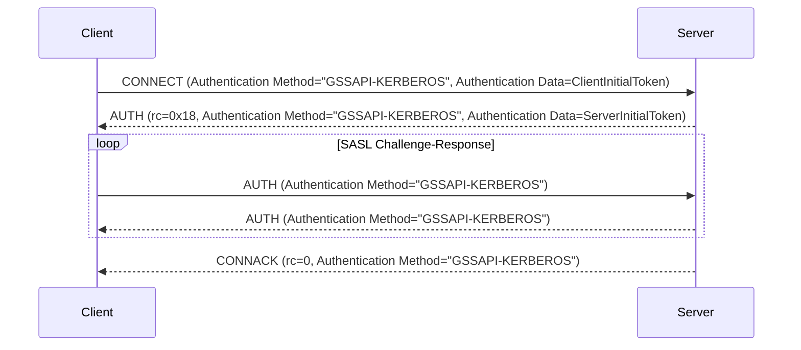

# MQTT 5.0 Enhanced Authentication - Kerberos

::: tip

The Kerberos Authentication is only available in the EMQX Enterprise edition.

:::

Kerberos is a network authentication protocol that uses "tickets" to allow nodes to securely prove their identity to one another over a non-secure network. It is designed to provide strong authentication for client/server applications through secret-key cryptography. 

EMQX integrates Kerberos authentication following the SASL/GSSAPI mechanism from RFC 4422. The Generic Security Services Application Program Interface (GSSAPI) provides a standardized API that abstracts the details of the Kerberos protocol, allowing secure communication between the MQTT clients and the server without requiring the application to manage the specifics of the Kerberos authentication process.

This page introduces how to configure the Kerberos authenticator in EMQX.

::: tip
Enhanced authentication in MQTT is only supported starting from protocol version 5.

Since there is no mechanism negotiation, the client must explicitly specify `GSSAPI-KERBEROS` as the authentication mechanism.

:::

## Prerequisites for Configuration

Before configuring Kerberos authentication in EMQX, ensure that your environment meets the requirements, including installing essential libraries and properly setting up the Kerberos system.

### Install Kerberos Library

Before configuring the Kerberos authenticator, you must install the MIT Kerberos library on the EMQX node.

- On Debian/Ubuntu, the required packages are `libsasl2-2` and `libsasl2-modules-gssapi-mit`.

- On Redhat, the required packages are `krb5-libs` and `cyrus-sasl-gssapi`.


### Configure Kerberos Library

The Kerberos library configuration file is `/etc/krb5.conf`. The file contains the configuration information for the Kerberos library, including the realms and Key Distribution Centers (KDCs). The Kerberos library uses this file to locate the KDCs and realms.

Here is an example of a `krb5.conf` file:

```ini
[libdefaults]
    default_realm = EXAMPLE.COM
    default_keytab_name = /var/lib/emqx/emqx.keytab

[realms]
   EXAMPLE.COM = {
      kdc = kdc.example.com
      admin_server = kdc.example.com
   }
```

### Keytab Files

To configure the Kerberos authenticator, you need a running KDC (Key Distribution Center) server and valid keytab files for both the server and clients. Keytab files store cryptographic keys associated with the server's principal. They allow the server to authenticate to the Kerberos KDC without manual password entry.

EMQX can only support keytab files at the default location. You can configure the system default value by using the environment variable `KRB5_KTNAME` or by setting `default_keytab_name` in `/etc/krb5.conf`.

## Configure via Dashboard

In the EMQX Dashboard, navigate to **Access Control** -> **Authentication** in the left menu to enter the **Authentication** page. Click **Create** at the top right corner, then select **GSSAPI** as the **Mechanism**, and **Kerberos** as the **Backend**. Click **Next** to go to the **Configuration** step.

1. Configure the following fields:

   - **Principal**: Set Kerberos principal for the server to define the server's identity within the Kerberos authentication system. For example, `mqtt/cluster1.example.com@EXAMPLE.COM`. 

     Note: The realm in use must be configured in `/etc/krb5.conf` on EMQX nodes.


   - **Keytab File**: Specify the path to the Kerberos keytab file.

     Note: The keytab file must be located on the EMQX nodes, and the user running the EMQX service must have read permissions for the file.


2. Click **Create** to complete the configuration.

## Configure via Configuration Items

Sample configuration:

```hcl
  {
    mechanism = gssapi
    backend = kerberos
    principal = "mqtt/cluster1.example.com@EXAMPLE.COM"
  }
```

The `principal` is the server principal, which must be present in the system's default keytab file.

## Authentication Flow

The following diagram shows how the authentication process works.



## Common Issues and Troubleshooting

Here’s a guide to resolving some common issues you may encounter when configuring Kerberos authentication in EMQX:

### `Keytab contains no suitable keys for mqtt/cluster1.example.com@EXAMPLE.COM`

**Cause:** The keytab file does not contain the required keys for the principal. 

**Solution:**

- Ensure that the default keytab file is correctly configured.

- Use the `klist -k` command to inspect the keytab file. For example: `klist -kte /etc/krb5.keytab`.

  Note that EMQX currently supports keytab files only at the default location. If this error occurs, the system will return the path of the current default keytab file in the error message.

- Try to configure the system default keytab file path by using the environment variable `KRB5_KTNAME` or by setting `default_keytab_name` in `/etc/krb5.conf`.

### `invalid_server_principal_string`

**Cause:** The Kerberos principal string is incorrectly formatted. 

**Solution:** Ensure that the Kerberos principal string is in the correct format: `service/SERVER-FQDN@REALM.NAME`.

### `Cannot find KDC for realm "EXAMPLE.COM"`

**Cause:** The specified Kerberos realm (`EXAMPLE.COM`) is not listed in the `/etc/krb5.conf` file's `realms` section. 

**Solution:** Add the missing realm information to the `realms` section of your `/etc/krb5.conf` file.

### `Cannot contact any KDC for realm "EXAMPLE.COM"`

**Cause:** The KDC service for the specified realm is either not running or cannot be reached. 

**Solution:** Verify that the KDC service is running and accessible. Check network connectivity and ensure the KDC server is correctly configured.

### `Resource temporarily unavailable`

**Cause:** The KDC service configured in `/etc/krb5.conf` is either not running or not reachable. 

**Solution:** Make sure the KDC service is operational and that the EMQX node can communicate with it.

### `Preauthentication failed`

**Cause:** The server ticket is invalid, possibly due to an outdated keytab file.

**Solution:** Verify that the keytab file is up to date and contains the correct credentials.
