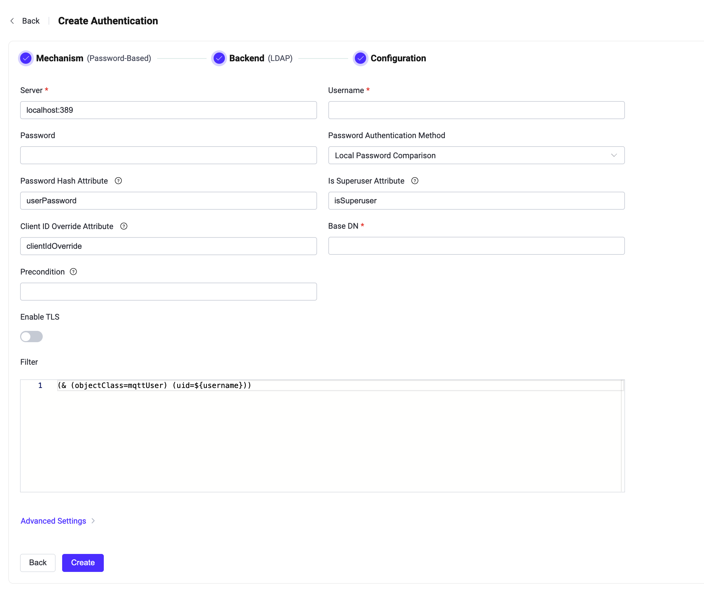

# Integrate with LDAP

[Lightweight Directory Access Protocol (LDAP)](https://ldap.com/) is a protocol used to access and manage directory information. EMQX supports integrating with an LDAP server for password authentication. This integration enables users to use their LDAP credentials for authentication in EMQX.

::: tip Prerequisite

Knowledge about [basic EMQX authentication concepts](../authn/authn.md)

:::

## Password Authentication Methods

EMQX's LDAP integration includes two distinct authentication methods:
- **LDAP Bind Authentication**

  EMQX directly uses LDAP binding to authenticate usernames and passwords. When a client connects, EMQX receives the provided username and password, then constructs a Distinguished Name (DN) using the configured `base_dn` and `filter`. It then attempts to bind (log in) to the LDAP server as the client using these credentials. If the bind operation succeeds, the authentication is accepted; otherwise, the connection is rejected.

  This method relies solely on the existing LDAP user entries and does not require EMQX to retrieve or process any sensitive data like password hashes. It is simple to set up and does not require modifying the LDAP schema.

  This approach is suitable for situations where:

  - User accounts already exist in the LDAP server.
  - The LDAP schema cannot be changed or extended.
  - You prefer minimal setup, and the LDAP server handles authentication directly.

- **Local Password Comparison**

  EMQX connects to the LDAP server using the bind account specified by the `username` and `password` configuration options (i.e., the bind DN). It then locates the client’s LDAP entry and retrieves the stored password (usually in a hashed format) from a specific attribute. The provided client password is then compared with the retrieved hash locally within EMQX.

  This method provides greater flexibility and control over the authentication process. It supports various password hash algorithms, allows retrieval of additional user attributes, and can be integrated with custom authentication logic or security policies.

  This approach is suitable for situations where:

  - You need to store or process custom authentication attributes (e.g., `isSuperuser`, ACL rules).
  - You have permission to configure schemas and data on the LDAP server.
  - More advanced security or validation logic is required beyond simple LDAP binding.

In both methods, EMQX can retrieve additional attributes such as the `isSuperuser` flag or ACL rules from the LDAP entry, using the `base_dn` and `filter` configuration. These attributes can be used to determine administrative permissions or enforce fine-grained access control. For detailed information, see [Retrieve ACL Rules from LDAP](#retrieve-acl-rules-from-ldap).

## LDAP Data Schema and Query

::: tip

This section applies to the "Local Password Comparison" authentication method. If you are using the "LDAP Bind Authentication" method, you can bypass this section.

:::

This section describes how to configure LDAP schema, create LDAP credentials, and store the credentials for password authentication.

An LDAP schema defines the structure and rules for organizing and storing authentication data within an LDAP directory. The LDAP authenticator supports almost all LDAP schema. Here is an example schema for OpenLDAP:

```sql

attributetype ( 1.3.6.1.4.1.11.2.53.2.2.3.1.2.3.1.4 NAME 'isSuperuser'
	EQUALITY booleanMatch
	SYNTAX 1.3.6.1.4.1.1466.115.121.1.7
	SINGLE-VALUE
	USAGE userApplications )


objectclass ( 1.3.6.1.4.1.11.2.53.2.2.3.1.2.3.4 NAME 'mqttUser'
	SUP top
	STRUCTURAL
	MAY ( isSuperuser )
    MUST ( uid $ userPassword ) )

```
The given schema example defines an attribute named `isSuperuser` to indicate whether a user is a superuser. It also defines an object class named `mqttUser` which is used to represent the user and the object class must include the `userPassword` attribute.

To create LDAP credentials, users need to define some necessary attribute names, the distinguished name (dn) of the base object, and a filter for the LDAP query.

Below are some sample LDAP credentials specified in [LDAP Data Interchange Format (LDIF)](https://ldap.com/ldif-the-ldap-data-interchange-format/) based on the given schema for OpenLDAP:

```sql

## create organization: emqx.io
dn:dc=emqx,dc=io
objectclass: top
objectclass: dcobject
objectclass: organization
dc:emqx
o:emqx,Inc.

## create organization unit: testdevice.emqx.io
dn:ou=testdevice,dc=emqx,dc=io
objectClass: top
objectclass:organizationalUnit
ou:testdevice

## create user=mqttuser0001,
#         password=mqttuser0001,
#         passhash={SHA}mlb3fat40MKBTXUVZwCKmL73R/0=
#         base64passhash=e1NIQX1tbGIzZmF0NDBNS0JUWFVWWndDS21MNzNSLzA9
dn:uid=mqttuser0001,ou=testdevice,dc=emqx,dc=io
objectClass: top
objectClass: mqttUser
uid: mqttuser0001
userPassword:: e1NIQX1tbGIzZmF0NDBNS0JUWFVWWndDS21MNzNSLzA9

## create user=mqttuser0002
#         password=mqttuser0002,
#         passhash={SSHA}n9XdtoG4Q/TQ3TQF4Y+khJbMBH4qXj4M
#         base64passhash=e1NTSEF9bjlYZHRvRzRRL1RRM1RRRjRZK2toSmJNQkg0cVhqNE0=
dn:uid=mqttuser0002,ou=testdevice,dc=emqx,dc=io
objectClass: top
objectClass: mqttUser
uid: mqttuser0002
userPassword:: e1NTSEF9bjlYZHRvRzRRL1RRM1RRRjRZK2toSmJNQkg0cVhqNE0=

## create a superuser mqttuser0003
#         password=mqttuser0003,
#         passhash={MD5}ybsPGoaK3nDyiQvveiCOIw==
#         base64passhash=e01ENX15YnNQR29hSzNuRHlpUXZ2ZWlDT0l3PT0=
dn:uid=mqttuser0003,ou=testdevice,dc=emqx,dc=io
objectClass: top
objectClass: mqttUser
uid: mqttuser0003
isSuperuser: TRUE
userPassword:: e01ENX15YnNQR29hSzNuRHlpUXZ2ZWlDT0l3PT0=

```

Edit the LDAP configuration file `slapd.conf` to include the schema and LDIF file so that they will be loaded when the LDAP server is started. Below is an example `slapd.conf` file:

::: tip

You can determine how to store LDAP credentials and access them based on your business needs.

:::

```sh
include         /usr/local/etc/openldap/schema/core.schema
include         /usr/local/etc/openldap/schema/cosine.schema
include         /usr/local/etc/openldap/schema/inetorgperson.schema
include         /usr/local/etc/openldap/schema/emqx.schema

TLSCACertificateFile  /usr/local/etc/openldap/cacert.pem
TLSCertificateFile    /usr/local/etc/openldap/cert.pem
TLSCertificateKeyFile /usr/local/etc/openldap/key.pem

database mdb
suffix "dc=emqx,dc=io"
rootdn "cn=root,dc=emqx,dc=io"
rootpw {SSHA}eoF7NhNrejVYYyGHqnt+MdKNBh4r1w3W

directory       /usr/local/etc/openldap/data
```

## Configure LDAP Authentication via Dashboard

You can configure how to use LDAP for password authentication in the EMQX Dashboard.

1. In the EMQX Dashboard, click **Access Control** -> **Authentication** from the left navigation menu.
2. On the **Authentication** page, click **Create** in the top right corner.
3. Click to select **Password-Based** as **Mechanism**, and **LDAP** as **Backend** to go to the **Configuration** tab, as shown below.



4. Follow the instructions below for the configuration:

   - Enter the information needed to connect to the LDAP server.

     - **Server**: Specify the server address that EMQX connects to (`host:port`).
     - **Username**: Specifies the account name EMQX uses to bind to the LDAP server (i.e., the bind DN), for example: `cn=root,dc=emqx,dc=io`. This account must have permission to read user entries and is typically the same as the `rootdn` defined in the LDAP configuration file (e.g., `slapd.conf`).
     - **Password**: The plaintext password corresponding to the above username, used to complete the bind operation. This value should match the actual password of the `rootpw` defined in the LDAP configuration.

   - **Authentication configuration**: Fill in the authentication-related settings.

     - **Password Authentication Method**: Select the authentication method: `LDAP Bind Authentication` (default) or `Local Password Comparison`.

     - **Bind Password**: Specifies the password that EMQX uses to authenticate itself to the LDAP server before it can perform any operations or queries. It is referenced through a placeholder `${password}` that will be resolved at runtime with the actual password defined in the configuration option **Password**.

     - **Base DN**: Specifies the starting point (i.e., base DN) for LDAP search operations. EMQX begins searching for user entries that match the configured filter from this DN. Placeholders such as `${username}` are supported for dynamically constructing the client identity. For more information, see, see [RFC 4511 Search Request](https://datatracker.ietf.org/doc/html/rfc4511#section-4.5.1).

       ::: tip

       DN refers to Distinguished Name. This is a unique identifier of each object entry and it also describes the location of the entry within the information tree.

       :::

     - **Password Hash Attribute**: Specifies the attribute representing the user's password, applicable when `Local Password Comparison` is selected as the authentication method. The value of this attribute should follow [RFC 3112](#https://datatracker.ietf.org/doc/html/rfc3112), the supported algorithms are `md5`,  `sha`, `sha256`, `sha384`, `sha512`, and `ssha`.

     - **Is Superuser Attribute**: Identifies the attribute that indicates whether a user is a superuser, applicable when `Local Password Comparison` is selected as the authentication method.  The value of this attribute should be in boolean, if absent is equal to `false`.
   
   - **Precondition**: A [Variform expression](../../configuration/configuration.md#variform-expressions) used to control whether this LDAP authenticator should be applied to a client connection. The expression is evaluated against attributes from the client (such as `username`, `clientid`, `listener`, etc.). The authenticator will only be invoked if the expression evaluates to the string `"true"`. Otherwise, it will be skipped. For more information about the precondition, see [Authentication Preconditions](./authn.md#authentication-preconditions).
   
   - **Enable TLS**: Turn on the toggle switch if you want to enable TLS. For more information on enabling TLS, see [Network and TLS](../../network/overview.md).
   
   - **Filter**: Defines the criteria for the LDAP query. The filter sets conditions that an entry must meet to be considered a match.
     The syntax of the filter follows [RFC 4515](#https://www.rfc-editor.org/rfc/rfc4515) and also supports placeholders.
   
   - **Advanced Settings**: Set the concurrent connections and waiting time before a connection is timed out.
     - **Connection Pool size** (optional): Input an integer value to define the number of concurrent connections from an EMQX node to LDAP. Default: `8`.
     - **Query Timeout** (optional): Specify the waiting period before EMQX assumes the query is timed out. Default: `5` seconds.
   
5. After you finish the settings, click **Create**.

## Configure LDAP Authentication via Configuration Items

You can configure the EMQX LDAP authenticator with EMQX configuration items.<!--插入超链接-->

LDAP authentication is identified with `mechanism = password_based` and `backend = ldap`.

Below is a sample configuration for the **Local Password Comparison** method:

```bash
{
  backend = "ldap"
  mechanism = "password_based"
  method {
    type = hash
    password_attribute = "userPassword"
    is_superuser_attribute = "isSuperuser"
  }
  server = "127.0.0.1:389"
  query_timeout = "5s"
  username = "root"
  password = "root password"
  pool_size = 8
  base_dn = "uid=${username},ou=testdevice,dc=emqx,dc=io"
  filter = "(objectClass=mqttUser)"
}
```

Below is a sample configuration for the **LDAP Bind Authentication** method:

```bash
{
  backend = "ldap"
  mechanism = "password_based"
  method {
    type = bind
    bind_password = "${password}"
  }
  server = "127.0.0.1:389"
  query_timeout = "5s"
  username = "root"
  password = "root password"
  pool_size = 8
  base_dn = "uid=${username},ou=testdevice,dc=emqx,dc=io"
  filter = "(objectClass=mqttUser)"
}
```

## Retrieve ACL Rules from LDAP

In addition to authenticating clients, EMQX can also retrieve per-user ACL (Access Control List) rules from the same LDAP entry used during authentication. This allows both authentication and authorization to be managed centrally via LDAP.

During the authentication process, EMQX uses the configured `base_dn` and `filter` to locate the user’s LDAP entry. If ACL-related attributes are found, EMQX retrieves them and caches the result in the client’s session. These rules are then used to perform authorization checks (such as publish/subscribe permissions) without requiring repeated LDAP queries.

### Supported ACL Attributes

To enable the feature of retrieving ACL rules from LDAP, you need to define any the following attributes in the LDAP schema:

- **`mqttPublishTopic`**: Whitelist of topics the client is allowed to publish to.
- **`mqttSubscriptionTopic`**: Whitelist of topics the client is allowed to subscribe to.
- **`mqttPubSubTopic`**: Topics the client is allowed to both publish and subscribe to.
- **`mqttAclRule`**: Fine-grained ACL rules defined in JSON format, allowing detailed control over actions (e.g., publish or subscribe), permissions (allow or deny), and topic filters.
- **`mqttAclTtl`**: Optional attribute specifying how long the ACL rules remain valid (time-to-live) in the client session.

The attribute names shown above are just examples. You can customize them in the LDAP authenticator configuration using the appropriate fields.

The behavior and meaning of these attributes are the same as those defined in the [LDAP authorizer](../authz/ldap.md), except for `mqttAclTtl`, which is unique to the LDAP authenticator. This attribute allows you to control how long the fetched ACL rules are cached in the client's session. Its value can be a numeric string in seconds (e.g., `60`) or a duration with supported time units like `1s`, `15m`, `1h`, or `1d`.

After the specified TTL expires, EMQX will no longer use the cached rules and will fall back to default authorization settings, unless new rules are retrieved in a subsequent authentication or session.

### Example LDAP Schema

The example schema below defines the attributes for ACL rules:

```
attributetype ( 1.3.6.1.4.1.11.2.53.2.2.3.1.2.3.1.4 NAME 'isSuperuser'
	EQUALITY booleanMatch
	SYNTAX 1.3.6.1.4.1.1466.115.121.1.7
	SINGLE-VALUE
	USAGE userApplications )
attributetype ( 1.3.6.1.4.1.11.2.53.2.2.3.1.2.3.4.1 NAME ( 'mqttPublishTopic' 'mpt' )
	EQUALITY caseExactMatch
	SUBSTR caseExactSubstringsMatch
	SYNTAX 1.3.6.1.4.1.1466.115.121.1.15
	USAGE userApplications )
attributetype ( 1.3.6.1.4.1.11.2.53.2.2.3.1.2.3.4.2 NAME ( 'mqttSubscriptionTopic' 'mst' )
	EQUALITY caseExactMatch
	SUBSTR caseExactSubstringsMatch
	SYNTAX 1.3.6.1.4.1.1466.115.121.1.15
	USAGE userApplications )
attributetype ( 1.3.6.1.4.1.11.2.53.2.2.3.1.2.3.4.3 NAME ( 'mqttPubSubTopic' 'mpst' )
	EQUALITY caseExactMatch
	SUBSTR caseExactSubstringsMatch
	SYNTAX 1.3.6.1.4.1.1466.115.121.1.15
	USAGE userApplications )
attributetype ( 1.3.6.1.4.1.11.2.53.2.2.3.1.2.3.4.4 NAME ( 'mqttAclRule' 'mar' )
	EQUALITY caseExactMatch
	SUBSTR caseExactSubstringsMatch
	SYNTAX 1.3.6.1.4.1.1466.115.121.1.15
	USAGE userApplications )
attributetype ( 1.3.6.1.4.1.11.2.53.2.2.3.1.2.3.4.5 NAME ( 'mqttAclTtl' 'mat' )
	EQUALITY caseExactMatch
	SUBSTR caseExactSubstringsMatch
	SYNTAX 1.3.6.1.4.1.1466.115.121.1.15
	USAGE userApplications )
objectclass ( 1.3.6.1.4.1.11.2.53.2.2.3.1.2.3.4 NAME 'mqttUser'
	SUP top
	STRUCTURAL
	MAY ( isSuperuser $ mqttPublishTopic $ mqttSubscriptionTopic $ mqttPubSubTopic $ mqttAclRule $ mqttAclTtl )
  MUST ( uid $ userPassword ))
```

### Example LDIF Entry with ACL Attributes

Below is an example of LDAP authentication data specified in [LDAP Data Interchange Format (LDIF)](https://ldap.com/ldif-the-ldap-data-interchange-format/) based on the given schema for OpenLDAP:

```sql
dn:dc=emqx,dc=io
objectclass: top
objectclass: dcobject
objectclass: organization
dc:emqx
o:emqx,Inc.

# create testdevice.emqx.io
dn:ou=testdevice,dc=emqx,dc=io
objectClass: top
objectclass:organizationalUnit
ou:testdevice

## create user=mqttuser0002
#         password=mqttuser0002,
#         passhash={SSHA}n9XdtoG4Q/TQ3TQF4Y+khJbMBH4qXj4M
#         base64passhash=e1NTSEF9bjlYZHRvRzRRL1RRM1RRRjRZK2toSmJNQkg0cVhqNE0=
dn:uid=mqttuser0002,ou=testdevice,dc=emqx,dc=io
objectClass: top
objectClass: mqttUser
objectClass: mqttDevice
objectClass: mqttSecurity
uid: mqttuser0002
isEnabled: TRUE
mqttAccountName: user2
mqttPublishTopic: mqttuser0002/pub/1
mqttPublishTopic: mqttuser0002/pub/+
mqttPublishTopic: mqttuser0002/pub/#
mqttSubscriptionTopic: mqttuser0002/sub/1
mqttSubscriptionTopic: mqttuser0002/sub/+
mqttSubscriptionTopic: mqttuser0002/sub/#
mqttPubSubTopic: mqttuser0002/pubsub/1
mqttPubSubTopic: mqttuser0002/pubsub/+
mqttPubSubTopic: mqttuser0002/pubsub/#
mqttAclRule: [{"permission": "allow", "action": "pub", "topic": "mqttuser0002/complexrule1/1"}]
mqttAclRule: {"permission": "allow", "action": "pub", "topic": "mqttuser0002/complexrule2/#"}
mqttAclTtl: 1s
userPassword:: e1NTSEF9bjlYZHRvRzRRL1RRM1RRRjRZK2toSmJNQkg0cVhqNE0=
```

### LDAP Authenticator Configuration Example

To enable ACL rule retrieval and caching, you need to **explicitly** configure the attribute names in the LDAP authenticator configuration:

```bash
{
  backend = "ldap"
  mechanism = "password_based"
  method {
    type = hash
    password_attribute = "userPassword"
    is_superuser_attribute = "isSuperuser"
  }
  server = "127.0.0.1:389"
  query_timeout = "5s"
  username = "root"
  password = "root password"
  pool_size = 8
  base_dn = "uid=${username},ou=testdevice,dc=emqx,dc=io"
  filter = "(objectClass=mqttUser)"
  publish_attribute = "mqttPublishTopic"
  subscribe_attribute = "mqttSubscriptionTopic"
  all_attribute = "mqttPubSubTopic"
  acl_attribute = "mqttAclRule"
  acl_ttl_attribute = "mqttAclTtl"
}
```


