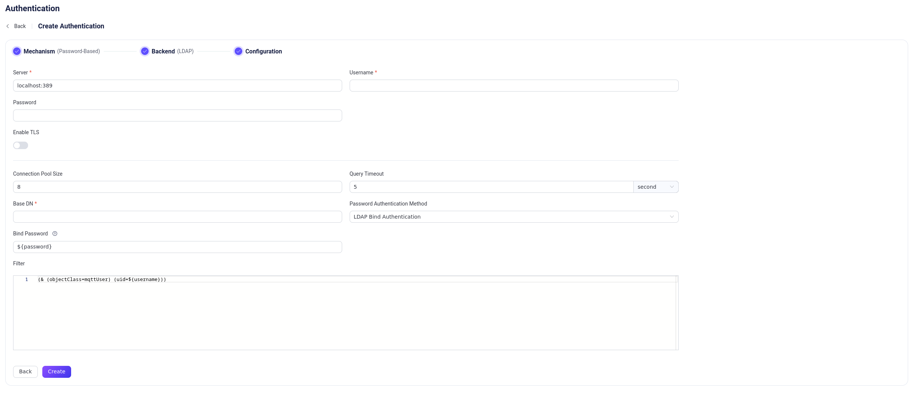

# Integrate with LDAP

::: tip Note

LDAP integration for authentication is available in EMQX Enterprise.

:::

[Lightweight Directory Access Protocol (LDAP)](https://ldap.com/) is a protocol used to access and manage directory information. EMQX supports integrating with an LDAP server for password authentication. This integration enables users to use their LDAP credentials for authentication in EMQX.

::: tip Prerequisite

Knowledge about [basic EMQX authentication concepts](../authn/authn.md)

:::

## Password Authentication Methods

EMQX's LDAP integration includes two distinct authentication methods:
- **Local Password Comparison**

   EMQX queries LDAP to retrieve the client's password and then compares the retrieved password with the password information stored locally in EMQX. This method allows EMQX to have greater flexibility and capability when performing LDAP user authentication, supporting more complex validation logic and security strategies, and handling additional user attributes. For example, EMQX can retrieve the user's `isSuperUser` flag while querying the user's password, which means EMQX can determine whether the user has superuser privileges while authenticating, thereby providing different levels of access and operational capabilities based on the user's permission level. However, this approach requires users to have the necessary permissions to configure schemas and data on the LDAP server.
   
- **LDAP Bind Authentication**

  EMQX directly uses LDAP binding to authenticate usernames and passwords. This method provides basic authentication solely through the LDAP `BIND` operation, involving only the use of existing usernames and passwords, without engaging in complex queries or data processing. Therefore, this approach is suitable for situations where users already have account data on the LDAP server or lack the permissions to add or modify data.

## LDAP Data Schema and Query

::: tip

This section applies to the "Local Password Comparison" authentication method. If you are using the "LDAP Bind Authentication" method, you can bypass this section.

:::

This section describes how to configure LDAP schema, create LDAP credentials, and store the credentials for password authentication.

An LDAP schema defines the structure and rules for organizing and storing authentication data within an LDAP directory. The LDAP authenticator supports almost all LDAP schema. Here is an example schema for OpenLDAP:

```sql

attributetype ( 1.3.6.1.4.1.11.2.53.2.2.3.1.2.3.1.4 NAME 'isSuperuser'
	EQUALITY booleanMatch
	SYNTAX 1.3.6.1.4.1.1466.115.121.1.7
	SINGLE-VALUE
	USAGE userApplications )

objectclass ( 1.3.6.1.4.1.11.2.53.2.2.3.1.2.3.4 NAME 'mqttUser'
	SUP top
	STRUCTURAL
	MAY ( isSuperuser )
    MUST ( uid $ userPassword ) )

```
The given schema example defines an attribute named `isSuperuser` to indicate whether a user is a superuser. It also defines an object class named `mqttUser` which is used to represent the user and the object class must include the `userPassword` attribute.

To create LDAP credentials, users need to define some necessary attribute names, the distinguished name (dn) of the base object, and a filter for the LDAP query.

Below are some sample LDAP credentials specified in [LDAP Data Interchange Format (LDIF)](https://ldap.com/ldif-the-ldap-data-interchange-format/) based on the given schema for OpenLDAP:

```sql

## create organization: emqx.io
dn:dc=emqx,dc=io
objectclass: top
objectclass: dcobject
objectclass: organization
dc:emqx
o:emqx,Inc.

## create organization unit: testdevice.emqx.io
dn:ou=testdevice,dc=emqx,dc=io
objectClass: top
objectclass:organizationalUnit
ou:testdevice

## create user=mqttuser0001,
#         password=mqttuser0001,
#         passhash={SHA}mlb3fat40MKBTXUVZwCKmL73R/0=
#         base64passhash=e1NIQX1tbGIzZmF0NDBNS0JUWFVWWndDS21MNzNSLzA9
dn:uid=mqttuser0001,ou=testdevice,dc=emqx,dc=io
objectClass: top
objectClass: mqttUser
uid: mqttuser0001
userPassword:: e1NIQX1tbGIzZmF0NDBNS0JUWFVWWndDS21MNzNSLzA9

## create user=mqttuser0002
#         password=mqttuser0002,
#         passhash={SSHA}n9XdtoG4Q/TQ3TQF4Y+khJbMBH4qXj4M
#         base64passhash=e1NTSEF9bjlYZHRvRzRRL1RRM1RRRjRZK2toSmJNQkg0cVhqNE0=
dn:uid=mqttuser0002,ou=testdevice,dc=emqx,dc=io
objectClass: top
objectClass: mqttUser
uid: mqttuser0002
userPassword:: e1NTSEF9bjlYZHRvRzRRL1RRM1RRRjRZK2toSmJNQkg0cVhqNE0=

## create a superuser mqttuser0003
#         password=mqttuser0003,
#         passhash={MD5}ybsPGoaK3nDyiQvveiCOIw==
#         base64passhash=e01ENX15YnNQR29hSzNuRHlpUXZ2ZWlDT0l3PT0=
dn:uid=mqttuser0003,ou=testdevice,dc=emqx,dc=io
objectClass: top
objectClass: mqttUser
uid: mqttuser0003
isSuperuser: TRUE
userPassword:: e01ENX15YnNQR29hSzNuRHlpUXZ2ZWlDT0l3PT0=

```

Edit the LDAP configuration file `sladp.conf` to include the schema and LDIF file so that they will be loaded when the LDAP server is started. Below is an example `sladp.conf` file:

::: tip

You can determine how to store LDAP credentials and access them based on your business needs.

:::

```sh
include         /usr/local/etc/openldap/schema/core.schema
include         /usr/local/etc/openldap/schema/cosine.schema
include         /usr/local/etc/openldap/schema/inetorgperson.schema
include         /usr/local/etc/openldap/schema/emqx.schema

TLSCACertificateFile  /usr/local/etc/openldap/cacert.pem
TLSCertificateFile    /usr/local/etc/openldap/cert.pem
TLSCertificateKeyFile /usr/local/etc/openldap/key.pem

database mdb
suffix "dc=emqx,dc=io"
rootdn "cn=root,dc=emqx,dc=io"
rootpw {SSHA}eoF7NhNrejVYYyGHqnt+MdKNBh4r1w3W

directory       /usr/local/etc/openldap/data
```

## Configure LDAP Authentication via Dashboard

You can configure how to use LDAP for password authentication in the EMQX Dashboard.

Go to EMQX Dashboard, and click **Access Control** -> **Authentication** on the left navigation menu to enter the **Authentication** page. Click **Create** at the top right corner, then click to select **Password-Based** as **Mechanism**, and **LDAP** as **Backend**, this will lead us to the **Configuration** tab, as shown below.



Follow the instructions below for the configuration:

**Connect**: Fill in the information needed to connect to the LDAP server.

- **Server**: Specify the server address that EMQX is to connect (`host:port`).
- **Username**: Specify the LDAP root user name.
- **Password**: Specify the LDAP root user password.

**TLS Configuration**: Turn on the toggle switch if you want to enable TLS. For more information on enabling TLS, see [Network and TLS](../../network/overview.md).

**Connection Configuration**: Set the concurrent connections and waiting time before a connection is timed out.

- **Connection Pool size** (optional): Input an integer value to define the number of concurrent connections from an EMQX node to LDAP. Default: `8`.
- **Query Timeout** (optional): Specify the waiting period before EMQX assumes the query is timed out. Units supported include milliseconds, second, minute, and hour.

**Authentication configuration**: Fill in the authentication-related settings.

- **Base DN**: The name of the base object entry (or possibly the root) relative to which the search is to be performed. For more information, see [RFC 4511 Search Request](https://datatracker.ietf.org/doc/html/rfc4511#section-4.5.1), the placeholders are supported.

  ::: tip

  DN refers to Distinguished Name. This is a unique identifier of each object entry and it also describes the location of the entry within the information tree.

  :::

- **Password Authentication Method**: Select the authentication method: `LDAP Bind Authentication` (default) or `Local Password Comparison`.

- **Bind Password**: Specifies the password that EMQX uses to authenticate itself to the LDAP server before it can perform any operations or queries. It is referenced through a placeholder `${password}` that will be resolved at runtime with the actual password defined in the configuration option **Password**.

- **Password Hash Attribute**: Specifies the attribute representing the user's password, applicable when `Local Password Comparison` is selected as the authentication method. The value of this attribute should follow [RFC 3112](#https://datatracker.ietf.org/doc/html/rfc3112), the supported algorithm is `md5` `sha` `sha256` `sha384` `sha512` and `ssha`.

- **Is Superuser Attribute**: Identifies the attribute that indicates whether a user is a superuser, applicable when `Local Password Comparison` is selected as the authentication method.  The value of this attribute should be in boolean, if absent is equal to `false`.

- **Filter**: Defines the criteria for the LDAP query. The filter sets conditions that an entry must meet to be considered a match.
  The syntax of the filter follows [RFC 4515](#https://www.rfc-editor.org/rfc/rfc4515) and also supports placeholders.

After you finish the settings, click **Create**.

## Configure LDAP Authentication via Configuration Items

You can configure the EMQX LDAP authenticator with EMQX configuration items.<!--插入超链接-->

LDAP authentication is identified with `mechanism = password_based` and `backend = ldap`.

Below is a sample configuration for the **Local Password Comparison** method:

```bash
{
  backend = "ldap"
  mechanism = "password_based"
  method {
    type = hash
    password_attribute = "userPassword"
    is_superuser_attribute = "isSuperuser"
  }
  server = "127.0.0.1:389"
  query_timeout = "5s"
  username = "root"
  password = "root password"
  pool_size = 8
  base_dn = "uid=${username},ou=testdevice,dc=emqx,dc=io"
  filter = "(objectClass=mqttUser)"
}
```

Below is a sample configuration for the **LDAP Bind Authentication** method:

```bash
{
  backend = "ldap"
  mechanism = "password_based"
  method {
    type = bind
    bind_password = "${password}"
  }
  server = "127.0.0.1:389"
  query_timeout = "5s"
  username = "root"
  password = "root password"
  pool_size = 8
  base_dn = "uid=${username},ou=testdevice,dc=emqx,dc=io"
  filter = "(objectClass=mqttUser)"
}
```

