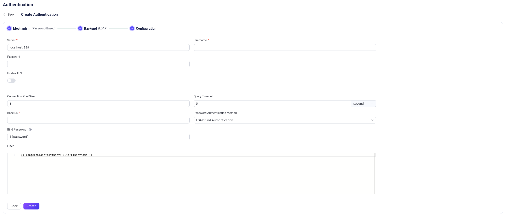

# Integration via LDAP Bind Operation

[Lightweight Directory Access Protocol (LDAP)](https://ldap.com/) is a protocol used to access and manage directory information. EMQX supports integrating with an LDAP server for password authentication by the `bind` operation. This integration enables users to use their LDAP credentials for authentication in EMQX.

For the `bind` operation, see [here](https://datatracker.ietf.org/doc/html/rfc4511#section-4.2) for details.

::: tip Prerequisite

- Knowledge about [basic EMQX authentication concepts](../authn/authn.md)

:::

## Data Schema and Query

The `bind` operation is a part of the LDAP specification, hence there is no need to prepare any schema for data definition. Here is an OpenLDAP schema for example to show this feature:

```sql

objectclass ( 1.3.6.1.4.1.11.2.53.2.2.3.1.2.3.4 NAME 'mqttUser'
	SUP top
	STRUCTURAL
	MAY ( isSuperuser )
    MUST ( uid $ userPassword ) )

```
The given schema example defines an object class named `mqttUser` which is used to represent the user and the object class must include the `userPassword` attribute which is required for the `bind` operation.

To create LDAP credentials, users need to define some necessary attribute names, the distinguished name (dn) of the base object, and a filter for the LDAP query.

Below are some sample LDAP credentials specified in [LDAP Data Interchange Format (LDIF)](https://ldap.com/ldif-the-ldap-data-interchange-format/) based on the given schema for OpenLDAP:

```sql

## create organization: emqx.io
dn:dc=emqx,dc=io
objectclass: top
objectclass: dcobject
objectclass: organization
dc:emqx
o:emqx,Inc.

## create organization unit: testdevice.emqx.io
dn:ou=testdevice,dc=emqx,dc=io
objectClass: top
objectclass:organizationalUnit
ou:testdevice

## create user=mqttuser0001,
#         password=mqttuser0001,
#         passhash={SHA}mlb3fat40MKBTXUVZwCKmL73R/0=
#         base64passhash=e1NIQX1tbGIzZmF0NDBNS0JUWFVWWndDS21MNzNSLzA9
dn:uid=mqttuser0001,ou=testdevice,dc=emqx,dc=io
objectClass: top
objectClass: mqttUser
uid: mqttuser0001
userPassword:: e1NIQX1tbGIzZmF0NDBNS0JUWFVWWndDS21MNzNSLzA9

## create user=mqttuser0002
#         password=mqttuser0002,
#         passhash={SSHA}n9XdtoG4Q/TQ3TQF4Y+khJbMBH4qXj4M
#         base64passhash=e1NTSEF9bjlYZHRvRzRRL1RRM1RRRjRZK2toSmJNQkg0cVhqNE0=
dn:uid=mqttuser0002,ou=testdevice,dc=emqx,dc=io
objectClass: top
objectClass: mqttUser
uid: mqttuser0002
userPassword:: e1NTSEF9bjlYZHRvRzRRL1RRM1RRRjRZK2toSmJNQkg0cVhqNE0=

```

Edit the LDAP configuration file `sladp.conf` to include the schema and LDIF file so that they will be loaded when the LDAP server is started. Below is an example `sladp.conf` file:

::: tip

You can determine how to store LDAP credentials and access them based on your business needs.

:::

```sh
include         /usr/local/etc/openldap/schema/core.schema
include         /usr/local/etc/openldap/schema/cosine.schema
include         /usr/local/etc/openldap/schema/inetorgperson.schema
include         /usr/local/etc/openldap/schema/emqx.schema

TLSCACertificateFile  /usr/local/etc/openldap/cacert.pem
TLSCertificateFile    /usr/local/etc/openldap/cert.pem
TLSCertificateKeyFile /usr/local/etc/openldap/key.pem

database mdb
suffix "dc=emqx,dc=io"
rootdn "cn=root,dc=emqx,dc=io"
rootpw {SSHA}eoF7NhNrejVYYyGHqnt+MdKNBh4r1w3W

directory       /usr/local/etc/openldap/data
```

## Configure with Dashboard

You can use EMQX Dashboard to configure how to use LDAP-Bind for password authentication.

On [EMQX Dashboard](http://127.0.0.1:18083/#/authentication), click **Access Control** -> **Authentication** on the left navigation menu to enter the **Authentication** page. Click **Create** at the top right corner, then click to select **Password-Based** as **Mechanism**, and **LDAP Bind** as **Backend**, this will lead us to the **Configuration** tab, as shown below.



Follow the instruction below on how to configure:

**Connect**: Fill in the information needed to connect to the LDAP server.

- **Server**: Specify the server address that EMQX is to connect (`host:port`).
- **Username**: Specify the LDAP root user name.
- **Password**: Specify the LDAP root user password.

**TLS Configuration**: Turn on the toggle switch if you want to enable TLS. For more information on enabling TLS, see [Network and TLS](../../network/overview.md).

**Connection Configuration**: Set the concurrent connections and waiting time before a connection is timed out.

- **Pool size** (optional): Input an integer value to define the number of concurrent connections from an EMQX node to LDAP. Default: `8`.
- **Query Timeout** (optional): Specify the waiting period before EMQX assumes the query is timed out. Units supported include milliseconds, second, minute, and hour.

**Authentication configuration**: Fill in the authentication-related settings:

- **Base DN**: The name of the base object entry (or possibly the root) relative to which the search is to be performed. For more information, see [RFC 4511 Search Request](https://datatracker.ietf.org/doc/html/rfc4511#section-4.5.1), the placeholders are supported.

  ::: tip

  DN refers to Distinguished Name. This is a unique identifier of each object entry and it also describes the location of the entry within the information tree.

  :::

- **Filter**: Filter for the LDAP query, defines the conditions that must be fulfilled in order for the search to match a given entry.
  The syntax of the filter follows [RFC 4515](#https://www.rfc-editor.org/rfc/rfc4515) and also supports placeholders.

After you finish the settings, click **Create**.

## Configure with Configuration Items

You can configure the EMQX LDAP-Bind authenticator with EMQX configuration items.

LDAP-Bind authentication is identified with `mechanism = password_based` and `backend = ldap_bind`.

Sample configuration:

```bash
{
  backend = "ldap_bind"
  mechanism = "password_based"
  server = "127.0.0.1:389"
  query_timeout = "5s"
  username = "root"
  password = "root password"
  pool_size = 8
  base_dn = "ou=testdevice,dc=emqx,dc=io"
  filter = "(uid=${username})"
}
```
