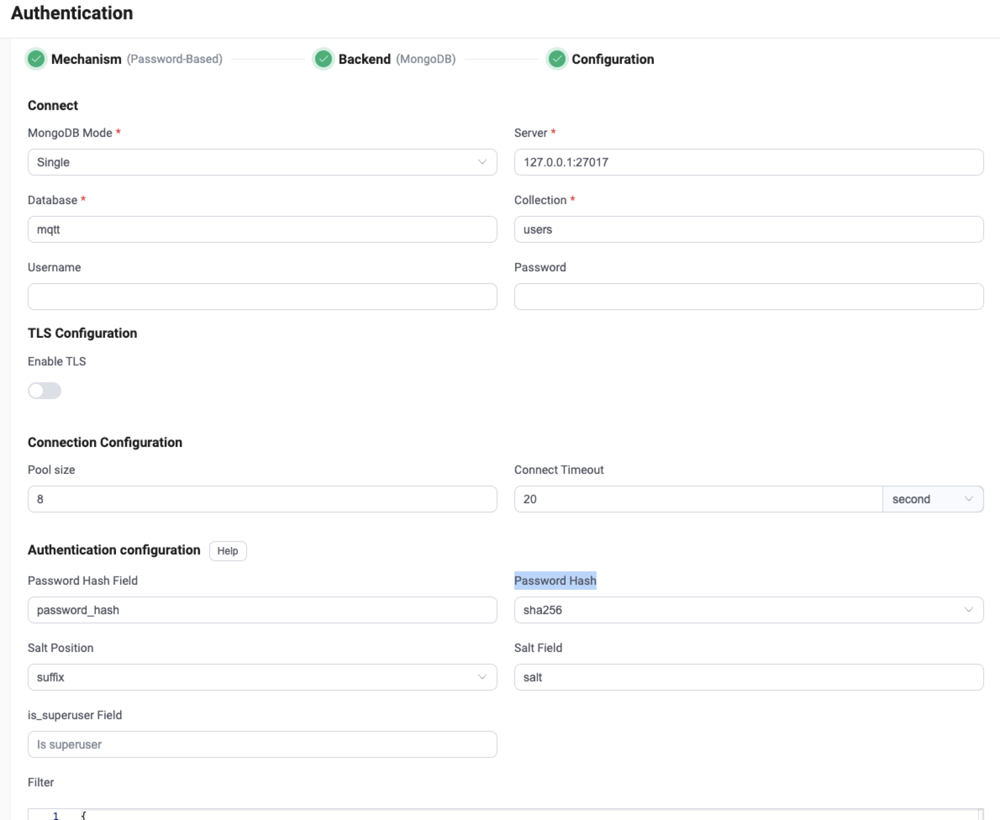

# Integrate with MongoDB

EMQX supports integrating with MongoDB for password authentication. EMQX MongoDB authenticator currently supports connecting to MongoDB running in three different modes, which are Single, [Replica Set](https://www.mongodb.com/docs/manual/reference/replica-configuration/) and [Sharding](https://www.mongodb.com/docs/manual/sharding/). This page gives detailed instructions on the data schema supported and on how to configure with EMQX Dashboard and configuration file. 

::: tip

Knowledge about [basic EMQX authentication concepts](../authn/authn.md)

:::

## Data Schema and Query Statement

EMQX MongoDB authenticator supports storing authentication data as MongoDB documents. Users need to provide a query statement template and ensure the following fields are included:

- `password_hash`: required; password (in plain text or hashed) stored in the database; this field supports renaming;
- `salt`: optional; `salt = ""` or just remove this field to indicate no salt value will be added; this field supports renaming;
- `is_superuser`: optional; flag if the current client is a superuser; default: `false`; this field supports renaming.

For example, if we want to add a document for a superuser (`is_superuser`: `true`) with username `user123`, password `secret`, suffixed salt `slat_foo123`, and password hash `sha256`, the query statement should be:

```
> db.mqtt_user.insertOne(
  {
      "username": "emqx_u",
      "salt": "slat_foo123",
      "is_superuser": true,
      "password_hash": "44edc2d57cde8d79c98145003e105b90a14f1460b79186ea9cfe83942fc5abb5"
  }
);
{
  "acknowledged" : true,
  "insertedId" : ObjectId("631989e20a33e26b05b15abe")
}
```

:::tip 

When there is a significant number of users in the system, please optimize and index the tables to be queried beforehand to shorten the query response time and reduce the load for EMQX.

 :::

For this MongoDB data schema, the corresponding Dashboard configuration parameters are: 

- **Password Hash**: `sha256`
- **Salt Position**: `suffix`
- **Collection**: `mqtt_user`
- **Filter**: `{ username = "${username}" }`
- **Password Hash field**: `password_hash`
- **Salt Field**: `salt`
- **is_superuser Field**： `is_superuser`

## Configure with Dashboard

You can use EMQX Dashboard to configure how to use MongoDB for password authentication. 

In the EMQX Dashboard, click **Access Control** -> **Authentication** from the left navigation menu. On the **Authentication** page, click **Create** at the top right corner. Click to select **Password-Based** as **Mechanism**, and **MongoDB** as **Backend** to go to the **Configuration** tab, as shown below. 



Follow the instructions below on how to configure the authentication:

**Connect**: Enter the information for connecting to MongoDB.

- **MongoDB Mode**: Select how MongoDB is deployed, including `Single`, `Replica Set` and `Sharding`. 
- **Server**: Specify the MongoDB server address that EMQX is to connect, if **MongoDB Mode** is set to `Replica Set` or `Sharding`, you will need to input all MondoDB servers (separated with a `,`) that EMQX is to connect.
- **Replica Set Name**: Specify the Replica Set name to use; type: strings; only needed if you set **MongoDB Mode** to `Replica Set`.
- **Database**: MongoDB database name; Data type: strings.
- **Collection**: Name of MongoDB collection where authentication rules are stored; Data type: strings.
- **Username** (optional): Specify MongoDB user name. 
- **Password** (optional): Specify MongoDB user password. 
- **Read Mode** (optional): Only needed if you set **MongoDB Mode** to `Replica Set`; Default: `master`; Options: `master`, `slave_ok`. 
  - **master**: Indicate each query in a sequence must only read fresh data (from a master/primary server). If the connected server is not a master, the first read will fail, and subsequent operations will be aborted.
  - **slave_ok**: Allows queries to read stale data from a secondary/slave server or fresh data from a master.

- **Write Mode** (optional): Only needed if you set **MongoDB Mode** to `Replica Set`; Options: `unsafe`, `safe`; Default: `safe`.

**TLS Configuration**: Turn on the toggle switch if you want to enable TLS. For more information on enabling TLS, see [Network and TLS](../../network/overview.md).

**Connection Configuration**: Set the concurrent connections and waiting time before a connection is timed out.

- **Pool size** (optional): Specify the number of concurrent connections from an EMQX node to a MongoDB server. Default: `8`. 
- **Connect Timeout** (optional): Define the duration to wait before considering a connection as timed out. Supported units: milliseconds, seconds, minutes, hours.

**Authentication configuration**: Configure settings related to authentication:

- **Password Hash Field**: Specify the field name of the password.
- **Password Hash**: Select the hashing function for password storage, such as `plain`, `md5`, `sha`, `bcrypt`, or `pbkdf2`. Additional configurations depend on the selected function:
  - For `plain`, `md5`, `sha`, `sha256`, or `sha512`:
    - **Salt Position**: Define how salt (random data) is added to the password. Options are`suffix`, `prefix`, or `disable`. You can keep the default value unless you migrate user credentials from external storage into the EMQX built-in database. Note: Set **Salt Position** to `disable` if `plain` is selected.
  - For `bcrypt`:
    - **Salt Rounds**: Set the number of hash function applications, expressed as 2^Salt Rounds, also known as the "cost factor". Default: `10`; Range: `5-10`. Higher values are recommended for better security. Note: Increasing the cost factor by 1 doubles the necessary time for authentication.
  - For `pkbdf2`:
    - **Pseudorandom Function**: Specify the hash functions to generate the key, such as `sha256`. 
    - **Iteration Count**: Specify the iteration times; Default: `4096`.
    - **Derived Key Length** (optional): Specify the generated key length. You can leave this field blank, then the key length will be determined by the pseudorandom function you selected.  
- **Salt Field**: Specify the salt field in MongoDB.
- **is_superuser Field**: Determine if the user is a super user. 
- **Filter**: A map interpreted as MongoDB selector for credential lookup. [Placeholders](./authn.md#authentication-placeholders) are supported. 

After you finish the settings, click **Create**.

## Configure with Configuration Items

You can configure the EMQX MongoDB authenticator with EMQX configuration items. <!--for detailed operating steps, see [authn-mongodb:standalone](../../configuration/configuration-manual.html#authn-mongodb:standalone), [authn-mongodb:sharded-cluster](../../configuration/configuration-manual.html#authn-mongodb:sharded-cluster) and [authn-mongodb:replica-set](../../configuration/configuration-manual.html#authn-mongodb:replica-set).-->

Below are code examples you may refer to:

:::: tabs type:card

::: tab Single mode

```bash
{
  mechanism = password_based
  backend = mongodb

  password_hash_algorithm {
    name = sha256
    salt_position = suffix
  }

  collection = "mqtt_user"
  filter { username = "${username}" }

  mongo_type = single
  server = "127.0.0.1:27017"

  database = "mqtt"
  username = "emqx"
  password = "secret"
}
```

:::

::: tab Replica set

```bash
{
  mechanism = password_based
  backend = mongodb

  password_hash_algorithm {
    name = sha256
    salt_position = suffix
  }

  collection = "mqtt_user"
  filter { username = "${username}" }

  mongo_type = rs
  servers = "10.123.12.10:27017,10.123.12.11:27017,10.123.12.12:27017"
  replica_set_name = "rs0"

  database = "mqtt"
  username = "emqx"
  password = "secret"
}
```

:::

::: tab Sharding

```bash
{
  mechanism = password_based
  backend = mongodb
  enable = true

  password_hash_algorithm {
    name = sha256
    salt_position = suffix
  }

  collection = "mqtt_user"
  filter { username = "${username}" }

  mongo_type = sharded
  servers = "10.123.12.10:27017,10.123.12.11:27017,10.123.12.12:27017"

  database = "mqtt"
  username = "emqx"
  password = "secret"
}
```

:::

::::
