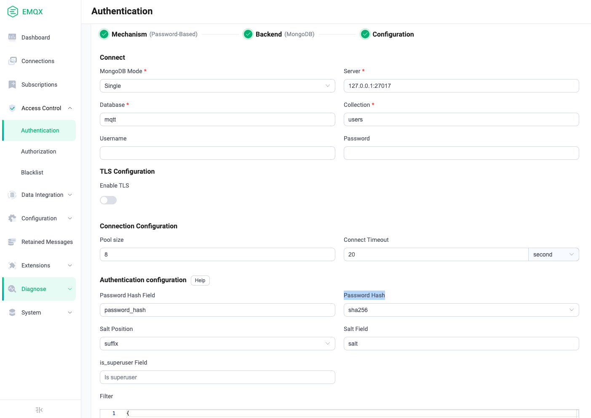

# Use MongoDB for password authentication

EMQX supports to integrate with MongoDB for password authentication.

::: tip

- Knowledge about [basic EMQX authentication concepts](../authn/authn.md)

:::

## Configure with Dashboard

EMQX MongoDB authenticator currently supports connecting to MongoDB running in three different modes, which are [Single](<!--链接待补充-->), [Replica Set](https://www.mongodb.com/docs/manual/reference/replica-configuration/) and [Sharding](https://www.mongodb.com/docs/manual/sharding/). You can use EMQX Dashboard to configure how to use MongoDB for password authentication. 

On [EMQX Dashboard](http://127.0.0.1:18083/#/authentication), click **Access Control** -> **Authentication** on the left navigation tree to enter the **Authentication** page. Click **Create** at the top right corner, then click to select **Password-Based** as **Mechanism**, and **MongoDB** as **Backend**, this will lead us to the **Configuration** tab, as shown below. 



Follow the instruction below on how to configure:

**Connect**: In this section, we will fill in the information needed to connect MongoDB.

- **MongoDB Mode**: Select how MongoDB is deployed, including **Single**, **Replica Set** and **Sharding**. 
- **Server**:  Specify the MongoDB server address that EMQX is to connect, if **Replica Set** or **Sharding** is selected as the **MongoDB Mode**, you will need to input all MondoDB servers (seperated with a `,`) that EMQX is to connect.
- **Replica Set Name**: Specify the Replica Set name to use, only needed if you select **Replica Set** as the **MongoDB Mode**.
- **Database**: Required string value with MongoDB database name to use.
- **Collection**: Required string value with the name of MongoDB collection where authentication rules are stored.
- **Username** (optional): Specify MongoDB user named. 
- **Password**(optional): Speficy MongoDB user password. 

**TLS Configuration**: Turn on the toggle switch if you want to enable TLS. 

**Connection Configuration**: In this section, we will fill in the ... <!--信息待补充-->

- **Pool size** (optional): Input an integer value to define the number of concurrent connections from an EMQX node to a MongoDB server. Default: **8**. 
- **Connect Timeout**: Specify the waiting period before EMQX assume the connection is timed out. Default: **20 second**.

**Authentication configuration**: In this section, we will fill in the authentication related settings:

- **Password Hash Field**: <!--信息待补充-->
- **Password Hash**: Select the Hash function for storing the password in the database, for example, plain, md5, sha, bcrypt, pbkdf2. 
- **Salt Position**: Specify the way (**suffix**, **prefix**, or **disable**) to add salt (random data) to the password.
- **Salt Field**: <!--信息待补充-->
- **is_superuser Field**: Specify if the user is a super user. 
- **Filter**: A map interpreted as MongoDB selector for credential lookup.
  Supports [placeholders](./authn.md#authentication-placeholders). <!--信息待完善-->

Now we can click **Create** to finish the settings. 

## Configure with configuration items

You can configure the EMQX MongoDB authenticator with EMQX  EMQX configuration items, for detailed operating steps, see <!--链接到对应章节-->. Below are code examples you may refer to:

:::: tabs type:card

::: tab Single mode

```
{
  mechanism = password_based
  backend = mongodb
  enable = true

  password_hash_algorithm {
    name = sha256
    salt_position = suffix
  }

  collection = "mqtt_user"
  filter { username = "${username}" }

  mongo_type = single
  server = "127.0.0.1:27017"

  database = "mqtt"
  username = "emqx"
  password = "secret"
}
```

:::

::: tab Replica set

```
{
  mechanism = password_based
  backend = mongodb
  enable = true

  password_hash_algorithm {
    name = sha256
    salt_position = suffix
  }

  collection = "mqtt_user"
  filter { username = "${username}" }

  mongo_type = rs
  servers = "10.123.12.10:27017,10.123.12.11:27017,10.123.12.12:27017"
  replica_set_name = "rs0"

  database = "mqtt"
  username = "emqx"
  password = "secret"
}
```

:::

::: tab Sharding:

```
{
  mechanism = password_based
  backend = mongodb
  enable = true

  password_hash_algorithm {
    name = sha256
    salt_position = suffix
  }

  collection = "mqtt_user"
  filter { username = "${username}" }

  mongo_type = sharded
  servers = "10.123.12.10:27017,10.123.12.11:27017,10.123.12.12:27017"

  database = "mqtt"
  username = "emqx"
  password = "secret"
}
```

:::

::::
