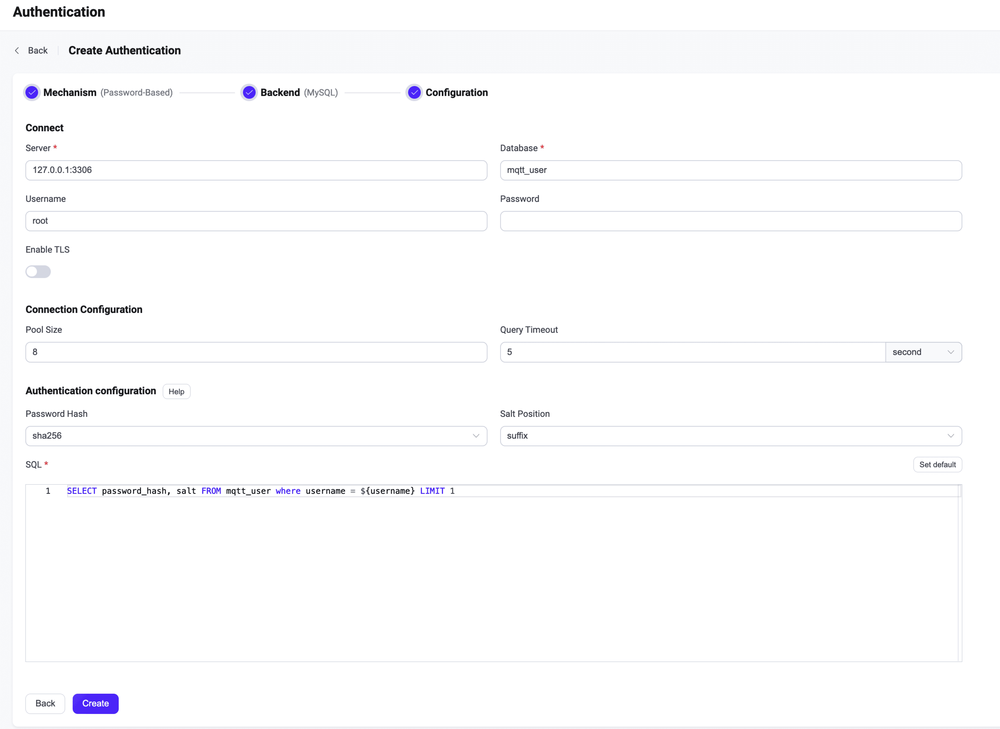

# Integrate with MySQL

EMQX supports integrating with MySQL for password authentication. 

::: tip

Knowledge about [basic EMQX authentication concepts](../authn/authn.md)

:::

## Data Schema and Query Statement

MySQL authenticator supports almost all MySQL storage schema. You can determine how to store credentials and access them as your business needs, for example, using one or multiple tables, views, etc.

Users need to provide a query statement template and ensure the following fields are included:

- `password_hash`: required; password (in plain text or hashed) stored in the database; 
- `salt`: optional; `salt = ""` or just remove this field to indicate no salt value will be added; 
- `is_superuser`: optional; flag if the current client is a superuser; default: `false`.

Example table structure for storing credentials:

```sql
CREATE TABLE `mqtt_user` (
  `id` int(11) unsigned NOT NULL AUTO_INCREMENT,
  `username` varchar(100) DEFAULT NULL,
  `password_hash` varchar(100) DEFAULT NULL,
  `salt` varchar(35) DEFAULT NULL,
  `is_superuser` tinyint(1) DEFAULT 0,
  `created` datetime DEFAULT NULL,
  PRIMARY KEY (`id`),
  UNIQUE KEY `mqtt_username` (`username`)
) ENGINE=InnoDB DEFAULT CHARSET=utf8mb4;
```

::: tip
The above example has created an implicit `UNIQUE` index field (username) that is helpful for the queries.
When there is a significant number of users in the system, please optimize and index the tables to be queried beforehand to shorten the query response time and reduce the load for EMQX.
:::

In this table, MQTT users are identified by `username`.

For example, if we want to add a document for a superuser (`is_superuser`: `true`) with username `emqx_u`, password `public`, suffixed salt `slat_foo123`, and password hash `sha256`, the query statement should be:

```bash
mysql> INSERT INTO mqtt_user(username, password_hash, salt, is_superuser) VALUES ('emqx_u', SHA2(concat('public', 'slat_foo123'), 256), 'slat_foo123', 1);
Query OK, 1 row affected (0,01 sec)
```

The corresponding configuration parameters are:

```sql
password_hash_algorithm {
    name = sha256
    salt_position = suffix
}

query = "SELECT password_hash, salt, is_superuser FROM mqtt_user WHERE username = ${username} LIMIT 1"
```

## Configure with Dashboard

You can use EMQX Dashboard to configure how to use MySQL for password authentication. 

In the EMQX Dashboard, click **Access Control** -> **Authentication** from the left navigation menu. On the **Authentication** page, click **Create** at the top right corner. Click to select **Password-Based** as **Mechanism**, and **MySQL** as **Backend** to go to the **Configuration** tab, as shown below. 



Follow the instructions below on how to configure the authentication:

**Connect**: Enter the information for connecting to MySQL.

- **Server**: Specify the server address that EMQX is to connect (`host:port`).
- **Database**: MySQL database name.
- **Username** (optional): Specify user name. 
- **Password** (optional): Specify user password. 

**TLS Configuration**: Turn on the toggle switch if you want to enable TLS. For more information on enabling TLS, see [Network and TLS](../../network/overview.md).

**Connection Configuration**: Set the concurrent connections and waiting time before a connection is timed out.

- **Pool size** (optional): Input an integer value to define the number of concurrent connections from an EMQX node to MySQL. Default: `8`. 
- **Connect Timeout** (optional): Specify the waiting period before EMQX assumes the connection is timed out. Units supported include milliseconds, second, minute, and hour. 

**Authentication configuration**: Configure settings related to authentication:

- **Password Hash**: Select the hash function for storing passwords in the database, such as `plain`, `md5`, `sha`, `bcrypt`, or `pbkdf2`. Additional configuration depends on your selected function:
  - For `plain`, `md5`, `sha`, `sha256`, or `sha512`:
    - **Salt Position**: Determines how salt (random data) is added to the password. Options are `suffix`, `prefix`, or `disable`. Retain the default setting unless migrating credentials from external storage to the EMQX built-in database. Note: Set to `disable` if `plain` is chosen.
  - For `bcrypt`:
    - **Salt Rounds**: Set the number of times the hash function executes, denoted as 2^Salt Rounds, also known as the "cost factor". The default is `10`, with a range of `5` to `10`. A higher value is recommended for enhanced security. Note: Increasing the cost factor by 1 doubles the necessary time for authentication.
  - For `pkbdf2`:
    - **Pseudorandom Function**: Specify the Hash functions to generate the key, such as `sha256`. 
    - **Iteration Count**: Specify the iteration times; Default: `4096`.
    - **Derived Key Length** (optional): Specify the length of the generated password. You can leave this field blank, then the key length will be determined by the pseudorandom function you selected. 
- **SQL**: Fill in the query statement according to the data schema. For more information, see [SQL data schema and query statement](#sql-table-structure-and-query-statement). 

After you finish the settings, click **Create**.

## Configure with Configuration Items

You can configure the EMQX MySQL authenticator with EMQX configuration items.<!--插入超链接-->

MySQL authentication is identified with `mechanism = password_based` and `backend = mysql`.

Sample configuration:

```bash
{
  backend = "mysql"
  mechanism = "password_based"

  server = "127.0.0.1:3306"
  username = "root"
  database = "mqtt_user"
  password = ""
  pool_size = 8

  password_hash_algorithm {name = "sha256", salt_position = "suffix"}
  query = "SELECT password_hash, salt FROM mqtt_user where username = ${username} LIMIT 1"
  query_timeout = "5s"
}
```
