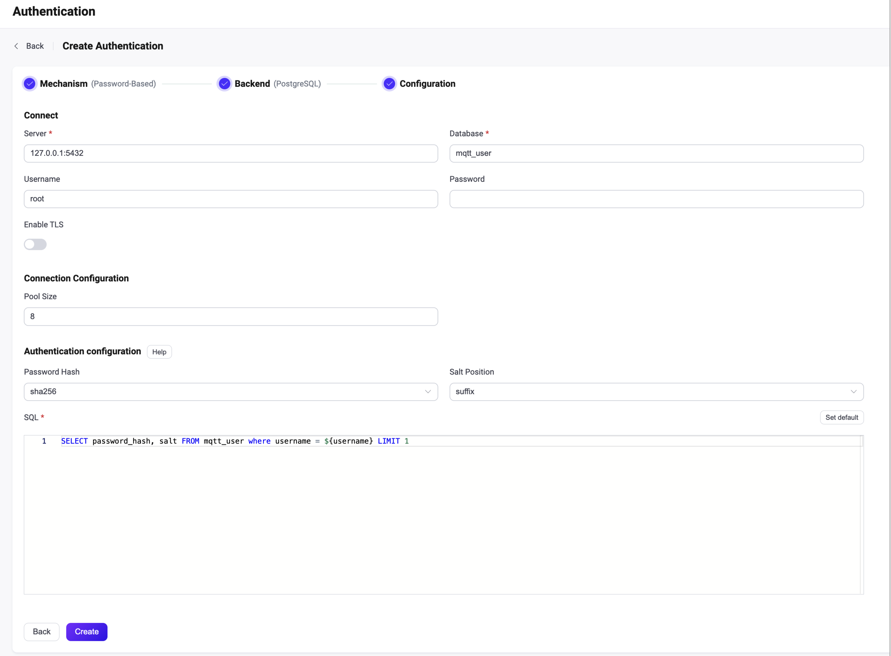

# Integrate with PostgreSQL

EMQX supports integrating with PostgreSQL for password authentication. 

::: tip

- Knowledge about [basic EMQX authentication concepts](../authn/authn.md)

:::

## Data schema and query statement

EMQX PostgreSQL authenticator supports almost any storage schema. You can determine how to store credentials and access them as your business needs, for example, using one or multiple tables, views, etc.

Users need to provide a query statement template and ensure the following fields are included:

- `password_hash`: required; password (in plain text or hashed) stored in the database; 
- `salt`: optional; `salt = ""` or just remove this field to indicate no salt value will be added; 
- `is_superuser`: optional; flag if the current client is a superuser; default: `false`.

Example table structure for storing credentials:

```sql
CREATE TABLE mqtt_user (
    id serial PRIMARY KEY,
    username text NOT NULL UNIQUE,
    password_hash  text NOT NULL,
    salt text NOT NULL,
    is_superuser boolean DEFAULT false,
    created timestamp with time zone DEFAULT NOW()
);
```

::: tip
The above example has created an implicit `UNIQUE` index.
When there is a significant number of users in the system, please optimize and index the collection to be queried beforehand to shorten the query response time and reduce the load for EMQX.
:::

In this table, MQTT users are identified by `username`.

For example, if we want to add a document for a superuser (`is_superuser`: `true`) with username `user123`, password `secret`, and prefixed salt `salt`, the query statement should be:

> Using crypto functions in PostgreSQL requires the pgcrypto extension to be enabled.

```sql
postgres=# create extension pgcrypto;
CREATE EXTENSION
```

SQL:

```bash
INSERT INTO mqtt_user(username, password_hash, salt, is_superuser) VALUES ('user123', 'bede90386d450cea8b77b822f8887065e4e5abf132c2f9dccfcc7fbd4cba5e35', 'salt', true);
INSERT 0 1
```

The corresponding configuration parameters are:

- `password_hash_algorithm`: sha256
- `salt_position`: prefix

SQL: 

```sql
query = "SELECT password_hash, salt, is_superuser FROM mqtt_user WHERE username = ${username} LIMIT 1"
```


## Configure with Dashboard

You can use EMQX Dashboard to configure how to use PostgreSQL for password authentication. 

On [EMQX Dashboard](http://127.0.0.1:18083/#/authentication), click **Access Control** -> **Authentication** on the left navigation tree to enter the **Authentication** page. Click **Create** at the top right corner, then click to select **Password-Based** as **Mechanism**, and **PostgreSQL** as **Backend**, this will lead us to the **Configuration** tab, as shown below. 



Follow the instruction below on how to configure:

**Connect**: In this section, we will fill in the information needed to connect PostgreSQL.

- **Server**:  Specify the server address that EMQX is to connect (`host:port`).
- **Database**: PostgreSQL database name.
- **Username** (optional): Specify user name. 
- **Password** (optional): Specify user password. 

**TLS Configuration**: Turn on the toggle switch if you want to enable TLS. 

**Connection Configuration**: In this section, we will set the concurrent connections.

- **Pool size** (optional): Input an integer value to define the number of concurrent connections from an EMQX node to PostgreSQL. Default: **8**. 

**Authentication configuration**: In this section, we will fill in the authentication-related settings:

- **Password Hash Field**: Specify the field name of the password.
- **Password Hash**: Select the Hash function for storing the password in the database, for example, plain, md5, sha, bcrypt, pbkdf2. 
  - If **plain**, **md5**, **sha**, **sha256** or **sha512** are selected, we also need to configure:
    - **Salt Position**: Specify the way (**suffix**, **prefix**, or **disable**) to add salt (random data) to the password. Note: If **plain** is selected, the **Salt Position** should be **disable**. 

  - If **bcrypt** is selected, no extra configurations are needed. 
  - If **pkbdf2** is selected, we also need to configure:
    - **Pseudorandom Function**: Specify the Hush functions to generate the key, such as sha256. 
    - **Iteration Count**: Specify the iteration times; Default: 4096
    - **Derived Key Length**: Specify the length of the generated password, if left blank, the password length will be determined by the pseudorandom function you selected. 
- **SQL**: Fill in the query statement according to the data schema. For more information, see [SQL data schema and query statement](#sql-table-structure-and-query-statement). 

Now we can click **Create** to finish the settings. 


## Configure with configuration items

You can configure the EMQX PostgreSQL authenticator with EMQX configuration items. For detailed operation steps, see [authn-postgresql:authentication](../../configuration/configuration-manual.md#authn-postgresql:authentication).  

PostgreSQL authentication is identified with `mechanism = password_based` and `backend = postgresql`.

Sample configuration:

```
{
  mechanism = password_based
  backend = postgresql
  enable = true

  password_hash_algorithm {
    name = sha256
    salt_position = suffix
  }

  database = mqtt
  username = postgres
  password = public
  server = "127.0.0.1:5432"
  query = "SELECT password_hash, salt, is_superuser FROM users where username = ${username} LIMIT 1"
}
```
