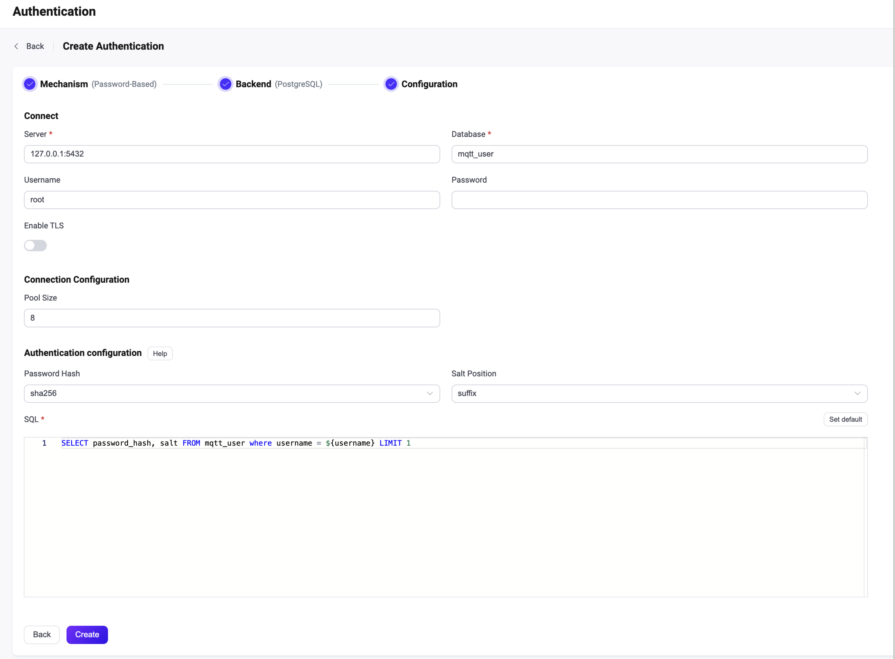

# Integrate with PostgreSQL

EMQX supports integrating with PostgreSQL for password authentication. 

::: tip

Knowledge about [basic EMQX authentication concepts](../authn/authn.md)

:::

## Data Schema and Query Statement

EMQX PostgreSQL authenticator supports almost any storage schema. You can determine how to store credentials and access them as your business needs, for example, using one or multiple tables, views, etc.

Users need to provide a query statement template and ensure the following fields are included:

- `password_hash`: required; password (in plain text or hashed) stored in the database; 
- `salt`: optional; `salt = ""` or just remove this field to indicate no salt value will be added; 
- `is_superuser`: optional; flag if the current client is a superuser; default: `false`.

Example table structure for storing credentials:

```sql
CREATE TABLE mqtt_user (
    id serial PRIMARY KEY,
    username text NOT NULL UNIQUE,
    password_hash  text NOT NULL,
    salt text NOT NULL,
    is_superuser boolean DEFAULT false,
    created timestamp with time zone DEFAULT NOW()
);
```

::: tip
The above example has created an implicit `UNIQUE` index field (username) that is helpful for the queries.
When there is a significant number of users in the system, please optimize and index the tables to be queried beforehand to shorten the query response time and reduce the load for EMQX.
:::

In this table, MQTT users are identified by `username`.

For example, if you want to add a document for a superuser (`is_superuser`: `true`) with username `user123`, password `secret`, and suffixed salt `salt`, the query statement should be:

```bash
INSERT INTO mqtt_user(username, password_hash, salt, is_superuser) VALUES ('user123', 'f84fa2149dbb62ed4e0cf1f550d2949b33a6513d3a7707e08502511c79ccb0ee', 'salt', true);
INSERT 0 1
```

The corresponding configuration parameters are:

- password_hash_algorithm: `sha256`
- salt_position: `suffix`

SQL: 

```sql
query = "SELECT password_hash, salt, is_superuser FROM mqtt_user WHERE username = ${username} LIMIT 1"
```

## Configure with Dashboard

You can use EMQX Dashboard to configure how to use PostgreSQL for password authentication. 

1. In EMQX Dashboard, click **Access Control** -> **Authentication** from the left navigation menu.
2. On the **Authentication** page, click **Create** in the top right corner.
3. Click to select **Password-Based** as **Mechanism**, and **PostgreSQL** as **Backend** to go to the **Configuration** tab, as shown below. 



4. Follow the instructions below to configure the authentication backend:
   - Enter the information for connecting to PostgreSQL.

     - **Server**: Specify the server address that EMQX is to connect (`host:port`).
     - **Database**: PostgreSQL database name.
     - **Username**: Specify user name. 
     - **Password**: Specify user password. 
   - Configure settings related to authentication:
     - **Password Hash**: Select the password hashing algorithm applied to plain-text passwords before results are stored in the database. Available options are `plain`, `md5`, `sha`, `sha256`, `sha512`, `bcrypt`, and `pbkdf2`. Additional configurations depend on the selected algorithm:
       - For `md5`, `sha`, `sha256` or `sha512`:
         - **Salt Position**: Determines how salt (random data) is mixed with the password. Options are `suffix`, `prefix`, or `disable`.  You can keep the default value unless you migrate user credentials from external storage into the EMQX built-in database.
         - Resulting hash is represented as a string of hexadecimal characters, and compared case-insensitively with the stored credential.
       - For `plain`:
         - **Salt Position**: should be `disable`.
       - For `bcrypt`:
         - **Salt Rounds**: Defines the number of times the hash function is applied, expressed as _2<sup>Salt Rounds</sup>_, also known as the "cost factor". The default value is `10`, with a permissible range of `5` to `10`. A higher value is recommended for enhanced security. Note: Increasing the cost factor by 1 doubles the necessary time for authentication.
       - For `pbkdf2`:
         - **Pseudorandom Function**: Selects the hash function that generates the key, such as `sha256`.
         - **Iteration Count**: Sets the number of times the hash function is executed. The default is `4096`.
         - **Derived Key Length** (optional): Specifies the length in bytes of the generated key. If left blank, the length will default to that determined by the selected pseudorandom function.
         - Resulting hash is represented as a string of hexadecimal characters, and compared case-insensitively with the stored credential.
   - **Precondition**: A [Variform expression](../../configuration/configuration.md#variform-expressions) used to control whether this PostgreSQL authenticator should be applied to a client connection. The expression is evaluated against attributes from the client (such as `username`, `clientid`, `listener`, etc.). The authenticator will only be invoked if the expression evaluates to the string `"true"`. Otherwise, it will be skipped. For more information about the precondition, see [Authentication Preconditions](./authn.md#authentication-preconditions).
   - **Enable TLS**: Turn on the toggle switch if you want to enable TLS. For more information on enabling TLS, see [Network and TLS](../../network/overview.md).
   - **Advanced Settings**:
     - **Connection Pool size** (optional): Specify the number of concurrent connections from an EMQX node to a PostgreSQL server. Default: `8`. 
     - **Disable Prepared Statements** (optional): If you are using a PostgreSQL service that does not support prepared statements, such as PGBouncer in transaction mode or Supabase, enable this option. This option was introduced in EMQX v5.7.1.
   - **SQL**: Fill in the query statement according to the data schema. For more information, see [SQL data schema and query statement](#sql-table-structure-and-query-statement). 

After you finish the settings, click **Create**.

## Configure with Configuration Items

You can configure the EMQX PostgreSQL authenticator with EMQX configuration items. <!--For detailed operation steps, see [authn-postgresql:authentication](../../configuration/configuration-manual.html#authn-postgresql:authentication). -->

PostgreSQL authentication is identified with `mechanism = password_based` and `backend = postgresql`.

Sample configuration:

```bash
{
  mechanism = password_based
  backend = postgresql

  password_hash_algorithm {
    name = sha256
    salt_position = suffix
  }

  database = mqtt
  username = postgres
  password = public
  server = "127.0.0.1:5432"
  query = "SELECT password_hash, salt, is_superuser FROM users where username = ${username} LIMIT 1"
}
```
