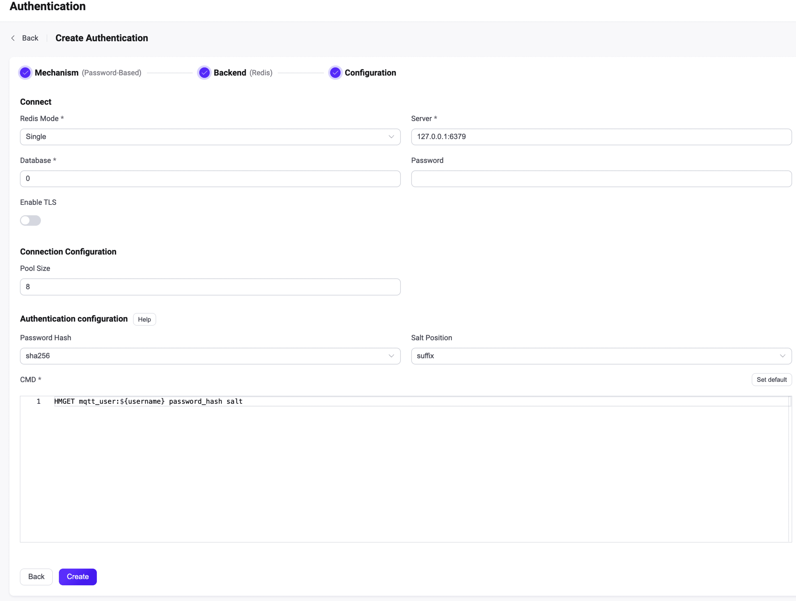

# Integrate with Redis

EMQX supports integrating with Redis for password authentication. EMQX Redis authenticator currently supports connecting to running in three different modes, which are Single, [Redis Sentinel](https://redis.io/docs/manual/sentinel/) and [Redis Cluster](https://redis.io/docs/manual/scaling/). This section gives detailed instructions on the data schema supported and on how to configure with EMQX Dashboard and configuration file. 

::: tip Prerequisite:

Knowledge about [basic EMQX authentication concepts](../authn/authn.md)

:::

## Data Schema and Query Statement

Redis authentication works with credentials stored as [Redis hashes](https://redis.io/docs/manual/data-types/#hashes) with predefined field names: 

- `password_hash`: required; password (in plain text or hashed) stored in the database; 
- `salt`: optional; `salt = ""` or just remove this field to indicate no salt value will be added; 
-  `is_superuser`: optional; flag if the current client is a superuser; default: `false`.

For example, if we want to add a document for a superuser (`is_superuser`: `true`) with username `user123`, password `secret`, prefixed salt `salt`, and password hash `sha256`, the query statement should be:

```bash
>redis-cli
127.0.0.1:6379> HSET mqtt:user123 is_superuser 1 salt salt password_hash ac63a624e7074776d677dd61a003b8c803eb11db004d0ec6ae032a5d7c9c5caf
(integer) 3
```

The corresponding config params are:

```
password_hash_algorithm {
    name = sha256
    salt_position = prefix
}

cmd = "HMGET mqtt:${username} password_hash salt is_superuser"
```

::: tip
The name `password_hash` conveys our preference for storing hashed passwords. But given that Redis doesn't have a MySQL-like `as` syntax, EMQX 5.0 has kept the `password` field (in EMQX 4.x) compatible.

So, we can also configure `cmd` as `HMGET mqtt:${username} password salt is_superuser`.
:::

## Configure with Dashboard

You can use EMQX Dashboard to configure how to use Redis for password authentication. 

In the EMQX Dashboard, click **Access Control** -> **Authentication** from the left navigation menu. On the **Authentication** page, click **Create** at the top right corner. Click to select **Password-Based** as **Mechanism**, and **Redis** as **Backend** to go to the **Configuration** tab, as shown below. 



Follow the instructions below on how to configure the authentication:

**Connect**: Enter the information for connecting to Redis.

- **Redis Mode**: Select how Redis is deployed, including `Single`, `Sentinel` and `Cluster`. 
- **Server(s)**: Specify the Redis server address that EMQX is to connect, if **Redis Mode** is set to `Sentinel` or `Cluster`, you will need to input all Redis servers (separated with a `,`) that EMQX is to connect.
- **Sentinel Name**: Specify the name to use; type: strings; only needed if you set **Redis Mode** to `Sentinel`.
- **Database**: Redis database name; Data type: strings.
- **Password** (optional): Specify Redis user password. 

**TLS Configuration**: Turn on the toggle switch if you want to enable TLS. For more information on enabling TLS, see [Network and TLS](../../network/overview.md).

**Connection Configuration**: Set the concurrent connections.

- **Pool size** (optional): Specify the number of concurrent connections from an EMQX node to a Redis server. Default: `8`. 

**Authentication configuration**: Configure settings related to authentication:

- **Password Hash**: the hash function for storing passwords in the database. Options include `plain`, `md5`, `sha`, `bcrypt`, and `pbkdf2`. Additional configuration depends on your selected function:
  - For `plain`, `md5`, `sha`, `sha256`, or `sha512`:
    - **Salt Position**: Determine how salt (random data) is added to the password. Options are `suffix`, `prefix`, or `disable`. Keep the default value unless you migrate user credentials from external storage into the EMQX built-in database. Note: Set to `disable` if `plain` is selected. 
  - For `bcrypt`:
    - **Salt Rounds**: Set the number of applications of the hash function, expressed as 2^Salt Rounds, also known as the "cost factor". The default is `10`, with a range of `5` to `10`. Opting for a higher value enhances security. Note: Increasing the cost factor by 1 doubles the necessary time for authentication.
  - For `pkbdf2`:
    - **Pseudorandom Function**: Select the hash function for key generation, such as `sha256`.
    - **Iteration Count**: Specify the number of iterations. Default: `4096`.
    - **Derived Key Length** (optional): Set the desired length of the generated password. If left unspecified, the length will be determined by the selected pseudorandom function.
- **CMD**: Redis query command. 

After you finish the settings, click **Create**.

## Configure with Configuration Items

You can configure the EMQX Redis authenticator with EMQX configuration items. <!--For detailed operation steps, see  [authn-redis:standalone](../../configuration/configuration-manual.html#authn-redis:standalone), [authn-redis:sentinel](../../configuration/configuration-manual.html#authn-redis:sentinel), and  [authn-redis:cluster](../../configuration/configuration-manual.html#authn-redis:cluster).-->

Redis authentication is identified with `mechanism = password_based` and `backend = redis`.

EMQX supports working with three kinds of Redis installation.

:::: tabs type:card

::: tab Standalone Redis.

```bash
{
  mechanism = password_based
  backend = redis
  enable = true

  redis_type = single
  server = "127.0.0.1:6379"

  password_hash_algorithm {
      name = sha256
      salt_position = suffix
  }

  cmd = "HMGET mqtt_user:${username} password_hash salt is_superuser"
  database = 1
  password = "public"
  auto_reconnect = true
}
```

:::

::: tab Redis Sentinel 

```bash
{
  mechanism = password_based
  backend = redis
  enable = true

  redis_type = sentinel
  servers = "10.123.13.11:6379,10.123.13.12:6379"
  sentinel = "mymaster"

  password_hash_algorithm {
      name = sha256
      salt_position = suffix
  }

  cmd = "HMGET mqtt_user:${username} password_hash salt is_superuser"
  database = 1
  password = "public"
  auto_reconnect = true
}
```

:::

::: tab Redis Cluster 

```bash
{
  mechanism = password_based
  backend = redis
  enable = true

  redis_type = cluster
  servers = "10.123.13.11:6379,10.123.13.12:6379"

  password_hash_algorithm {
      name = sha256
      salt_position = suffix
  }

  cmd = "HMGET mqtt_user:${username} password_hash salt is_superuser"
  password = "public"
  auto_reconnect = true
}
```

:::

::::
