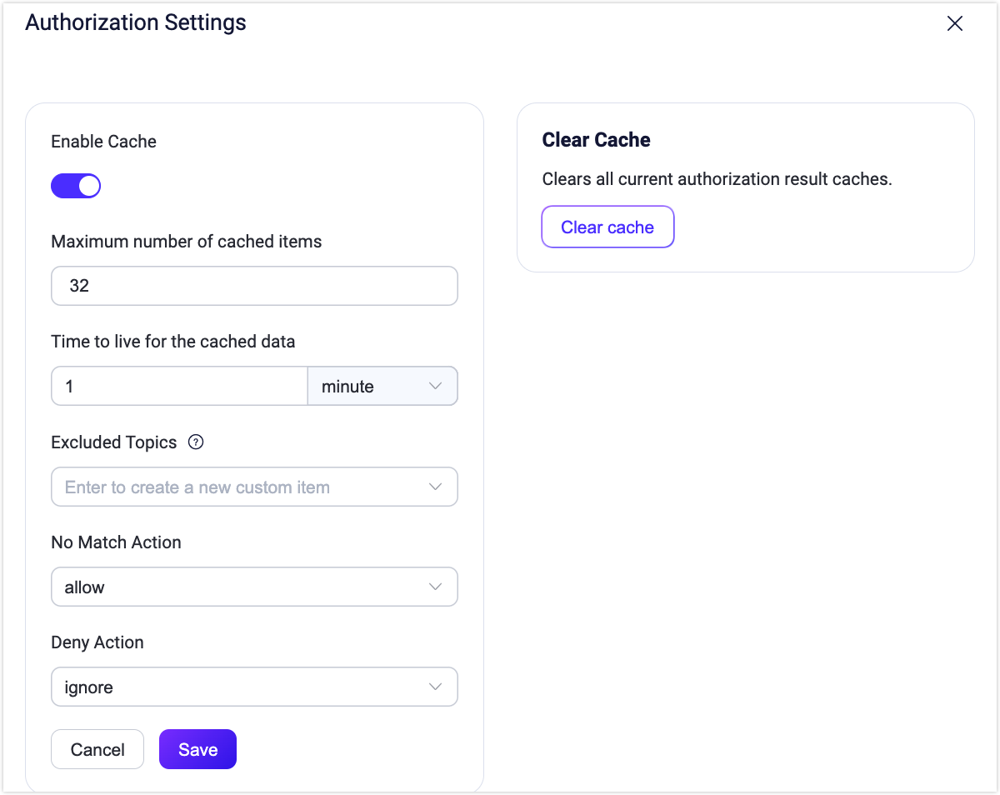
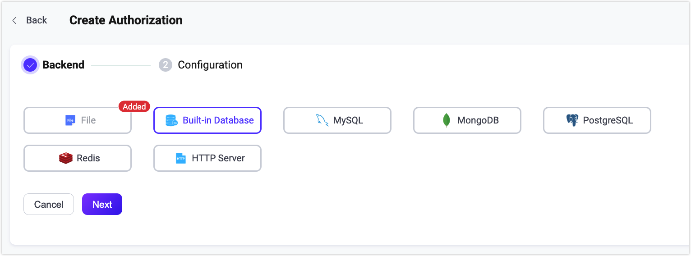

# Authorization

In EMQX, authorization refers to the permission control over the publish/subscribe operation of the MQTT clients. When a client performs publish/subscribe operation, EMQX follows a specific procedure or use the user-specified query statement to query the client's permission list from the configured data source. Based on the query result, EMQX allows or rejects the current operation.

The permission list of the client needs to be stored in a specific data source (database, file) in advance. You can update the list during runtime by updating the corresponding data record. 

An file-based authorizer is configured in EMQX by default and you can use the authorizer directly. The authorization is processed based on the predefined rules configured in the ACL file. 

## How Authorization Works

### Authorization Chain

EMQX allows users to create an authorization chain by configuring multiple authorizers rather than one single authorizer to make authorization more flexible. EMQX follows the authorizers' position in the chain to perform the authorization in sequence. With the authorization chain configured, when EMQX fails to retrieve the matching authentication information from the first authorizer, it switches to the next authenticator to continue the process.

The process of the authorization check is as follows:

1. If EMQX successfully retrieves the client's permission information, it matches the client's operation to the retrieved permission list.
   - If they match, EMQX allows or denies the operation based on permission setting.
   - If they do not match, EMQX switches to the next authenticator to continue the process.

2. If EMQX fails to retrieve the client's permission information, it checks if there are any other authorizers configured.
   - If yes, EMQX switches to the next authenticator to continue the process.
   - If it is already the last authorizer, EMQX follows the setting of `no_match` to determine whether to allow or reject the client operation.

For information on how to adjust the sequence of the authorizer in an authorization chain and how to check the running metrics, see [Manage authorizers](#manage-authorizers).

### Authorization Cache

To better handle the access pressure brought by a large number of publish/subscribe requests, EMQX introduces the authorization cache mechanism. You can enable cache through the **Authorization** page in EMQX Dashboard (**Access Control**->**Authorization**->**Settings**).



- **Enable Cache**: Setting for whether to enable cache for the authorization data.

- **Max number of cache per client**: The maximum number of cache for single client; the default setting is **32**.

- **Cache TTL**: The living time of cache data; unit is **minute**.

- **No Match Action**: The action to take when all authorizers fail to retrieve authorization information; values to choose: **allow** (to operate), **deny** (to operate); default value: **allow**.

- **Deny Action**: The action to take when denying the operating request from the current client; values to choose: **ignore** (operating request), **disconnect** (the connection of current client); default value: **allow**.

- **Clear Cache**: Clear the cache of all current authorization results. 

You can also configure the authorization data cache through the configuration file. For more information, see [Configuration file](../../configuration/configuration.md).

::: tip
If set properly, caching can greatly improve performance. So, it is recommended to timely adjust the setting based on your system performance.
:::

### Authorization Placeholders

EMQX authorizers allow using placeholders in their configuration. During the authorization step, these placeholders are replaced with actual client information to construct a query or HTTP request that matches the current client.

#### Placeholders in Data Queries

Placeholders are used to construct query statement. For example, in one EMQX MySQL authorizer, the default query SQL uses the placeholder `${username}`:

```sql
SELECT action, permission, topic FROM mqtt_acl where username = ${username}
```

When a client (name: `emqx_u`) initiates a connect request, the constructed query statement is like:

```sql
SELECT action, permission, topic FROM mqtt_acl where username = 'emqx_u'
```

The following placeholders are supported in query statements:

* `${username}`:  It is replaced with the username at runtime. The username comes from the `Username` field in the `CONNECT` packet. If `peer_cert_as_username` is enabled, it is overridden by the fields or the content of the certificate.
* `${clientid}`:  It is replaced by the client ID at runtime. The client ID is normally explicitly specified by the client in the `CONNECT` packet. If `use_username_as_clientid` or `peer_cert_as_clientid` is enabled, this field is overridden by the username, fields in the certificate, or the content of the certificate.
* `${peerhost}`: It is replaced with the client's IP address at runtime. EMQX supports [Proxy Protocol](http://www.haproxy.org/download/1.8/doc/proxy-protocol.txt), that is, even if EMQX is deployed behind some TCP proxy or load balancer, users can still use this placeholder to get the real IP address.
* `${cert_common_name}`: It is replaced by the Common Name of the client's TLS certificate at runtime, only applicable to TLS connections.
* `${cert_subject}`:  It is replaced by the subject of the client's TLS certificate at runtime, only applicable to TLS connections.

#### Topic Placeholders

EMQX also allows placeholders to be used in topics to support dynamic themes. The supported placeholders are as follows:

* `${clientid}`
* `${username}`

Placeholders can be used as topic segments, like `a/b/${username}/c/d`, but not `a/b${username}c/d`.

To avoid placeholder interpolation, one may use special `eq` syntax: `eq a/b/${username}/c/d`. This topic is treated as `a/b/${username}/c/d` literally, without interpolation.

### Authorization Check Priority

Besides the cache and authorization checker, the authorization result may also be affected by the [Super User Role and Permission](../authn/authn.md) set during the authentication phase.

For super users, all their operations will be skipped from authorization check; if the permission list is set, EMQX will first follow the client's permission data to run the  authorization checker. The priority is as follows:

```bash
Super user > permission data > authorization check
```

## Manage Authorizers

You can view and manage authorizers in the **Access Control**->**Authorization** page in the Dashboard.

### Adjust Sequence of Authorizers

As mentioned in [Authorization chain](#authorization-chain), authorizers are executed according to the configured sequence. You can select **Up**, **Down**, **Move to top**, and **Move to bottom** from the **More** dropdown list to move the authorizer. You can also adjust the authorizer positions in the `authorization.sources` configuration item.

### Check Authorizer Status

You can check the connection status in the **Status** column:

| Status       | Meaning                                                      | Troubleshooting                                              |
| ------------ | ------------------------------------------------------------ | ------------------------------------------------------------ |
| Connected    | All nodes are connected to the data source successfully.     | -                                                            |
| Disconnected | Parts of or all nodes are not connected to the data source (database, file). | Check if the data source is available; <br>Restart the authorizer manually (**Disable** and **Enable** again) after troubleshooting. |
| Connecting   | Parts of or all nodes are reconnecting to the data source (database, file). | Check if the data source is available; <br/>Restart the authorizer manually (**Disable** and **Enable** again) after troubleshooting. |

### Running Metrics

You can view the statistic metrics of each authorizer in the Overview page of the authorizer. The following metrics are listed:

- **Allow**: Number of authorizations passed
- **Deny**: Number of authorizations failed
- **No match**: Number of times client authorizations data not found

- **Rate(tps)**: Execution rates of authorizations

You can also check the authorization status and execution status on each node through **Node Status**.

If you want to view the overall running metrics of authorization, see [Metrics - Authentication & Authorization](../../observability/metrics-and-stats.md#Authentication & Authorization).

## Integrate with Data Storage Objects

The EMQX authorization mechanism supports integration with various data storage objects, including built-in databases, files, MySQL, PostgreSQL, MongoDB, and Redis. You can manage permission data through REST API or EMQX Dashboard. <!-- Using a CSV or JSON file to import the data in a batch is currently not supported.-->.

In addition, EMQX can also connect to HTTP services developed by our users to meet different authorization requirements.

According to the backend data storage used, there are currently 7 different types of EMQX authorizers. Each authorizer has its own configuration options. You can click the corresponding links in the following table for more details.

| Database          | Description                                                  |
| ----------------- | ------------------------------------------------------------ |
| ACL File          | [Authorization with static rules configured in a file](./file.md) |
| Built-in database | [Authorization with built-in database as rules storage](./mnesia.md) |
| MySQL             | [Authorization with MySQL as rules storage](./mysql.md)      |
| PostgreSQL        | [Authorization with PostgreSQL as rules storage](./postgresql.md) |
| MongoDB           | [Authorization with MongoDB as rules storage](./mongodb.md)  |
| Redis             | [Authorization with Redis as rules storage](./redis.md)      |
| HTTP              | [Authorization with external HTTP service](./http.md)        |

Below is an example of how to configure an EMQX MySQL authorizer.

Example:

```bash
{
    enable => true

    type = mysql
    database = "mqtt"
    username = "root"
    password = "public"

    query = "SELECT permission, action, topic FROM mqtt_acl WHERE username = ${username}"
    server = "10.12.43.12:3306"
}
```

## Configure Authorization Mechanisms

EMQX provides 3 ways to use authorization, namely: Dashboard, Configuration file and HTTP API.

### Configure with Dashboard

EMQX Dashboard is an intuitive way to configure EMQX authorizer, where you can configure relevant parameters, check their working status, adjust their position in the authorization chain.



### Configure with Configuration File

You can also configure authorization in the `authorization` fields in the configuration file `emqx.conf`. The general config structure is the following:

```bash
authorization {
  sources = [
    { ...   },
    { ...   }
  ]
  no_match = allow
  deny_action = ignore
  cache {
    enable = true
    max_size = 32
    ttl = 1m
  }
}
```

Where, 

- `sources` (optional): An ordered array; each array element defines the data source of the corresponding authorizer. For detailed configurations, see the corresponding configuration file.

- `no_match`: Determines the default action for a publish/subscribe request if none of the configured authorizers find any authorization rules; optional value: `allow` or `deny`; default:  `allow`. The setting  also triggers the enabling of black/white list. 

- `deny_action`: Determines the next step if a publish/subscribe operation is rejected; optional value: `ignore` or `disconnect`; default:  `ignore`. If set to `ignore`, the operation is silently ignored; if set to `disconnect`, the client connection is dropped.

- `cache`: Defines the caching settings, including:
* `cache.enable`: Specifies whether to enable caching, default: `true`. If the authorization is solely based on the JWT packets, it is recommended to configure this field `false`.
  
* `cache.max_size`: Specifies the maximum number of elements in the cache; default: 32. Older records will be removed from the cache if the specified number exceeds.
  
* `cache.ttl`: Specifies the effective time of cached values, default: `1m` (one minute). 

### HTTP API

There are several API endpoints for managing authorization:

* `/api/v5/authorization/settings`: for general parameters, `no_match`, `deny_action`, and `cache`;
* `/api/v5/authorization/sources`: for managing and arranging authorizers;
* `/api/v5/authorization/cache`: for cleaning authorization cache;
* `/api/v5/authorization/sources/built_in_database`:  for managing authorization rules of `built_in_database` authorizer.

For detailed operation steps, see [HTTP API](../../admin/api.md).


