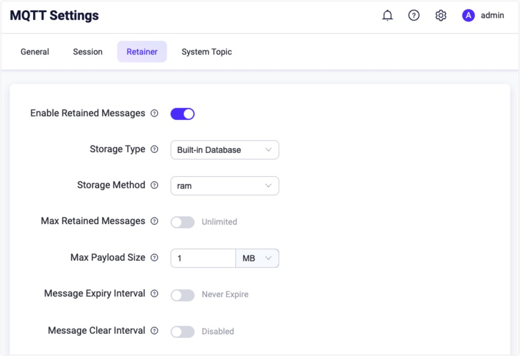
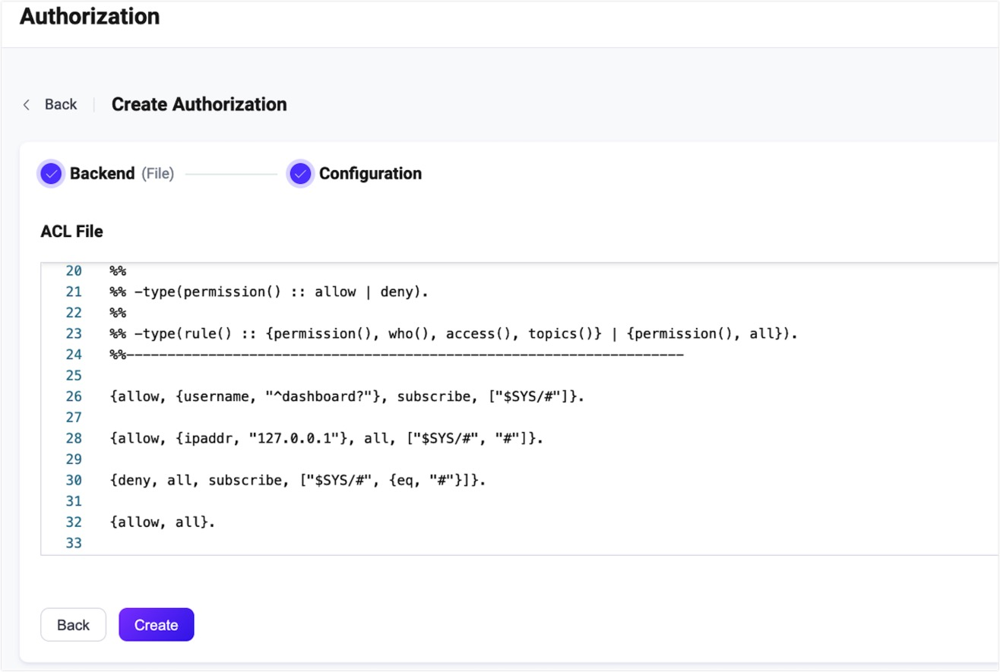

# Use ACL file

EMQX supports authorization checks against the predefined rules stored in ACL files. You can configure multiple authorization check rules in the file. After receiving the client's operation request, EMQX matches the authorization rules in order from top to bottom. After successfully matching a rule, EMQX allows or denies the current request according to the setting, and stops matching subsequent rules. 

File-based ACL is simple and lightweight. It is suitable to configure generic rules. For hundreds or more per-client rules, it is recommended to use other authorization sources, and file-based ACL can be the safety guard put at the end of the authorization chain. 

::: tip Prerequisite
Starting from 5.0, file-based ACL rules can be edited and reloaded from EMQX dashboard UI.

Be familiar with the basic concepts of [Authorization](./authz.md).

:::

## ACL File Format

Before the authorization check based on ACL file, you need to store the authorization rules in the file in the form of [Erlang tuples](https://www.erlang.org/doc/reference_manual/data_types.html#tuple) data list.

ACL configuration file is a list of Erlang tuples ending with a period. A _tuple_ is a comma-separated list of expressions. The whole list is enclosed in curly braces.

The `%%` prefix identifies comment strings and will be abandoned in the parsing process.

Example:

```erlang
%% Allow MQTT client using username "dashboard"  to subscribe to "$SYS/#" topics
{allow, {user, "dashboard"}, subscribe, ["$SYS/#"]}.

%% Allow users with IP address "127.0.0.1" to publish/subscribe to topics "$SYS/#", "#"
{allow, {ipaddr, "127.0.0.1"}, pubsub, ["$SYS/#", "#"]}.

%% Deny "All Users" subscribe to "$SYS/#" "#" Topics
{deny, all, subscribe, ["$SYS/#", {eq, "#"}]}.

%% Allow any other publish/subscribe operation
{allow, all}.
```

The rules are matched from top to bottom. If a rule matches, its permission is applied, and the remaining rules are ignored.

- The first position in a tuple indicates the permission applied if the rule is successfully hit. The possible values are:
  * `allow`
  * `deny`
- The second position of a tuple describes clients for which the rule takes effect. The following terms and their combinations can be used to specify the clients:
  * `{username, "dashboard"}`: clients with user name `dashboard`; also can be `{user, "dashboard"}`
  * `{username, {re, "^dash"}}` : clients with user name matching the [regular expression](https://www.erlang.org/doc/man/re.html#regexp_syntax) `^dash`
  * `{clientid, "dashboard"}` : clients with client ID `dashboard`; also can be `{client, "dashboard"}`
  * `{clientid, {re, "^dash"}}` : clients with client ID matching the [regular expression](https://www.erlang.org/doc/man/re.html#regexp_syntax) `^dash`
  * `{ipaddr, "127.0.0.1"}`: clients connecting from IP address `127.0.0.1`. Netmasks are allowed. If EMQX is behind a load balance, `proxy_protocol` should be enabled for the client's MQTT listener. 
  * `{ipaddrs, ["127.0.0.1", ..., ]}` : clients connecting from one of the specified IP addresses `127.0.0.1, ..., `. Netmasks are allowed.
  * `all` : any clients
  * `{'and', [Spec1, Spec2, ...]}` : clients satisfying _all_ of the specifications from the list
  * `{'or', [Spec1, Spec2, ...]}` : clients satisfying _any_ of the specifications from the list
- The third position of the tuple indicates the operation to which the rule is applicable
  * `publish` : the rule applying to publish operations
  * `subscribe` : the rule applying to subscribe operations
  * `all` : the rule applying to both publish and subscribe operations
- The fourth position of the tuple specifies the topics to which the rule applies. The topics are specified with a list op _patterns_. [Topic placeholders](./authz.md#topic-placeholders) can be used. The following patterns are available:
  * A string value, like `"t/${clientid}"`: It uses topic placeholders. When a client with ID as `emqx_c` triggers the authorization check, it match the topic `t/emqx_c`  precisely. 
  * A string value, like `"$SYS/#"`: It is a standard topic filter allowing wildcards. Topic filters match topics according to the [MQTT specification rules](http://docs.oasis-open.org/mqtt/mqtt/v3.1.1/errata01/os/mqtt-v3.1.1-errata01-os-complete.html#_Toc442180920). For example, `$SYS/#` matches topics `$SYS/foo`, `$SYS/foo/bar` for publish and topics `$SYS/foo`, `$SYS/foo/#`, and `$SYS/#` for subscribe. Topic [placeholders](./authz.md#topic-placeholders) are also available.
  * An `eq` tuple, like `{eq, "foo/#"}`: It indicates full equivalence of topic characters. This pattern matches exactly `foo/#` topic for all operations. Wildcards or placeholders are not taken into account, i.e., topic `foo/bar` is not matched.

Additionally, there are two special rules. These rules are usually used as default at the end of the configuration.
- `{allow, all}` : allow all operations.
- `{deny, all}` : deny all operations.

## Configure with Dashboard

On [EMQX Dashboard](http://127.0.0.1:18083/#/authentication), click **Access Control** -> **Authorization** on the left navigation tree to enter the **Authorization** page. 

Click **Create** at the top right corner, select **File** as **Backend**, and click **Next**. The **Configuration** tab is shown as below:



EMQX configures file-based authorizer by default. You can click **Settings** button in **Actions** column to view or edit the authorization rules configured in the **ACL File** area. For more information on file format and fields descriptions, see [ACL file format](#acl-file-format).



## Configure with Configuration File

The file-based authorizer is identified by type `file`.

Sample configuration:

```bash
authorization {
  deny_action = ignore
  no_match = allow
  sources = [
    {
      type = file
      enable = true
      path = "etc/acl.conf"
    }
  ]
}
```

Where,

- `type`: Data source types of authorizer; here is `file`.
- `enable`: Whether to activate the authorizer; optional value: `true`, `false`.
- `path`: Configuration file path; default value: `etc/acl.conf`. If file-based authorizer is editted through Dashboard or REST API, EMQX stores the new file to `data/authz/acl.conf` and stops reading the configuration in the original file.

<!--For detailed parameter list, see [authz-file](../../configuration/configuration-manual.md#authz-file). Need to update the link later-->

::: tip
The initial file provided by the `path` config is not mutable to EMQX.
If rules are updated from the dashboard UI or management API, the new rules
will be stored in `data/authz/acl.conf`, and this original config will no longer be loaded.
::: <!--This note is not in the Chinese file anymore, remove?-->

