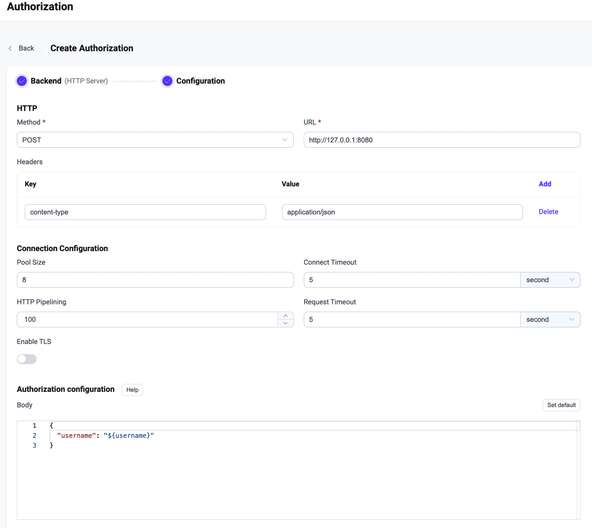

# Use HTTP service

EMQX supports the authorization based on the HTTP service. The user needs to build an external HTTP application as a data source by themselves. EMQX make requests to the HTTP service and determine the authorization result based on the data returned by the HTTP API, thus achieving complex authorization logic.

In 4.x versions, EMQX only prompts the status code returned by the HTTP API, such as `200`, `403`, and discards the content. In order to provide more information to the user, we added the return of the request content in EMQX 5.0 version.

::: tip Prerequisite

Be familiar with the basic concepts of [Authorization](./authz.md).

:::

::: tip
`POST` method is recommended. When using the `GET` method, some sensitive information can be exposed through HTTP server logging.

For untrusted environments, HTTPS should be used.
:::

## Configure with dashboard

On [EMQX Dashboard](http://127.0.0.1:18083/#/authentication), click **Access Control** -> **Authorization** on the left navigation tree to enter the **Authorization** page. 

Click **Create** at the top right corner, select **HTTP Server** as **Backend**, and click **Next**. The **Configuration** tab is shown as below:



**HTTP** section: <!--a brief description of what is being configured here.-->

- **Request Method**: Select the HTTP request method, optional values: `GET`, `POST`.

::: tip 

It is recommended to use the `POST` method. When using the `GET` method, sensitive information (such as plain text passwords) may be exposed through HTTP server logs. In addition, use HTTPS for untrusted environments. 

:::

- **URL**: Enter the IP address of the HTTP application.
- **Headers** (optional): Configure the HTTP request headers. <!--The key, value, and add of this content.-->

**Connection Configuration** section: 

In this section, configure concurrent connections, connection timeout, maximum HTTP requests, and request timeout.

- **Pool size** (optional): Integer, specifies the number of concurrent connections from EMQX nodes to external HTTP servers; default value: **8**. <!--Is there a range?-->
- **Connection Timeout** (optional): Enter the duration to wait for a connection timeout, with optional units: **hours**, **minutes**, **seconds**, **milliseconds**.
- **HTTP Pipelining** (optional): Positive integer, specifies the maximum number of HTTP requests that can be sent without waiting for a response; default value: **100**.
- **Request Timeout** (optional): Enter the duration to wait for a request timeout, with optional units: **hours**, **minutes**, **seconds**, **milliseconds**.
- **TLS Configuration**: Configure whether to enable TLS.

**Authorization Configuration** section: 

Complete the configuration of the HTTP request body here. <!--Related information needs to be added.-->

Click **Create** to complete the configuration.

## Required HTTP response format

When the client initiates a subscription or publishing operation, the HTTP Authorizer constructs and sends a request based on the configured request template. Users need to implement authorization logic in the authorization service and return the results according to the following requirements:

- Response `content-type` must be `application/json`.
- If the HTTP Status Code is `200`, the authorization result is granted by HTTP Body. It depends on the value of the `result` field:
    - `allow`: Allow Publish or Subscribe.
    - `deny`: Deny Publish or Subscribe.
    - `ignore`: Ignore this request, it will be handed over to the next authorizer.
- If the HTTP Status Code is `204`, it means that this Publish or Subscribe request is allowed.

<!--- NOTE: the code supports `application/x-www-form-urlencoded` too, but it is not very easy to extend in the future, hence hidden from doc -->

Example:

```json
HTTP/1.1 200 OK
Headers: Content-Type: application/json
...
Body:
{
    "result": "allow" | "deny" | "ignore" // Default `"ignore"`
}
```

::: tip EMQX 4.x compatibility statement:

In version 4.x, EMQX only used the status code returned by the HTTP API, while the content is discarded. For example, `200` indicates `allow`, and `403` indicates `deny`.

Due to the lack of expressive power, an incompatible adjustment is made to this mechanism in version 5.0.

:::

::: tip 

It is recommend using the `POST` method. When using the `GET` method, some sensitive information may be exposed through HTTP server logs.

For untrusted environments, HTTPS should be used.

:::

## Configuration items

The HTTP authorization requires configuration with `type=http`.

HTTP `POST` and `GET` requests are supported. Each of them has some specific options. For detailed information, see [authz:http_post](../../configuration/configuration-manual.md#authz:http_post) and [authz:http_get](../../configuration/configuration-manual.md#authz:http_get).

Example of an HTTP authorizer configured with `POST` request:

```
{
    type = http
    enable = true

    method = post
    url = "http://127.0.0.1:32333/authz/${peercert}?clientid=${clientid}"
    body {
        username = "${username}"
        topic = "${topic}"
        action = "${action}"
    }
    headers {
        "Content-Type" = "application/json"
        "X-Request-Source" = "EMQX"
    }
}
```

Example of an HTTP authorizer configured with `GET` request:

```
{
    type = http
    enable = true

    method = get
    url = "http://127.0.0.1:32333/authz"
    body {
        username = "${username}"
        topic = "${topic}"
        action = "${action}"
    }
    headers {
        "X-Request-Source" = "EMQX"
    }
}
```

### `method`<!--Remove the format?-->

Required field with possible values `get` or `post`. Denoting the corresponding HTTP request method used.

### `url`

HTTP url for external authorization requests, required. It may contain [placeholders](./authz.md#authorization-placeholders):
* `${clientid}` : clientid of the client.
* `${username}` : username of the client.
* `${peerhost}` : client IP address.
* `${proto_name}` : Name of the protocol used by the client, such as `MQTT` and `CoAP` etc.
* `${mountpoint}` : Gateway listener's mountpoint.
* `${action}` : action that is being authorized.
* `${topic}` : topic access to which is authorized.

For `https://` urls `ssl` configuration must be enabled:

```
{
    ...
    url = "https://127.0.0.1:32333/auth/${peercert}?clientid=${clientid}"
    ssl {
        enable = true
    }
}

```

### `body`

Optional arbitrary map for sending to the external API. For `post` requests it is sent as a JSON body.
For `get` requests it is encoded as query parameters. The map keys and values can contain [placeholders](./authz.md#authorization-placeholders).

For different configurations `body` map can be encoded differently.

Assume an MQTT client is connected with clientid `id123`, username `iamuser` and tries to publish to `foo/bar` topic.

* `GET` request:
    ```
    {
        method = get
        url = "http://127.0.0.1:32333/auth/${clientid}"
        body {
            username = "${username}"
            topic = "${topic}"
            action = "${action}"
        }
    }
    ```
    The resulting request will be:
    ```
    GET /auth/id123?username=iamuser&topic=foo%2Fbar&action=publish HTTP/1.1
    ... Headers ...
    ```
* `POST` JSON request:
    ```
    {
        method = post
        url = "http://127.0.0.1:32333/auth/${clientid}"
        body {
            username = "${username}"
            topic = "${topic}"
            action = "${action}"
        }
        headers {
            "content-type": "application/json"
        }
    }
    ```
    The resulting request will be:
    ```
    POST /auth/id123 HTTP/1.1
    Content-Type: application/json
    ... Other headers ...
    
    {"username":"iamuser","topic":"foo/bar", "action": "publish"}
    ```
### `headers`

Map with arbitrary HTTP headers for external requests, optional.

For `get` requests the default value is:
```
{
    "accept" = "application/json"
    "cache-control" = "no-cache"
    "connection" = "keep-alive"
    "keep-alive" = "timeout=30, max=1000"
}
```
Headers cannot contain `content-type` header for `get` requests.

For `post` requests the default value is:
```
{
    "accept" = "application/json"
    "cache-control" = "no-cache"
    "connection" = "keep-alive"
    "keep-alive" = "timeout=30, max=1000"
    "content-type" = "application/json"
}
```

`content-type` header value defines `body` encoding method for `post` requests, it must be `application/json`.

### `enable_pipelining`

A positive integer set maximum allowed async HTTP requests [HTTP pipelining](https://wikipedia.org/wiki/HTTP_pipelining).
Optional, default value is `100`, set `1` to disable.

### Request configuration

Optional values controlling the corresponding request thresholds. The default values are:

```
  connect_timeout = 15s
  max_retries = 5
  request_timeout = 30s
  retry_interval = 1s
```

### `pool_size`

Optional integer value defining the number of concurrent connections from an EMQX node to the external API. The default value is 8.

### `ssl`

Standard [SSL options](../../configuration/configuration.md#tls-ciphers) for connecting to the external API.
