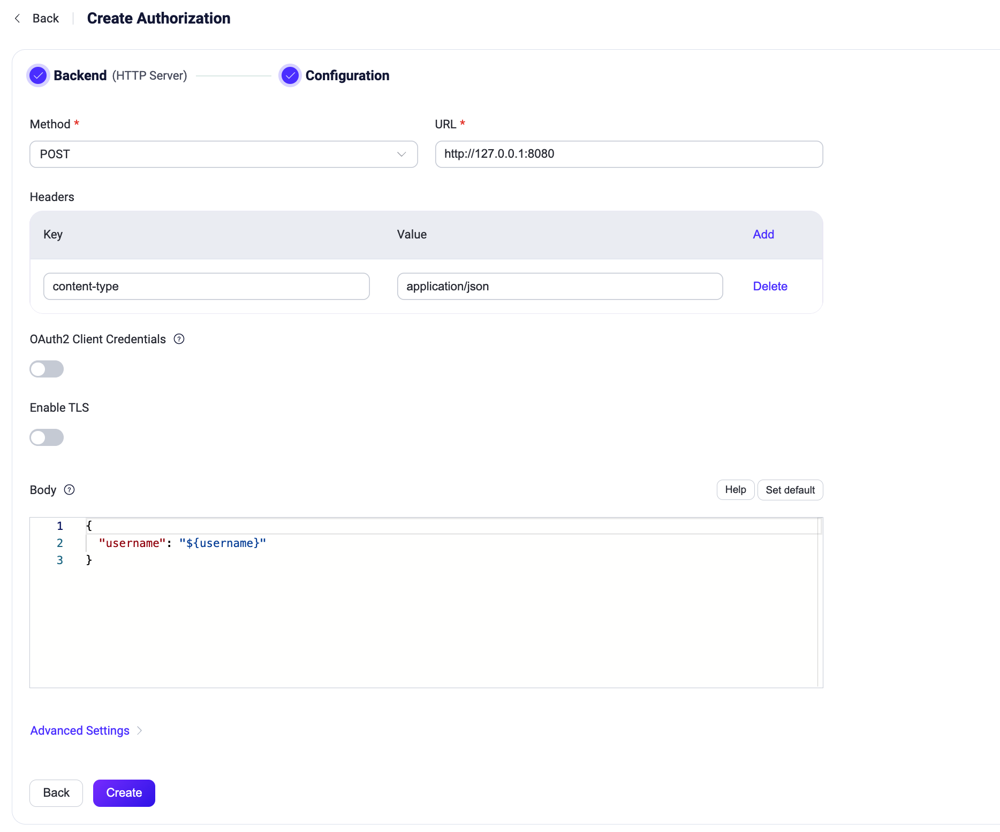

# Use HTTP Service

::: tip
Starting from EMQX v5.8.0, the HTTP authenticator supports including ACL rules in the response body to preset permissions for clients. You are recommended to use the new format for better performance. For details, see [HTTP Authentication](../authn/http.md).
:::

EMQX supports the authorization based on the HTTP service. The user needs to build an external HTTP application as a data source by themselves. EMQX makes requests to the HTTP service and determines the authorization result based on the data returned by the HTTP API, thus achieving complex authorization logic.

::: tip Tip

- Knowledge about [basic EMQX authorization concepts](./authz.md)

:::

## HTTP Request and Response

When the client initiates a subscription or publishing operation, the HTTP Authorizer constructs and sends a request based on the configured request template. Users need to implement authorization logic in the authorization service and return the results according to the following requirements.

### Request

The request can use JSON format, with the following placeholders in the URL and request body:

- `${clientid}`: The client ID.
- `${username}`: The username used by the client on login.
- `${client_attrs.NAME}`: A client attribute. `NAME` will be replaced by an attribute name set based on predefined configurations at runtime. For details about the client attributes, see [MQTT Client Attributes](../../client-attributes/client-attributes.md).
- `${peerhost}`: The source IP address of the client.
- `${proto_name}`: The protocol name used by the client, e.g. `MQTT`, `CoAP`.
- `${mountpoint}`: The mountpoint of the gateway listener (topic prefix).
- `${action}`: The action being requested, e.g. `publish`, `subscribe`.
- `${topic}`: The topic (or topic filter) to be published or subscribed in the current request.
- `${qos}`: The QoS of the message to be published or subscribed in the current request.
- `${retain}`: Whether the message to be published in the current request is a retained message.
- `${zone}`: The client's Zone at runtime. The Zone is a logical classification of the client, such as region or environment, that can be dynamically applied based on the client's configuration.

### Response

After checking, the authorization service needs to return a response in the following format:

- Response `content-type` must be `application/json`.
- If the HTTP Status Code is `200`, the authorization result is granted by HTTP Body. It depends on the value of the `result` field:
  - `allow`: Allow Publish or Subscribe.
  - `deny`: Deny Publish or Subscribe.
  - `ignore`: Ignore this request, it will be handed over to the next authorizer.
- If the HTTP Status Code is `204`, it means that this Publish or Subscribe request is allowed.
- HTTP Status Codes other than `200` and `204`, mean "ignore", for example, this HTTP service not available.

<!--- NOTE: the code supports `application/x-www-form-urlencoded` too, but it is not very easy to extend in the future, hence hidden from doc -->

Example response:

```json
HTTP/1.1 200 OK
Headers: Content-Type: application/json
...
Body:
{
    "result": "allow" | "deny" | "ignore" // Default `"ignore"`
}
```

::: tip EMQX 4.x compatibility statement:

In version 4.x, EMQX only used the status code returned by the HTTP API, while the content is discarded. For example, `200` indicates `allow`, and `403` indicates `deny`. In order to provide more information to the user, we added the return of the request content in EMQX 5.0 version.

:::

::: tip

It is recommended to use the `POST` method. When using the `GET` method, some sensitive information may be exposed through HTTP server logs.

For untrusted environments, HTTPS should be used.

:::

## Configure with Dashboard

1. On [EMQX Dashboard](http://127.0.0.1:18083/#/authentication), click **Access Control** -> **Authorization** on the left navigation tree to enter the **Authorization** page. 

2. Click **Create** at the top right corner, select **HTTP Server** as **Backend**, and click **Next**. The **Configuration** tab is shown as below.

   <!-- TODO: Replace or remove this screenshot after the Dashboard OAuth2 Client Credentials form is finalized. -->
   

3. Follow the instructions below to do the configuration.

   **HTTP**: Configure the HTTP request method, the IP address and request headers here.

   - **Request Method**: Select the HTTP request method, optional values: `GET`, `POST`.
   - **URL**: Enter the IP address of the HTTP application.
   - **Headers** (optional): Configure the HTTP request headers. Keys and values support using [placeholders](./authz.md#authorization-placeholders).

   **Connection Configuration**: Configure concurrent connections, connection timeout, maximum HTTP requests, and request timeout.

   - **Pool size** (optional): This is an integer that specifies the number of concurrent connections from EMQX nodes to external HTTP servers. The default value is `8`. 
   - **Connection Timeout** (optional): Enter the duration to wait for a connection timeout, with optional units: **hours**, **minutes**, **seconds**, **milliseconds**.
   - **HTTP Pipelining** (optional): Positive integer, specifies the maximum number of HTTP requests that can be sent without waiting for a response; default value: `100`.
   - **Request Timeout** (optional): Enter the duration to wait for a request timeout, with optional units: **hours**, **minutes**, **seconds**, **milliseconds**.
   - **TLS Configuration**: Configure whether to enable TLS.

   **Authorization Configuration**: Complete the configuration of the HTTP request body here. <!--Related information needs to be added.-->

4. Click **Create** to finish the setting.

### Configure OAuth2 Client Credentials

Starting from EMQX 6.0.4, an HTTP authorizer supports the OAuth 2.0 Client Credentials Grant. When OAuth2 is enabled, EMQX obtains, caches, and automatically refreshes an access token from the configured token endpoint. When EMQX calls the external HTTP authorization service, it sends the token in the `Authorization: Bearer <access_token>` request header so that the external service can authenticate EMQX.

Configure the following OAuth2 settings in Dashboard:

| Setting | Description |
| --- | --- |
| `enable` | Enables OAuth2 Client Credentials authentication. The default is `false`. |
| `grant_type` | OAuth2 grant type. Only `client_credentials` is supported. The default is `client_credentials`. |
| `token_endpoint` | URL of the OAuth2 token endpoint. The URL must use HTTP or HTTPS and must not contain user information. |
| `client_id` | Client ID used to request an access token. |
| `client_secret` | Client secret used to request an access token. |
| `scope` | Optional scope requested for the access token. |
| `timeout` | Timeout for connecting to and requesting the token endpoint. The default is `5s`. |
| `ssl` | TLS options for an HTTPS token endpoint. TLS is enabled by default. These options are independent of the TLS settings for the authorization service URL. |

EMQX sends a `POST` request with the `application/x-www-form-urlencoded` content type to the token endpoint. The request body contains `grant_type`, `client_id`, `client_secret`, and the optional `scope`. The token endpoint must return a `200` response with a JSON body containing an `access_token`. It can also return `token_type` and `expires_in`. If present, `token_type` must be `Bearer`, and `expires_in` must be a positive integer.

::: warning Important Notice

- Do not configure an `Authorization` header for the HTTP authorizer when OAuth2 is enabled. EMQX rejects the configuration because it conflicts with the automatically generated Bearer authorization header.
- The token endpoint must accept the client ID and client secret as form fields in the request body. Authenticating to the token endpoint with an HTTP Basic `Authorization` header is not supported.

:::

## Configure with Configuration Items

The HTTP authorization requires configuration with `type=http`.

HTTP `POST` and `GET` requests are supported. Each of them has some specific options. <!--For detailed information, see [authz:http_post](../../configuration/configuration-manual.html#authz:http_post) and [authz:http_get](../../configuration/configuration-manual.html#authz:http_get).-->

Example of an HTTP authorizer configured with `POST` request:

```bash
{
    type = http

    method = post
    url = "http://127.0.0.1:32333/authz/${peercert}?clientid=${clientid}"
    body {
        username = "${username}"
        topic = "${topic}"
        action = "${action}"
    }
    headers {
        "Content-Type" = "application/json"
        "X-Request-Source" = "EMQX"
    }
}
```

Example of an HTTP authorizer configured with `GET` request:

```bash
{
    type = http

    method = get
    url = "http://127.0.0.1:32333/authz"
    body {
        username = "${username}"
        topic = "${topic}"
        action = "${action}"
    }
    headers {
        "X-Request-Source" = "EMQX"
    }
}
```

### OAuth2 Client Credentials Configuration

Starting from EMQX 6.0.4, add an `oauth2` block to the HTTP authorizer to enable OAuth2 Client Credentials:

```hocon
oauth2 {
    enable = true
    grant_type = client_credentials
    token_endpoint = "https://auth.example.com/oauth/token"
    client_id = "emqx-client"
    client_secret = "emqx-client-secret"
    scope = "authorization.check"
    timeout = 5s
    ssl {
        enable = true
    }
}
```

Omit `scope` if the authorization server does not require it. For the request format and restrictions, see [Configure OAuth2 Client Credentials](#configure-oauth2-client-credentials).
