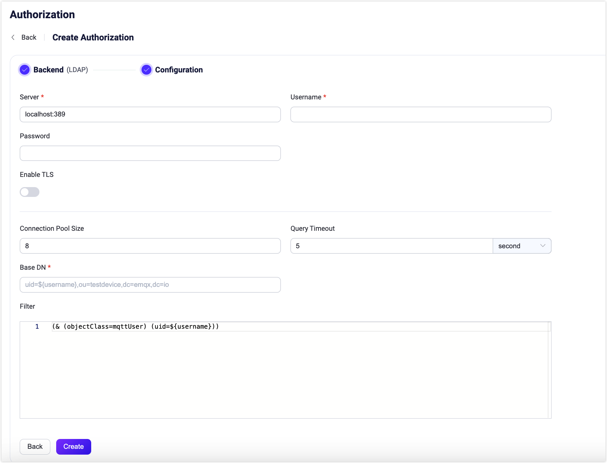

# Integrate with LDAP

[Lightweight Directory Access Protocol (LDAP)](https://ldap.com/) is a protocol used to access and manage directory information. EMQX supports integrating with an LDAP server for authorization checks. The LDAP authorizer implements authorization checks by matching publish/subscription requests against lists of attributes stored in the LDAP server.

::: tip Prerequisite

- Knowledge about [basic EMQX authorization concepts](./authz.md)

:::

## Data Schema and Query

The LDAP authorizer checks the client authorization against the authorization data stored within the LDAP directory. An LDAP schema defines the structure and rules for organizing and storing the authorization data. The LDAP authorizer supports almost any storage schema. Here is a schema example for OpenLDAP:

```sql

attributetype ( 1.3.6.1.4.1.11.2.53.2.2.3.1.2.3.4.1 NAME ( 'mqttPublishTopic' 'mpt' )
	EQUALITY caseIgnoreMatch
	SUBSTR caseIgnoreSubstringsMatch
	SYNTAX 1.3.6.1.4.1.1466.115.121.1.15
	USAGE userApplications )
attributetype ( 1.3.6.1.4.1.11.2.53.2.2.3.1.2.3.4.2 NAME ( 'mqttSubscriptionTopic' 'mst' )
	EQUALITY caseIgnoreMatch
	SUBSTR caseIgnoreSubstringsMatch
	SYNTAX 1.3.6.1.4.1.1466.115.121.1.15
	USAGE userApplications )
attributetype ( 1.3.6.1.4.1.11.2.53.2.2.3.1.2.3.4.3 NAME ( 'mqttPubSubTopic' 'mpst' )
	EQUALITY caseIgnoreMatch
	SUBSTR caseIgnoreSubstringsMatch
	SYNTAX 1.3.6.1.4.1.1466.115.121.1.15
	USAGE userApplications )

objectclass ( 1.3.6.1.4.1.11.2.53.2.2.3.1.2.3.4 NAME 'mqttUser'
    SUP top
	STRUCTURAL
	MAY ( mqttPublishTopic $ mqttSubscriptionTopic $ mqttPubSubTopic  ) )

```
The LDAP authorizer uses an allowed-list strategy. Users need to define a list of topics (wildcard supported) for each action. An action is only allowed if its topic can match, otherwise, the LDAP authorizer will ignore it.

Below is an example of LDAP authorization data specified in [LDAP Data Interchange Format (LDIF)](https://ldap.com/ldif-the-ldap-data-interchange-format/) based on the given schema for OpenLDAP:

```sql

## create organization: emqx.io
dn:dc=emqx,dc=io
objectclass: top
objectclass: dcobject
objectclass: organization
dc:emqx
o:emqx,Inc.

## create organization unit: testdevice.emqx.io
dn:ou=testdevice,dc=emqx,dc=io
objectClass: top
objectclass:organizationalUnit
ou:testdevice

dn:uid=mqttuser0001,ou=testdevice,dc=emqx,dc=io
objectClass: top
objectClass: mqttUser
uid: mqttuser0001
## allows publishing to these 3 topics
mqttPublishTopic: mqttuser0001/pub/1
mqttPublishTopic: mqttuser0001/pub/+
mqttPublishTopic: mqttuser0001/pub/#
## allows subscribe to these 3 topics
mqttSubscriptionTopic: mqttuser0001/sub/1
mqttSubscriptionTopic: mqttuser0001/sub/+
mqttSubscriptionTopic: mqttuser0001/sub/#
## the underneath topics allow both publish or subscribe
mqttPubSubTopic: mqttuser0001/pubsub/1
mqttPubSubTopic: mqttuser0001/pubsub/+
mqttPubSubTopic: mqttuser0001/pubsub/#

dn:uid=mqttuser0002,ou=testdevice,dc=emqx,dc=io
objectClass: top
objectClass: mqttUser
uid: mqttuser0002
mqttPublishTopic: mqttuser0002/pub/#
mqttSubscriptionTopic: mqttuser0002/sub/1
mqttPubSubTopic: mqttuser0002/pubsub/#

```

The given example defines a multi-valued attribute for each action. Each attribute can repeat zero or more times depending on how many topics are allowed for this action.

Edit the LDAP configuration file `sladp.conf` to include the schema and LDIF file so that they will be loaded when the LDAP server is started. Below is an example `sladp.conf` file:

::: tip

You can determine how to store LDAP authorization data and access them based on your business needs.

:::

```sh
include         /usr/local/etc/openldap/schema/core.schema
include         /usr/local/etc/openldap/schema/cosine.schema
include         /usr/local/etc/openldap/schema/inetorgperson.schema
include         /usr/local/etc/openldap/schema/ppolicy.schema
include         /usr/local/etc/openldap/schema/emqx.schema

TLSCACertificateFile  /usr/local/etc/openldap/cacert.pem
TLSCertificateFile    /usr/local/etc/openldap/cert.pem
TLSCertificateKeyFile /usr/local/etc/openldap/key.pem

database bdb
suffix "dc=emqx,dc=io"
rootdn "cn=root,dc=emqx,dc=io"
rootpw {SSHA}eoF7NhNrejVYYyGHqnt+MdKNBh4r1w3W

directory       /usr/local/etc/openldap/data
```

## Configure with Dashboard

You can use EMQX Dashboard to configure how to use LDAP for user authorization.

1. On [EMQX Dashboard](http://127.0.0.1:18083/#/authentication), click **Access Control** -> **Authorization** on the left navigation menu to enter the **Authorization** page.

2. Click **Create** at the top right corner, then click to select **LDAP** as **Backend**. Click **Next**. The **Configuration** tab is shown below.

   

3. Follow the instructions below to do the configuration.

   **Connect**: Fill in the information needed to connect to LDAP.

   - **Server**: Specify the server address that EMQX is to connect (`host:port`).
   - **Username** Specify the LDAP root user name.
   - **Password** Specify the LDAP root user password.

   **TLS Configuration**: Turn on the toggle switch if you want to enable TLS.

   **Connection Configuration**: Set the concurrent connections and waiting time before a connection is timed out.

   - **Pool size** (optional): Input an integer value to define the number of concurrent connections from an EMQX node to LDAP. Default: `8`.
   - **Query Timeout** (optional): Specify the waiting period before EMQX assumes the query is timed out. Units supported include milliseconds, second, minute, and hour.

   **Authorization configuration**: Fill in the authorization-related settings:

   - **Base DN**: The name of the base object entry (or possibly the root) relative to which the search is to be performed. For more information, see [RFC 4511 Search Request](https://datatracker.ietf.org/doc/html/rfc4511#section-4.5.1), the placeholders are supported.

     ::: tip

     DN refers to Distinguished Name. This is a unique identifier of each object entry and it also describes the location of the entry within the information tree.

     :::

   - **Filter**: The `filter` that defines the conditions that must be fulfilled in order for the `Search` to match a given entry.
     The syntax of the filter follows [RFC 4515](#https://www.rfc-editor.org/rfc/rfc4515) and also supports placeholders.

   - **Publish_attribute**: Indicates which attribute is used to represent the allowed topics list of the `publish`.

   - **Subscribe_attribute**: Indicates which attribute is used to represent the allowed topics list of the `subscribe`.

   - **All_attribute**: Indicates which attribute is used to represent the both allowed topics list of `publish` and `subscribe`.

4. Click **Create** to finish the settings.

## Configure with Configuration Items

You can configure the EMQX LDAP authorizer with EMQX configuration items.

The LDAP authorizer is identified by type `ldap`.

Sample configuration:

```bash
{
  type = ldap
  enable = true

  server = "127.0.0.1:389"
  publish_attribute = "mqttPublishTopic"
  subscribe_attribute = "mqttSubscriptionTopic"
  all_attribute = "mqttPubSubTopic"
  query_timeout = "5s"
  username = "root"
  password = "root password"
  pool_size = 8
  base_dn = "uid=${username},ou=testdevice,dc=emqx,dc=io"
  filter = "(objectClass=mqttUser)"
}
```
