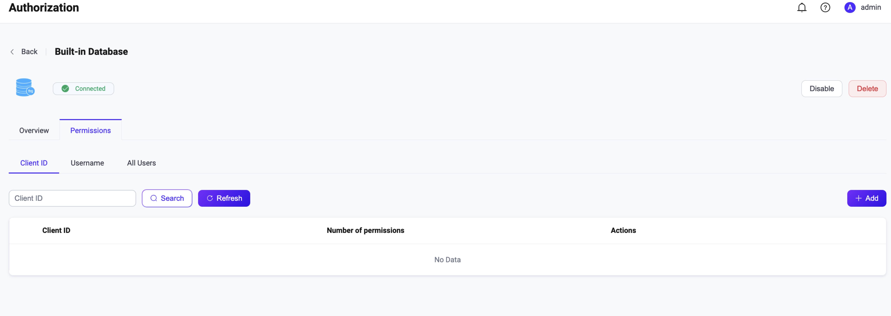

# Use Built-in Database

EMQX provides users with a low-cost, out-of-the-box authorization rule storage method through the built-in database. You can use the built-in database (Mnesia) as a data source by setting it up through the Dashboard or configuration files, and add relevant authorization check rules through the Dashboard or HTTP API.

::: tip Tip

- Knowledge about [basic EMQX authorization concepts](./authz.md)

:::

## Configure with Dashboard

1. On [EMQX Dashboard](http://127.0.0.1:18083/#/authentication), click **Access Control** -> **Authorization** on the left navigation tree to enter the **Authorization** page. 

2. Click **Create** at the top right corner, select **Built-in Database** as **Backend**, and click **Next**. 

   

3. As built-in database authorization does not require configuration parameters, you can click **Create** to finish.

## Configure with Configuration File

The built-in database authorizer is identified by type `built_in_database`.

Sample configuration:

```bash
{
    type = built_in_database
    enable = true
}
```

-  `type`: The data source type of the authorization checker; fill in `built_in_database` here.

- `enable`: Whether to activate this checker; optional values: `true`, `false`.

<!--For detailed parameter list, see [authz-mnesia](../../configuration/configuration-manual.md#authz-mnesia).-->

## Create Authorization Rules

You can create authorization rules through Dashboard or API.

### Create with Dashboard

On the **Authorization** page in Dashboard, click the **Permissions** button in the **Actions** column of the **Built-in Database** backend.



You can set authorization checks based on the client ID, username, or topic as needed.

- **Client ID**: See the **Client ID** tab, specify the client that this rule applies to.
- **Username**: See the **Username** tab, specify the user that this rule applies to.
- **Permission**: Whether to allow or deny a certain type of operation request from the current client/user; optional values: **Allow**, **Deny**.
- **Action**: Configure the operation corresponding to this rule; optional values: **Publish**, **Subscribe**, **Publish & Subscribe**.
- **Topic**: Configure the topic corresponding to this rule.

EMQX supports configuring multiple authorization check rules for a single client or user, and you can adjust the execution order and priority of different rules through the **Move Up** and **Move Down** buttons on the page.

If you want to configure authorization check rules for multiple clients or users at the same time, you can import <!--how to understand "传入规则“？--> the relevant configuration through the HTTP API.

### Create with API

Rules are also managed through `/api/v5/authorization/sources/built_in_database` APIs.

Each rule is applied to:
* a particular client identified by clientid
  *  `/api/v5/authorization/sources/built_in_database/clientid`
* a particular client identified by username
  * `/api/v5/authorization/sources/built_in_database/username` 

* all clients
  *  `/api/v5/authorization/sources/built_in_database/all` 


Below is a quick example for how to create rules for a client (`client1`):

```bash
curl -X 'POST' \
  'http://localhost:18083/api/v5/authorization/sources/built_in_database/clientid' \
  -H 'accept: */*' \
  -H 'Content-Type: application/json' \
  -d '[
  {
    "clientid": "client1",
    "rules": [
      {
        "action": "publish",
        "permission": "allow",
        "topic": "test/toopic/1"
      },
      {
        "action": "subscribe",
        "permission": "allow",
        "topic": "test/toopic/2"
      },
      {
        "action": "all",
        "permission": "deny",
        "topic": "eq test/#"
      }
    ]
  }
]'
```

Each rule contains:
* `permission`: Whether to allow or deny a certain type of operation request from current client/user; optional values: `allow` or `deny`;
* `action`: Configure the operation corresponding to this rule; optional values: `publish`, `subscribe`, or `all`;
* `topic filter`: Configure the corresponding to this rule, supporting [topic placeholders](./authz.md#topic-placeholders).

