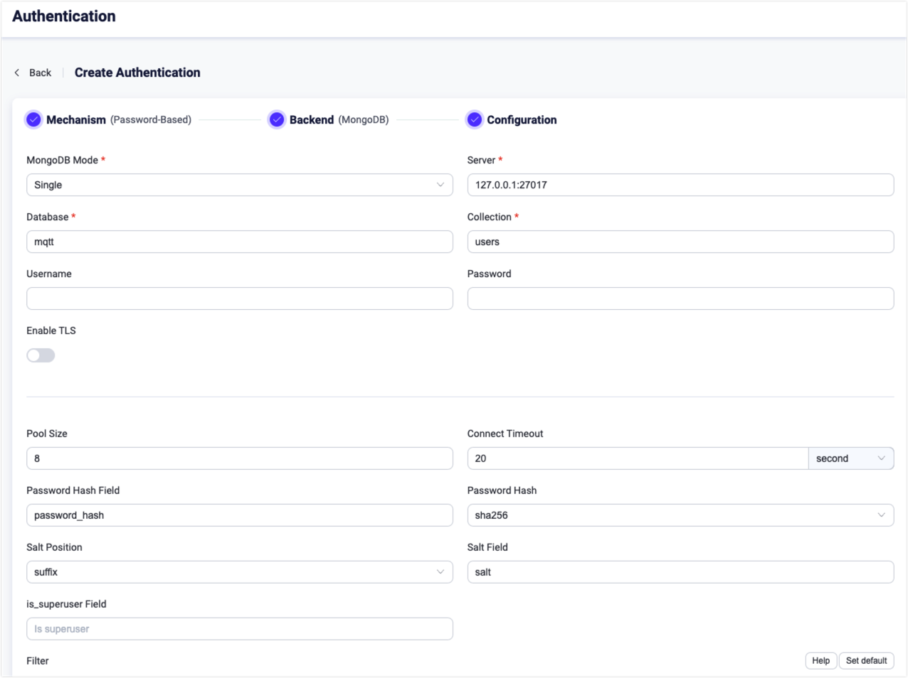

# Integrate with MongoDB

This authorizer implements authorization checks through matching pubublish/subscription requests against lists of rules stored in the MongoDB database.

::: tip Tip

- Knowledge about [basic EMQX authorization concepts](./authz.md)

:::

## Data Schema and Query Statement

MongoDB authorizer supports storing authorization rules as MongoDB documents. Users need to provide a query template to make sure that the result contains the following fields:

* `permission` value specifies the applied action if the rule matches. Should be one of `deny` or `allow`.
* `action` value specifies the request for which the rule is relevant. Should be one of `publish`, `subscribe`, or `all`.
* `topic` value specifies the topic filter for topics relevant to the rule. Should be a string that supports wildcards and [topic placeholders](./authz.md#topic-placeholders).

Example of adding an authorization rule for a user `user123` who is allowed to publish topics `data/user123/#`:

```js
> db.mqtt_acl.insertOne(
  {
      "username": "user123",
      "clientid": "client123",
      "ipaddress": "127.0.0.1",
      "permission": "allow",
      "action": "publish",
      "topics": ["data/user123/#"]
  }
);
{
  acknowledged: true,
  insertedId: ObjectId("62b4a1a0e693ae0233bc3e98")
}
```

The corresponding configuration parameters are:
```
collection = "mqtt_acl"
filter { username = "${username}", ipaddress = "${peerhost}" }
```

::: tip
When there is a significant number of users in the system, optimize and index the collection to be queried beforehand to shorten the query response time and reduce the load for EMQX.
:::

For this MongoDB data schema, the corresponding Dashboard configuration parameter is **Filter**: `{ username = "${username}" }`.

## Configurate with Dashboard

You can use EMQX Dashboard to configure how to use MongoDB for user authorization.

1. On [EMQX Dashboard](http://127.0.0.1:18083/#/authentication), click **Access Control** -> **Authorization** on the left navigation tree to enter the **Authorization** page. 

2. Click **Create** at the top right corner, then click to select **MongoDB** as **Backend**. Click **Next**. The **Configuration** tab is shown as below.

   

3. Follow the instructions below to do the configuration.

   **Connect**: Fill in the information needed to connect MongDB.

   - **MongoDB Mode**: Select how MongoDB is deployed, including **Single**, **Replica Set** and **Sharding**.
   - **Server**: Specify the server address that EMQX is to connect (`host:port`).
   - **Database**: MongoDB database name.
   - **Collection**: Name of MongoDB collection where authorization rules are stored; Data type: strings.
   - **Username** (optional): Specify MongoDB user name. 
   - **Password** (optional): Specify MongDB user password. 

   **TLS Configuration**: Turn on the toggle switch if you want to enable TLS. 

   **Connection Configuration**: Set the concurrent connections and waiting time before a connection is timed out.

   - **Pool size** (optional): Input an integer value to define the number of concurrent connections from an EMQX node to MongoDB. Default: **8**. 
   - **Connect Timeout** (optional): Specify the waiting period before EMQX assumes the connection is timed out. Units supported include milliseconds, second, minute, and hour.

   **Authorization configuration**: Fill in the authorization-related settings:

   - A map interpreted as MongoDB selector for credential lookup. [Placeholders](./authz.md#authorization-placeholders) are supported. 

4. Click **Create** to finish the settings.

## Configure with Configuration Items

You can configure the EMQX MongoDB authorizer with EMQX configuration items.

The MongoDB authorizer is identified by type `mongodb`. The authorizer supports connecting to MongoDB running in 3 types of deployment modes. <!---For detailed configuration information, see:[authz:mongo_single](../../configuration/configuration-manual.md#authz:mongo_single),[authz:mongo_sharded](../../configuration/configuration-manual.md#authz:mongo_sharded) and [authz:mongo_rs](../../configuration/configuration-manual.md#authz:mongo_rs)-->

Sample configuration:

:::: tabs type:card

::: tab Single 

```bash
{
  type = mongodb
  enable = true

  collection = "mqtt_user"
  filter { username = "${username}" }

  mongo_type = single
  server = "127.0.0.1:27017"

  database = "mqtt"
  username = "emqx"
  password = "secret"
}
```

:::

::: tab Replica set

```bash
{
  type = mongodb
  enable = true

  collection = "mqtt_user"
  filter { username = "${username}" }

  mongo_type = rs
  servers = "10.123.12.10:27017,10.123.12.11:27017,10.123.12.12:27017"
  replica_set_name = "rs0"

  database = "mqtt"
  username = "emqx"
  password = "secret"
}
```
:::

::: tab Sharding

```bash
{
  type = mongodb
  enable = true

  collection = "mqtt_user"
  filter { username = "${username}" }

  mongo_type = sharded
  servers = "10.123.12.10:27017,10.123.12.11:27017,10.123.12.12:27017"

  database = "mqtt"
  username = "emqx"
  password = "secret"
}
```

:::

::::
