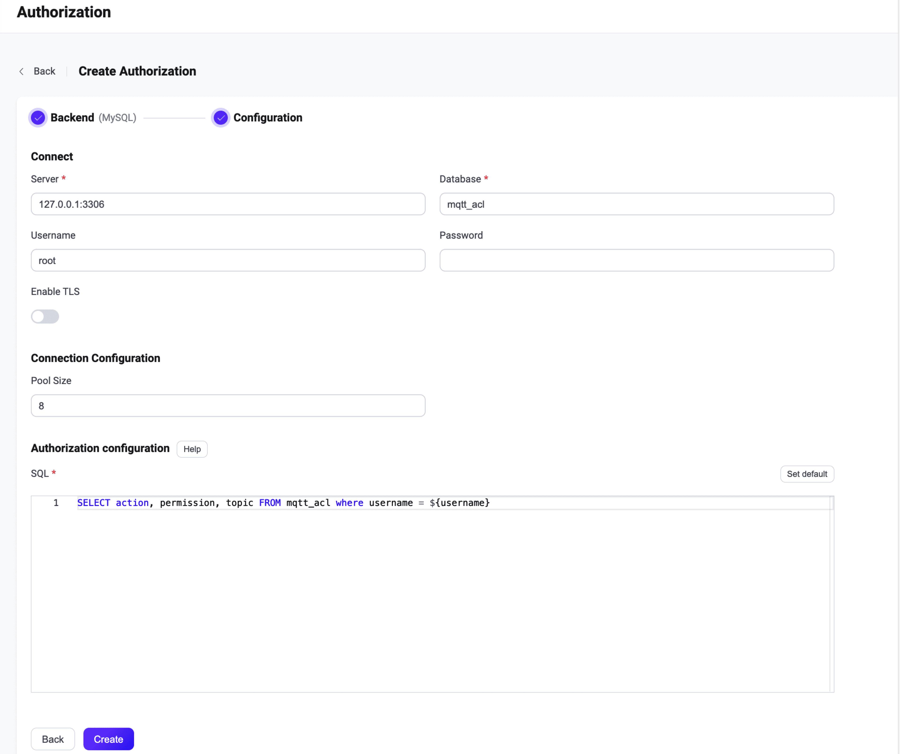

# Integrate with MySQL

This authorizer implements authorization checks through matching publish/subscription requests against lists of rules stored in the MySQL database.

::: tip Tip

- Knowledge about [basic EMQX authorization concepts](./authz.md)


:::

## Data Schema and Query Statement

MySQL authorizer supports almost any storage schema. You can determine how to store credentials and access them as your business needs, for example, using one or multiple tables, views, etc.

Users need to provide a query statement template and ensure the following fields are included:
* `permission` value specifies the applied action if the rule matches. Should be one of `deny` or `allow`.
* `action` value specifies the request for which the rule is relevant. Should be one of `publish`, `subscribe`, or `all`.
* `topic` value specifies the topic filter for topics relevant to the rule. Should be a string that supports wildcards and [topic placeholders](./authz.md#topic-placeholders).

Example table structure for storing credentials:

```sql
CREATE TABLE `mqtt_acl` (
  `id` int(11) unsigned NOT NULL AUTO_INCREMENT,
  `ipaddress` VARCHAR(60) NOT NULL DEFAULT '',
  `username` VARCHAR(255) NOT NULL DEFAULT '',
  `clientid` VARCHAR(255) NOT NULL DEFAULT '',
  `action` ENUM('publish', 'subscribe', 'all') NOT NULL,
  `permission` ENUM('allow', 'deny') NOT NULL,
  `topic` VARCHAR(255) NOT NULL DEFAULT '',
  PRIMARY KEY (`id`)
) ENGINE=InnoDB DEFAULT CHARSET=utf8mb4;
```

::: tip
When there is a significant number of users in the system, optimize and index the tables to be queried beforehand to shorten the query response time and reduce the load for EMQX.
:::

In this table, MQTT users are identified by `username`.

For example, if you want to add an authorization rule for a user `user123` who is allowed to publish topics `data/user123/#`, the query statement should be:

```bash
mysql> INSERT INTO mqtt_acl(username, permission, action, topic, ipaddress) VALUES ('user123', 'allow', 'publish', 'data/user123/#', '127.0.0.1');
Query OK, 1 row affected (0,01 sec)
```

The corresponding configuration parameters are:
```bash
query = "SELECT action, permission, topic, ipaddress FROM mqtt_acl where username = ${username} and ipaddress = ${peerhost}"
```

## Configure with Dashboard

You can use EMQX Dashboard to configure how to use MySQL for user authorization.

1. On [EMQX Dashboard](http://127.0.0.1:18083/#/authentication), click **Access Control** -> **Authorization** on the left navigation tree to enter the **Authorization** page. 

2. Click **Create** at the top right corner, then click to select **MySQL** as **Backend**. Click **Next**. The **Configuration** tab is shown as below.

   

3. Follow the instructions below to do the configuration.

   **Connect**: Fill in the information needed to connect MySQL.

   - **Server**: Specify the server address that EMQX is to connect (`host:port`).
   - **Database**: MySQL database name.
   - **Username** (optional): Specify user name. 
   - **Password** (optional): Specify user password. 

   **TLS Configuration**: Turn on the toggle switch if you want to enable TLS. 

   **Connection Configuration**: Set the concurrent connections and waiting time before a connection is timed out.

   - **Pool size** (optional): Input an integer value to define the number of concurrent connections from an EMQX node to MySQL. Default: **8**. 

   **Authorization configuration**: Fill in the authorization-related settings:

   - **SQL**: Fill in the query statement according to the data schema. For more information, see [Data Schema and Query Statement](#data-schema-and-query-statement). 

4. Click **Create** to finish the settings.

## Configure with Configuration Items

You can configure the EMQX MySQL authorizer with EMQX configuration items.

The MySQL authorizer is identified by type `mysql`. <!--For detailed configuration, see [authz:mysql](../../configuration/configuration-manual.md#authz:mysql).-->

Sample configuration:

```bash
{
  type = mysql
  enable = true

  database = "mqtt"
  username = "root"
  password = "public"
  server = "127.0.0.1:3306"
  query = "SELECT permission, action, topic FROM mqtt_acl WHERE username = ${username}"
}
```

