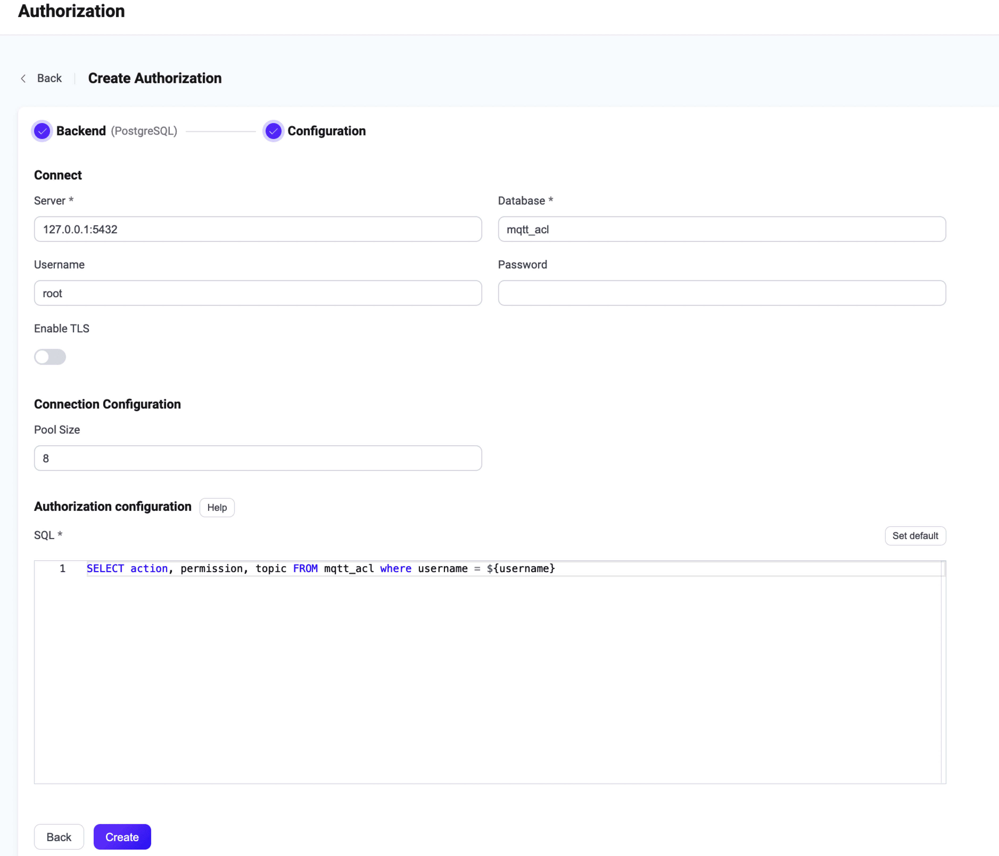

# Integrate with PostgreSQL

This authorizer implements authorization checks through matching publish/subscription requests against lists of rules stored in the PostgreSQL database.

::: tip Tip

- Knowledge about [basic EMQX authorization concepts](./authz.md)

:::

## Data Schema and Query Statement

PostgreSQL authorizer supports almost any storage schema. It is up to the user to decide how to store acl rules and access them: using one or multiple tables, views, etc.

Users need to provide a query statement template and ensure the following fields are included:
* `permission` value specifies the applied action if the rule matches. Should be one of `deny` or `allow`.
* `action` value specifies the request for which the rule is relevant. Should be one of `publish`, `subscribe`, or `all`.
* `topic` value specifies the topic filter for topics relevant to the rule. Should be a string that supports wildcards and [topic placeholders](./authz.md#topic-placeholders).

Example table structure for storing credentials:

```sql
CREATE TYPE ACTION AS ENUM('publish','subscribe','all');
CREATE TYPE PERMISSION AS ENUM('allow','deny');

CREATE TABLE mqtt_acl (
  id SERIAL PRIMARY KEY,
  ipaddress CHARACTER VARYING(60) NOT NULL DEFAULT '',
  username CHARACTER VARYING(255) NOT NULL DEFAULT '',
  clientid CHARACTER VARYING(255) NOT NULL DEFAULT '',
  action ACTION,
  permission PERMISSION,
  topic CHARACTER VARYING(255) NOT NULL
);

CREATE INDEX mqtt_acl_username_idx ON mqtt_acl(username);
```

In this table, MQTT users are identified by `username`.

For example, if you want to add an authorization rule for a user `user123` who is allowed to publish topics `data/user123/#`, the query statement should be:

```
postgres=# INSERT INTO mqtt_acl(username, permission, action, topic, ipaddress) VALUES ('user123', 'allow', 'publish', 'data/user123/#', '127.0.0.1');
INSERT 0 1
```

The corresponding config parameters are:
```
query = "SELECT permission, action, topic, ipaddress FROM mqtt_acl WHERE username = ${username} and ipaddress = ${peerhost}"
```

## Configure with Dashboard

You can use EMQX Dashboard to configure how to use PostgreSQL for user authorization.

1. On [EMQX Dashboard](http://127.0.0.1:18083/#/authentication), click **Access Control** -> **Authorization** on the left navigation tree to enter the **Authorization** page. 

2. Click **Create** at the top right corner, then click to select **PostgreSQL** as **Backend**. Click **Next**. The **Configuration** tab is shown as below.

   

3. Follow the instructions below to do the configuration.

   **Connect**: Fill in the information needed to connect PostgreSQL.

   - **Server**: Specify the server address that EMQX is to connect (`host:port`).
   - **Database**: PostgreSQL database name.
   - **Username** (optional): Specify user name. 
   - **Password** (optional): Specify user password. 

   **TLS Configuration**: Turn on the toggle switch if you want to enable TLS. 

   **Connection Configuration**: Set the concurrent connections and waiting time before a connection is timed out.

   - **Pool size** (optional): Input an integer value to define the number of concurrent connections from an EMQX node to PostgreSQL. Default: **8**. 

   **Authorization configuration**: Fill in the authorization-related settings:

   - **SQL**: Fill in the query statement according to the data schema. For more information, see [SQL data schema and query statement](#sql-table-structure-and-query-statement). 

4. Click **Create** to finish the settings.

## Configure with Configuration Items

You can configure the EMQX PostgresSQL authorizer with EMQX configuration items.

The PostgreSQL authorizer is identified by type `postgresql`. <!--For detailed configuration, see [authz:postgresql](../../configuration/configuration-manual.md#authz:postgresql).-->

Sample configuration:

```bash
{
  type = postgresql
  enable = true

  database = "mqtt"
  username = "postgres"
  password = "public"
  server = "127.0.0.1:5432"
  query = "SELECT permission, action, topic FROM mqtt_acl WHERE username = ${username}"
}
```

