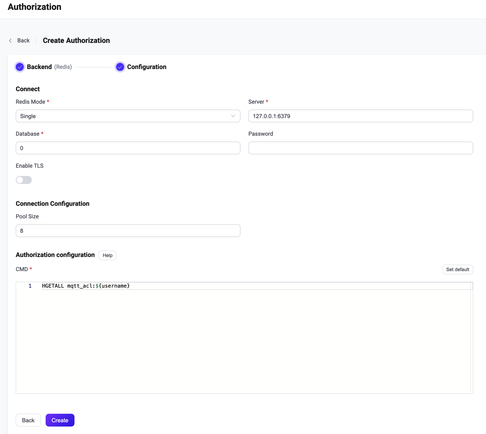

# Integrate with Redis

This authorizer implements authorization checks through matching publish/subscription requests against lists of rules stored in the Redis database.

::: tip Tip

- Knowledge about [basic EMQX authorization concepts](./authz.md)

:::

## Data Schema and Query Statement

Users need to provide a templated Redis command that returns a key-value list with topic filters as keys and actions (`publish`, `subscribe`, or `all`) as values.

For example, rules can be stored as [Redis hashes](https://redis.io/docs/manual/data-types/#hashes):

```
>redis-cli
127.0.0.1:6379> HSET users:someuser foo/# subscribe
(integer) 1
127.0.0.1:6379> HSET users:someuser bar/baz publish
(integer) 1
```

The corresponding config parameters are:
```
cmd = "HGET users:${username}"
```

Fetched rules are used as permissive ones, i.e., a request is accepted if topic filter and action match.

:::tip
All rules added in Redis Authorizer are **allow** rules, which means Redis Authorizer needs to be used in whitelist mode.
:::

## Configure with Dashboard

You can use EMQX Dashboard to configure how to use Redis for user authorization.

1. On [EMQX Dashboard](http://127.0.0.1:18083/#/authentication), click **Access Control** -> **Authorization** on the left navigation tree to enter the **Authorization** page. 

2. Click **Create** at the top right corner, then click to select **Redis** as **Backend**. Click **Next**. The **Configuration** tab is shown as below.

   

3. Follow the instructions below to do the configuration.

   **Connect**: Fill in the information needed to connect Redis.

   - **Redis Mode**: Select how Redis is deployed, including **Single**, **Sentinel** and **Cluster**.
   - **Server**: Specify the server address that EMQX is to connect (`host:port`).
   - **Database**: Redis database name.
   - **Password** (optional): Specify user password. 

   **TLS Configuration**: Turn on the toggle switch if you want to enable TLS. 

   **Connection Configuration**: Set the concurrent connections and waiting time before a connection is timed out.

   - **Pool size** (optional): Input an integer value to define the number of concurrent connections from an EMQX node to Redis. Default: **8**. 

   **Authorization configuration**: Fill in the authorization-related settings:

   - **CMD**: Fill in the query command according to the data schema.

4. Click **Create** to finish the settings.

## Configure with Configuration Items

You can configure the EMQX Redis authorizer with EMQX configuration items.

The Redis authorizer is identified by type `redis`. The authorizer supports connecting to Redis running in 3 types of deployment modes. <!--For detailed configuration information, see: [redis_single](../../configuration/configuration-manual.md#authz:redis_single), [authz:redis_sentinel](../../configuration/configuration-manual.md#authz:redis_sentinel), and [authz:redis_cluster](../../configuration/configuration-manual.md#authz:redis_cluster).-->

Sample configuration:

:::: tabs type: card

::: tab Single

```bash
{
    type = redis
    enable = true

    redis_type = single
    server = "127.0.0.1:6379"

    cmd = "HGETALL mqtt_user:${username}"
    database => 1
    password = public
    server = "127.0.0.1:6379"

}
```

:::

::: tab Sentinel

```bash
{
    type = redis
    enable = true

    redis_type = sentinel
    servers = "10.123.13.11:6379,10.123.13.12:6379"
    sentinel = "mymaster"

    cmd = "HGETALL mqtt_user:${username}"
    database => 1
    password = public

}
```

:::

::: tab Cluster

```bash
{
    type = redis
    enable = true

    redis_type = cluster
    servers = "10.123.13.11:6379,10.123.13.12:6379"

    cmd = "HGETALL mqtt_user:${username}"
    database => 1
    password = public
}
```

:::

::::
