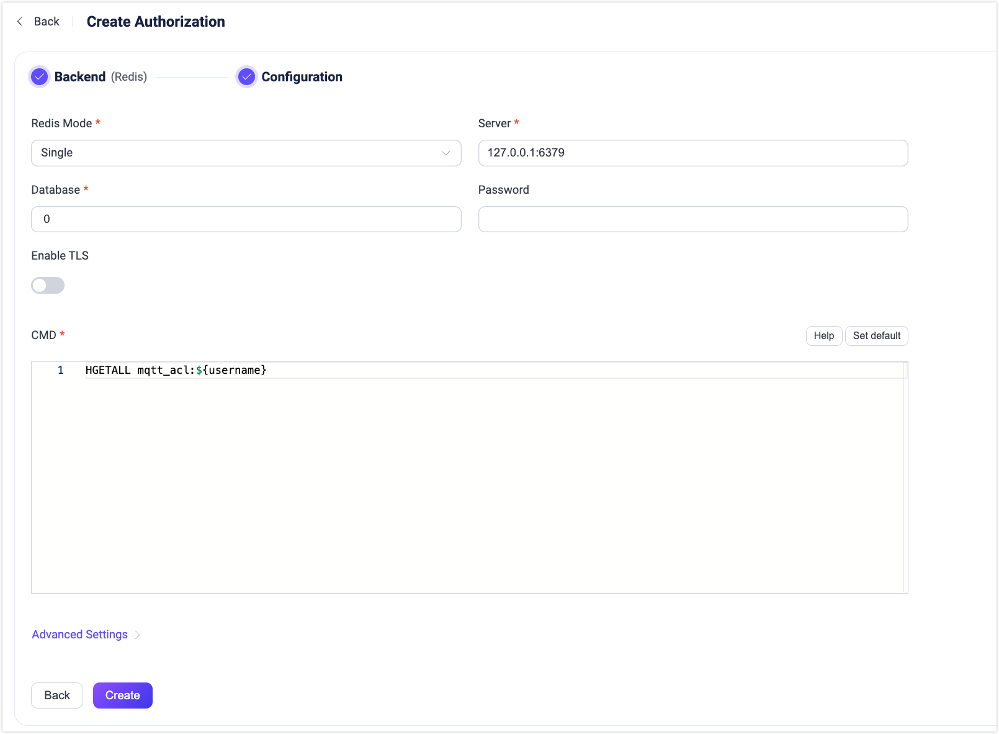

# Integrate with Redis

This authorizer implements authorization checks by matching publish/subscription requests against lists of rules stored in the Redis database.

::: tip Prerequisite

Knowledge about [basic EMQX authorization concepts](./authz.md)

:::

## Data Schema and Query Statement

Users need to provide a query template that returns the following data:

- `topic`: Specifies the topic that the rule applies to, which can use topic filters and [topic placeholders](./authz.md#topic-placeholders).
- `action`: Specifies the actions that the rule applies to, available options are `publish`, `subscribe`, and `all`.
- `qos` (Optional) Specifies the QoS levels that the current rule applies to. Value options are `0`, `1`, `2`. It can also be a number array to specify multiple QoS levels. The default is all QoS levels.
- `retain`: (Optional) Specifies whether the rule supports retained messages. Value options are `true`, `false`. The default is to allow retained messages.

For example, rules can be stored as [Redis hashes](https://redis.io/docs/latest/develop/data-types/hashes/).

Adding permission data for user `emqx_u` to subscribe to topic `t/1`:

```bash
HSET mqtt_acl:emqx_u t/1 subscribe
```

Due to Redis structure limitations, when using the `qos` and `retain` fields, the field other than topic needs to be placed in a JSON string, for example:

- Adding permission data for user `emqx_u` to subscribe to topic `t/2` with QoS 1 and QoS 2:

```bash
HSET mqtt_acl:emqx_u t/2 '{ "action": "subscribe", "qos": [1, 2] }'
```

- Adding permission data to deny user `emqx_u` from publishing retained messages to `t/3`:

```bash
HSET mqtt_acl:emqx_u t/3 '{ "action": "publish", "retain": false }'
```

The corresponding config parameters are:

```bash
cmd = "HGETALL mqtt_acl:${username}"
```

Fetched rules are used as permissive ones, i.e., a request is accepted if the topic filter and action match.

:::tip
All rules added in Redis Authorizer are **allow** rules, which means Redis Authorizer needs to be used in whitelist mode.
:::

## Configure with Dashboard

You can use EMQX Dashboard to configure how to use Redis for user authorization.

1. On the EMQX Dashboard, click **Access Control** -> **Authorization** on the left navigation tree to enter the **Authorization** page. 

2. Click **Create** at the top right corner, then click to select **Redis** as **Backend**. Click **Next**. The **Configuration** tab is shown as below.

   

3. Follow the instructions below to configure the settings.

   - **Redis Mode**: Select how Redis is deployed, including `Single`, `Sentinel` and `Cluster`.

   - **Server**: Specify the server address that EMQX is to connect (`host:port`).

   - **Database**: Redis database name.

   - **Username**: Specify the Redis username to connect with. This field is required if your Redis instance uses [Redis ACL](https://redis.io/docs/latest/operate/oss_and_stack/management/security/acl/#create-and-edit-user-acls-with-the-acl-setuser-command) (introduced in Redis 6.0) for authentication. If your Redis server uses the default user (with ACLs disabled or not enforced), you can leave this field blank.

     ::: tip

     The `username` field is supported starting from EMQX 5.2.0. Ensure your deployment is running this version or later to use Redis ACL.

     :::
     
   - **Password**: Specify the password for the Redis user. The field is required for connecting to Redis instances with authentication enabled.

     - If you have entered a username, this password must match the credentials configured in your Redis ACL settings.
     - If no username is provided, this password will be used to authenticate as the `default` user (if enabled).

   - **Precondition**: Enter an optional Variform expression. EMQX invokes this authorizer only when the expression evaluates to `true`. For details, see [Authorizer Preconditions](./authz.md#authorizer-preconditions).

   - **Compatibility Mode**: Controls whether to enable compatibility with the EMQX 4.x Redis ACL data format.

     - `Disabled (Default)`: Use the current rule format.
     - `v4`: Enable compatibility with legacy EMQX 4.x Redis ACL data, allowing reuse of existing data without modification during upgrades.

     ::: tip

     This option is intended for upgrade scenarios where existing Redis ACL data created by EMQX 4.x must be reused without modification. For new deployments, it is recommended to keep this option disabled and use the current rule format.

     :::

   - **Enable TLS**: Turn on the toggle switch if you want to enable TLS. 

   - **CMD**: Fill in the query command according to the data schema.

   - **Advanced Settings**: Set the concurrent connections and waiting time before a connection is timed out.
     - **Pool size** (optional): Input an integer value to define the number of concurrent connections from an EMQX node to Redis. Default: `8`. 

4. Click **Create** to finish the settings.

## Configure with Configuration Items

You can configure the EMQX Redis authorizer with EMQX configuration items.

The Redis authorizer is identified by type `redis`. The authorizer supports connecting to Redis running in 3 types of deployment modes. 

The optional `precondition` configuration item accepts a Variform expression. EMQX invokes this authorizer only when the expression evaluates to `true`. If `precondition` is omitted or empty, no precondition is applied. For details, see [Authorizer Preconditions](./authz.md#authorizer-preconditions).

Sample configuration:

:::: tabs type: card

::: tab Single

```hocon
{
    type = redis

    redis_type = single
    server = "127.0.0.1:6379"

    cmd = "HGETALL mqtt_user:${username}"
    database = 1
    password = public
    
    compatibility_mode = disabled
}
```

:::

::: tab Sentinel

```hocon
{
    type = redis

    redis_type = sentinel
    servers = "10.123.13.11:6379,10.123.13.12:6379"
    sentinel = "mymaster"

    cmd = "HGETALL mqtt_user:${username}"
    database = 1
    password = public
    
    compatibility_mode = disabled
}
```

:::

::: tab Cluster

```hocon
{
    type = redis

    redis_type = cluster
    servers = "10.123.13.11:6379,10.123.13.12:6379"

    cmd = "HGETALL mqtt_user:${username}"
    password = public
    
    compatibility_mode = disabled
}
```

:::

::::

> `compatibility_mode` can be set to `v4` when upgrading from EMQX 4.x and reusing legacy Redis ACL data.
