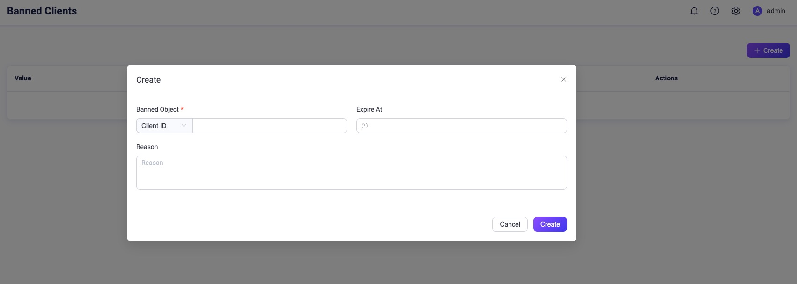

# Blacklist

EMQX provides users with a blacklisting/banning functionality.

The administrator can deny the access of clients by add the specified clients to the blacklist. In addition to the client identifier, it also supports direct ban by user names or source IP addresses.

::: tip
The blacklist is only applicable to a small number of client bans. If there are a large number of clients requiring authentication management, use the [authentication](./authn/authn.md) function.
:::

## Create blacklist with Dashboard

1. On [EMQX Dashboard](http://127.0.0.1:18083/#/authentication), click **Access Control** -> **Blacklist** on the left navigation tree to enter the **Blacklist** page. 

2. Click **Create** at the top right corner. The **Create** dialog is show as below.

   

3. Follow the instructions below to specify a client to be banned.

   **Banned Object**: Select **Client ID**, **Username**, or **IP Address** from the dropdown menu; fill in the corresponding value.

   **Expire At**: Click the clock icon to select the expiration time and date for this banning action.

   **Reason**: Fill in the reason why you want to ban this client in this text box.

2. Click **Create** to finish the setting.

## Flapping clients

Based on the blacklist function, EMQX automatically bans frequently logging clients to prevent them from consuming server resources that may affect other clients. Those clients will be banned for a period of time.

It should be noted that the automatic ban only bans the client by the identifier, not by the user name and IP address. That is to say, a malicious client may still able to attack if they change client identifier for each attempt.

This feature is disabled by default, and users can enable it by adding the following configuration to the `emqx.conf` file:

```bash
flapping_detect {

  enable = true

  ## The max disconnect allowed of a MQTT Client in `window_time`
  max_count = 15

  ## The time window for flapping detect
  window_time = 1m

  ## How long the clientid will be banned
  ban_time = 5m

}
```

These settings may be specified individually for each zone.
