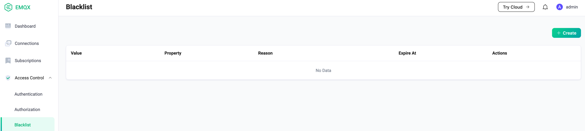
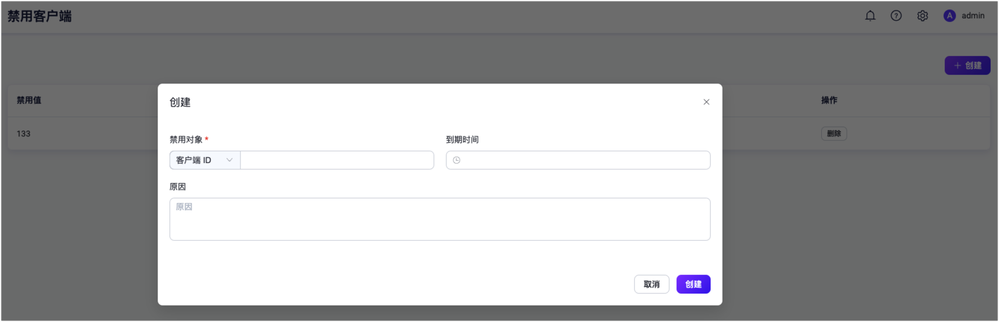

# Blacklist

EMQX Broker provides users with a blacklisting/banning functionality.

Administrator can add specified clients to the blacklist by the Dashboard
to deny access of the client.

In addition to the client identifier, it also supports direct ban of user names or source IP addresses.

::: tip
The blacklist is only applicable to a small number of client bans.
If there are a large number of clients requiring authentication management,
please use the [authentication](./authn/authn.md) function.
:::

## Usage

1. Open the blacklist page



2. Click the "Create" button to add



## Flapping Clients

Based on the blacklist function, EMQX supports automatic banning of clients that are frequently
logged in for a short period of time, and rejects these clients for a period of time
to prevent such clients from consuming server resources which in turn may affect other clients.

It should be noted that the automatic ban only bans the client identifier,
not the user name and IP address.
That is to say, a malicious client may still able to attack if they change client identifier for each attempt.

This feature is disabled by default, and users can enable it by adding the following configuration to the `emqx.conf` file:

```bash
flapping_detect {

  enable = true

  ## The max disconnect allowed of a MQTT Client in `window_time`
  max_count = 15

  ## The time window for flapping detect
  window_time = 1m

  ## How long the clientid will be banned
  ban_time = 5m

}
```

These settings may be specified individually for each zone.
