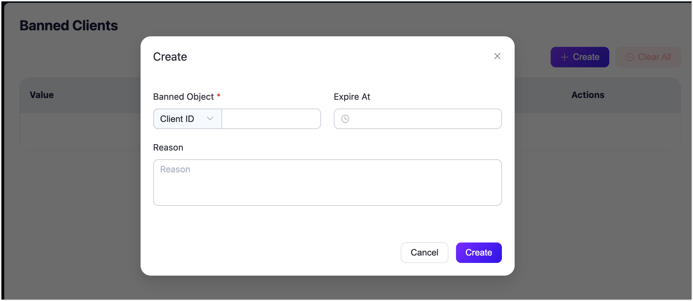

# Banned Clients

EMQX provides users with a banning functionality to deny the access from a specific client. You can add a client to the banned list by the client ID, user name or source IP address.

This page mainly introduces how to create and remove the banned clients on EMQX Dashboard, but you also use this function through [REST API](https://docs.emqx.com/en/enterprise/v5.2/admin/api-docs.html#tag/Banned).

| API                      | Function                                                     |
| ------------------------ | ------------------------------------------------------------ |
| DEL /banned              | Clear all banned data.                                       |
| GET /banned              | List all currently banned client IDs, usernames and IP addresses. |
| POST /banned             | Add a client ID, username or IP address to the blacklist.    |
| DEL /banned/ {as} /{who} | Remove a client ID, username or IP address from the blacklist. |

::: tip
The banned list is only applicable to a small number of client bans. If there are a large number of clients requiring authentication management, use the [authentication](./authn/authn.md) function.
:::

## Create Banned Clients

1. Go to EMQX Dashboard, and click **Access Control** -> **Banned Clients** on the left navigation menu to enter the **Banned Clients** page. 
2. Click **Create** at the top right corner. In the **Create** dialog, specify a client to be banned.
   - **Banned Object**: Choose how to enact a ban on a client by specifying either the **Client ID**, **Username**, or **IP Address** from the dropdown list, and then provide the associated value.
   - **Expire At** (optional): Click the clock icon to select the expiration time and date for this banning action.
   - **Reason** (optional): Fill in the reason why you want to ban this client in this text box.
2. Click **Create** to finish the setting.

## Clear Banned Clients

You can remove a single banned client record by clicking the **Delete** button in the **Actions** column. If you want to clear the records on the page all at once, click the **Clear All** button.

