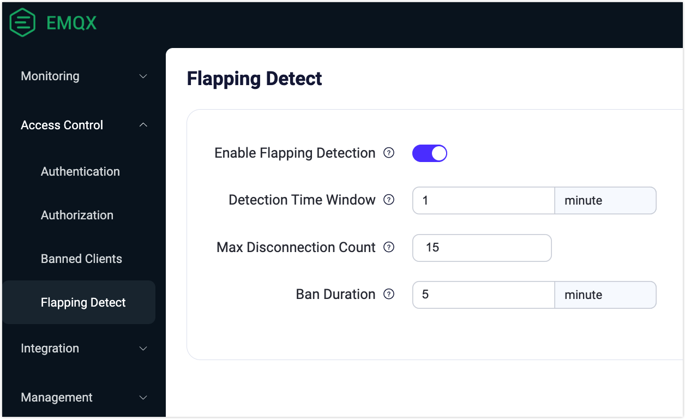

# Flapping Detect

::: tip Note

Flapping Detect is an EMQX Enterprise feature.

:::

Based on the Banned Clients function, EMQX automatically bans frequently logging clients to prevent them from consuming server resources that may affect other clients. Those clients will be banned for a period of time.

It should be noted that the automatic ban only bans the client by the client ID, not by the user name and IP address. A malicious client may still be able to attack if they change the client ID for each attempt.

This feature is disabled by default, and you can enable it via EMQX Dashboard or configuration file.

## Enable Flapping Detect on Dashboard

Go to Dashboard, and click **Access Control** -> **Flapping Detect** from the left navigation menu to enter the **Flapping Detect** page. Enable the flapping detection feature by clicking the toggle switch.

- **Detection Time Window**: You can specify the duration for which the system monitors the client's flapping behavior. The default value is `1` minute.
- **Max Disconnection Count**: You can specify the maximum number of disconnections allowed for an MQTT client during the detection window time. It allows you to set precise criteria for identifying and responding to clients exhibiting flapping behavior. The default number is `15`.
- **Ban Duration**: You can specify for how long the client should be banned. The default value is `5` minutes.

Click **Save Changes** to finish the setting.



## Enable Flapping Detect in Configuration File

You can also enable the flapping detect feature by adding the following configuration to the `emqx.conf` file:

```bash
flapping_detect {

  enable = true

  ## The maximum number of disconnections allowed for an MQTT client during the detection window time
  max_count = 15

  ## The duration for which the system monitors the client's flapping behavior
  window_time = 1m

  ## How long the clientid will be banned
  ban_time = 5m

}
```

These settings may be specified individually for each zone.

