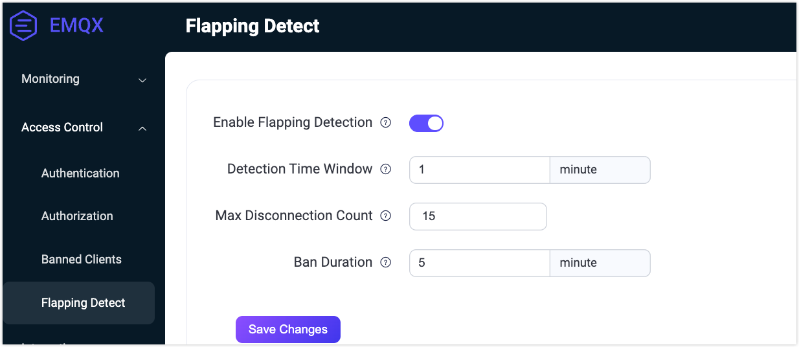

# Flapping Detect

Flapping detection identifies repeated `CONNECT` packets within a configured time window. To protect EMQX from excessive connection attempts, EMQX temporarily bans a client ID, username, or source IP address when it reaches the configured threshold.

Starting from EMQX 6.3.0, flapping detection can independently evaluate any combination of the following dimensions:

- Client ID: Counts connection attempts from the same client ID.
- Username: Counts connection attempts from clients that share the same username. Connections without a username are not counted for this dimension.
- Source IP address: Counts connection attempts from the same source IP address.

Each enabled dimension has its own detection time window, connection count threshold, and ban duration. When a client ID, username, or source IP address reaches its threshold, EMQX rejects new connection attempts that match that identifier or address before authentication. Existing connections are not disconnected.

Flapping detection is disabled by default. You can configure it on the EMQX Dashboard or in the configuration file.

## Configure Flapping Detect on Dashboard

1. In the Dashboard, click **Access Control** -> **Flapping Detect**.
2. Enable one or more detection dimensions:
   - **Detect by Client ID**
   - **Detect by Username**
   - **Detect by Source IP Address**
3. Configure the following settings for each enabled dimension:
   - **Detection Time Window**: The time window in which EMQX counts connection attempts. The default is `1` minute.
   - **Max Connection Count**: The number of connection attempts that triggers a ban within the detection time window. The default is `15`.
   - **Ban Duration**: How long EMQX bans the client ID, username, or source IP address. The default is `5` minutes.
4. Click **Save Changes**.



Ban entries created by flapping detection expire automatically. You can inspect or remove them on the [Banned Clients](./blacklist.md) page or through the `/banned` REST API.

## Configure Flapping Detect in the Configuration File

The following HOCON example enables detection by client ID and username and disables detection by source IP address:

```hocon
flapping_detect {
  by_clientid {
    window_time = 1m
    max_count = 15
    ban_time = 5m
  }

  by_username {
    window_time = 1m
    max_count = 15
    ban_time = 5m
  }

  by_peerhost = none
}
```

A dimension is enabled when detection settings are configured for it. Set the dimension to `none` to disable it. These settings can also be configured for individual zones.

Starting from EMQX 6.3.0, the flat `flapping_detect.enable`, `flapping_detect.window_time`, `flapping_detect.max_count`, and `flapping_detect.ban_time` fields are deprecated. EMQX continues to accept the flat fields and maps them to `flapping_detect.by_clientid`, so configurations created before EMQX 6.3.0 remain compatible. The deprecated fields affect only client ID detection. `by_username` and `by_peerhost` remain `none` unless you explicitly configure them. For the full configuration structure and precedence rules, see [Flapping Detect Configuration](../configuration/flapping.md).
