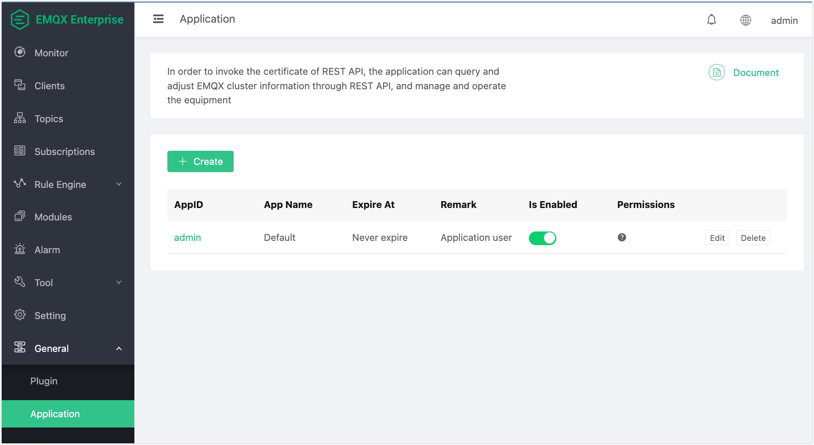

# API Key

EMQX Enterprise provides a Management API (port 8081 by default) for programmatic access to cluster management operations. API Keys, identified by an AppID and AppSecret pair, authenticate requests to this Management API. Each key can be restricted to specific API categories, giving you fine-grained control over what each integration or automation tool is allowed to do.

This page covers how to create API Keys, configure permissions, authenticate requests, and manage keys through the API.



## Quick Start

This section walks through the basic flow: create an API Key and use it to call the Management API.

1. Create an API Key via the Dashboard (port 18083): in the left navigation panel, click **Manage** -> **Application**, then click **Create**.

2. Fill in the required fields (name, permissions, etc.) and save. Record the generated AppID and AppSecret.

3. Use the key to call the Management API (port 8081):

   ```bash
   curl -u <app_id>:<app_secret> "http://127.0.0.1:8081/api/v4/clients"
   ```

4. Configure which write operations the key can perform via [Permission Categories](#permission-categories). For example, to allow only rule engine write access:

   ```json
   {
     "rule_engine": true
   }
   ```

## Management API vs Dashboard API

EMQX exposes two separate HTTP API services with independent authentication systems:

| | Management API | Dashboard API |
|---|---|---|
| **Port** | 8081 | 18083 |
| **Authentication** | AppID + AppSecret (Basic Auth) | Dashboard user credentials (Basic Auth) |
| **Used for** | Plugin/module APIs, automation, integration, CI/CD | Dashboard web UI, API Key management |
| **Path prefix** | `/api/v4/` | `/api/v4/` |

Both services share the same `/api/v4/` path namespace, but they authenticate separately. Credentials for one do not work on the other.

::: tip **Important** 

The API Key management endpoints (`/api/v4/apps/`) are part of the **Dashboard API on port 18083**, not the Management API on port 8081. Use Dashboard user credentials to create and manage API Keys.

:::

## Authenticate to the Management API

::: tip

This section applies to the Management API (port `8081`) only.

The Dashboard API (port `18083`) uses Dashboard username and password for authentication and does not support API Keys.

:::

All requests to the Management API (port `8081`) must authenticate with an API Key.

An API Key consists of an `AppID` and `AppSecret`, authenticated via HTTP Basic Auth:

```
Authorization: Basic base64(AppID:AppSecret)
```

Most HTTP clients handle this automatically with the `-u` flag:

```bash
curl -u my_app_id:my_app_secret "http://127.0.0.1:8081/api/v4/clients"
```

### Authentication Failure

Requests return HTTP `401` in the following cases:

- `AppID` or `AppSecret` is invalid
- The API Key is disabled (`status: false`)
- The API Key has expired

## Create an API Key

This section describes how to create an API Key for accessing the Management API, either via the Dashboard or the API.

### Via Dashboard

1. In the left navigation panel, click **Manage**, then click **Apps** (HTTP API).
2. Click **Add App**.
3. Fill in the fields and configure permissions as needed. For details on permissions, see [Permission Model](#permission-model).
4. Click **Confirm** to save.

### Via API

**Endpoint:** `POST /api/v4/apps/`

**Note:**

- Uses the Dashboard API (port `18083`)
- Authenticates with Dashboard user credentials

**Request Parameters (JSON):**

Field meanings correspond to the configuration options in the Dashboard.

| Field | Type | Required | Description |
|-------|------|----------|-------------|
| `app_id` | string | Yes | Unique identifier for the API Key. |
| `name` | string | No | Display name. |
| `secret` | string | No | Custom secret. Auto-generated if omitted. |
| `desc` | string | No | Description. |
| `status` | boolean | No | Enabled or disabled. Defaults to `true`. |
| `expired` | integer | No | Expiration timestamp (Unix seconds). Omit for no expiration. |
| `permissions` | object | No | Permission map keyed by category name. See [Permission Categories](#permission-categories). |
| `fallback` | boolean | No | Default behavior for paths not covered by any category. Defaults to `false` (deny). See [The `fallback` Setting](#the-fallback-setting). |

**Example:**

```bash
curl -i -X POST "http://127.0.0.1:18083/api/v4/apps/" \
  -u admin:public \
  -H "Content-Type: application/json" \
  -d '{
    "app_id": "my_automation",
    "name": "CI/CD Pipeline",
    "desc": "Used by CI/CD for rule engine management",
    "status": true,
    "permissions": {
      "rule_engine": true,
      "resources": true,
      "plugins": false,
      "modules": false,
      "banned": false
    },
    "fallback": false
  }'
```

**Response:**

```json
{
  "code": 0,
  "data": {
    "secret": "<generated_secret_token>"
  }
}
```

::: warning Note

The AppSecret is returned in plaintext in both the creation and lookup responses. Store it securely. The `/api/v4/apps/` endpoints are only accessible via the Dashboard API and cannot be called with an API Key.

:::

## Permission Model

API Key permissions control write operations (`PUT`, `POST`, `DELETE`) to the corresponding endpoints. Read (`GET`) requests to all APIs are always allowed, regardless of permission settings.

**New API Keys deny all write operations by default. Enable write access only as needed.**

### Permission Categories

Each API Key has an independent boolean permission for each of the following five categories.

Setting a category to `true` allows the key to perform write operations on the corresponding endpoints. Setting it to `false` denies write operations (GET requests are still allowed).

| Category | Permission Key | Endpoints Controlled |
|----------|---------------|----------------------|
| Banned | `banned` | `/api/v4/banned/` (client blacklist management) |
| Rule Engine | `rule_engine` | `/api/v4/rules/`, `/api/v4/actions/`, `/api/v4/rule_events/` |
| Resources | `resources` | `/api/v4/resources/`, `/api/v4/resource_types/` |
| Plugins | `plugins` | `/api/v4/plugins/` |
| Modules | `modules` | `/api/v4/modules/`, `/api/v4/trace/`, `/api/v4/topic-metrics/`, `/api/v4/quota/`, `/api/v4/client_tags/` |

New API Keys default all five categories to `false`, following the principle of least privilege. Enable only the write permissions the key actually needs. All keys can always read (GET) from any endpoint.

### The `fallback` Setting

Many commonly used endpoints do not belong to any of the five named categories, such as:

- `/api/v4/clients/`
- `/api/v4/subscriptions/`
- `/api/v4/stats/`
- `/api/v4/metrics/`
- `/api/v4/nodes/`

The `fallback` setting controls **write access** when a key tries to call write operations on these endpoints:

- `false` (default): Write access is denied.
- `true`: Write access is allowed.

Read (GET) requests to these endpoints are always allowed regardless of the `fallback` setting.

::: tip

Most read-only monitoring APIs (clients, subscriptions, stats, metrics, nodes) fall into the uncategorized group governed by `fallback`. Since GET is always allowed, you can read monitoring data without setting `fallback` to `true`. Only set `fallback: true` if you need to perform write operations on uncategorized endpoints.

:::

### Compatibility Mode

API Keys created before the permission system was introduced operate in compatibility mode. A compatibility mode key has full read and write access to all APIs, equivalent to all categories set to `true` and `fallback` set to `true`.

#### Identify Compatibility Mode Keys

You can identify a compatibility mode key by the `compatibility_mode` field in its API response.

```json
"compatibility_mode": true
```

#### Exit Compatibility Mode

To apply permission restrictions to a compatibility mode key, update the key with an explicit `permissions` object. This exits compatibility mode and applies the permissions you specify.

```json
{
  "permissions": { ... }
}
```

::: warning Note

Updating a compatibility mode key with a `permissions` object is irreversible. Once a key exits compatibility mode, it operates under the normal permission system.

:::

## Manage API Keys

This section describes the API Key management endpoints: get, update, and delete.

### Get Key Details

**Endpoint:** `GET /api/v4/apps/:appid`

**Example:**

```bash
curl -u admin:public "http://127.0.0.1:18083/api/v4/apps/my_automation"
```

**Response Example:**

```json
{
  "code": 0,
  "data": {
    "status": true,
    "secret": "<secret>",
    "permissions": {
      "rule_engine": true,
      "resources": true,
      "plugins": false,
      "modules": false,
      "banned": false
    },
    "name": "Documentation Test",
    "expired": null,
    "desc": "Created for documentation examples",
    "compatibility_mode": false,
    "app_id": "doc_test_key"
  }
}
```

::: tip

The `secret` field is only returned when fetching a single key's details. It is not included when listing all keys.

:::

### Update a Key

**Endpoint:** `PUT /api/v4/apps/:appid`

You can update `name`, `desc`, `status`, `expired`, `permissions`, and `fallback` independently. Only the fields you include in the request body are changed.

**Disable a key:**

```bash
curl -i -X PUT "http://127.0.0.1:18083/api/v4/apps/my_automation" \
  -u admin:public \
  -H "Content-Type: application/json" \
  -d '{"status": false}'
```

**Update permissions only:**

```bash
curl -i -X PUT "http://127.0.0.1:18083/api/v4/apps/my_automation" \
  -u admin:public \
  -H "Content-Type: application/json" \
  -d '{
    "permissions": {
      "rule_engine": true,
      "resources": true,
      "plugins": true,
      "modules": false,
      "banned": false
    }
  }'
```

**Response:**

```json
{"code": 0}
```

### Delete a Key

**Endpoint:** `DELETE /api/v4/apps/:appid`

```bash
curl -i -X DELETE "http://127.0.0.1:18083/api/v4/apps/my_automation" \
  -u admin:public
```

**Response:**

```json
{"code": 0}
```

## Pre-configure API Keys with a Bootstrap File

You can pre-configure API Keys before EMQX starts using a bootstrap file. This is useful for initial deployments or containerized environments where credentials must be available before any API calls are possible.

**Configuration:**

Set the environment variable pointing to the file path:

```bash
EMQX_API_KEY__BOOTSTRAP_FILE=/path/to/bootstrap_keys.txt
```

**File format:**

One key per line, with the AppID and AppSecret separated by a colon:

```
my_app_id:my_app_secret
another_app:another_secret
```

Bootstrap keys are created with full access — no permission restrictions and `fallback` set to `true`. They carry the description tag `Bootstrapped From File`. After EMQX starts, you can update these keys via the API to apply permission restrictions.

::: tip

Use the bootstrap file to create an initial admin key for managing other API Keys. After startup, use that key to create restricted keys for specific integrations.

:::

## API Reference

| Method | Endpoint | Description |
|--------|----------|-------------|
| `POST` | `/api/v4/apps/` | Create an API Key |
| `GET` | `/api/v4/apps/` | List all API Keys |
| `GET` | `/api/v4/apps/:appid` | Get API Key details |
| `PUT` | `/api/v4/apps/:appid` | Update an API Key |
| `DELETE` | `/api/v4/apps/:appid` | Delete an API Key |

## Security Recommendations

- **Principle of least privilege:** Grant only the write permissions a key actually needs. A CI/CD pipeline that only manages rules should have `rule_engine: true` and everything else `false`. All keys can still read (GET) any endpoint.
- **Control `fallback` carefully:** Leave `fallback` as `false` unless the key specifically needs write access to uncategorized endpoints. GET requests are always allowed regardless.
- **Use expiration dates:** Set the `expired` field for temporary keys used in short-lived pipelines or test environments.
- **Rotate secrets:** Delete and recreate keys periodically, or update them with a new `secret` value.
- **Bootstrap for setup, API for ongoing management:** Use the bootstrap file to create your initial management key, then manage all subsequent keys through the API.
