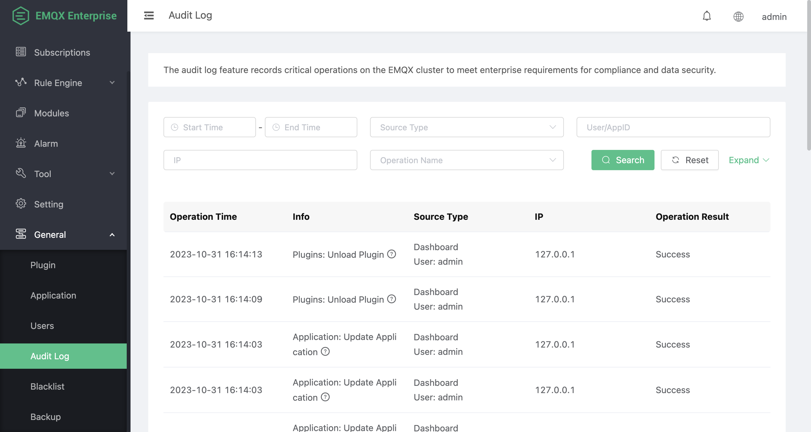

# Audit Log

The Audit Log feature enables you to track important operation changes in your EMQX cluster in real time. It is a critical tool for enterprise users to comply with regulatory requirements and ensure data security. EMQX Audit Log supports recording change-related operations from the [Dashboard](../getting-started/dashboard-ee.md), [REST API](../advanced/http-api.md) and [CLI](../advanced/cli.md), for example, Dashboard user logins and modifications to resources such as clients, access controls, and data integrations. However, read-only operations such as metrics retrieval and client list queries are not recorded. Through the Audit Log, enterprise users can easily see who performed which critical operations, how they did it, and when they did it, ensuring compliance and security auditing during their operations.

::: warning Notice

Audit logs for command-line operations may contain sensitive information, so take caution when sending them to a log collector. It is advisable to filter log content or use encrypted transmission methods to prevent unauthorized information leakage.

:::

## Enable and Configure Audit Log

The Audit Log is disabled by default. You can enable it on the Dashboard by clicking **General** -> **Audit Log** from the left navigation menu. You can also enable and manage it through [Modules](../modules/audit.md). 

When enabling the audit log, you need to configure the following parameters:

- **Node max log entries**: The upper limit of stored log entries, with a default value of `5000`. Once the number of stored log entries reaches this limit, the earliest recorded log entry on that node is automatically deleted to make room for new log entries. This helps control the number of logs per node to prevent excessive resource consumption that could impact performance.
- **Ignore high frequency events**: By default, it ignores high-frequency operations in certain scenarios, with a default value of `true`. High-frequency events include operations such as subscribe/publish/unsubscribe and kicking a specific client. These operations might be frequently called through the REST API, resulting in an excessive number of audit log entries. When enabled, EMQX will ignore these high-frequency events and not record them in the audit log to reduce the log volume. If you need to record these high-frequency events, you can set this parameter to `false`.

## View Audit Log on Dashboard

When the audit log is enabled, EMQX records all change-related operations. You can view the list of operations through the Dashboard or query and retrieve them via the REST API. Additionally, the operation records are also written synchronously to the `data/audit/audit.log.1` log file.

The operation list includes the following information:

- **Operation Time:** The time when the operation record occurred.
- **Info:** A brief description of the operation, including the component and operation name.
- **Source Type:** This includes the source of the operation and the operator. The operation sources include **Dashboard**, **REST API**, and **CLI**, with the corresponding operators being Dashboard logged-in users, the AppID (Application ID) making the REST API call, and the node initiating the operation, respectively.
- **IP:** The IP address of the operation initiator. This field is empty if the operation source is CLI.
- **Operation Result:** Indicates whether the operation was successful or not.

The operation list page is shown in the image below:



## Audit Log Format

When you retrieve audit logs via REST API or view them in the log file, you can find the fields contained in the audit log message formats varies depending on the source of the operation records.

### Dashboard or REST API Operation Records

Audit logs for operations originating from the Dashboard or REST API include information about the operation user, target, and the result of the operation. Examples of operation records retrieved via REST API and log files are as follows:

:::: tabs type:card

::: tab REST API

Example of a record obtained through REST API:

```json
{
  "source_type": "dashboard",
  "source_ip": "127.0.0.1",
  "source": "admin",
  "operation_type": "apps",
  "operation_result": "success",
  "operation_name": "update_app",
  "node": "emqx@127.0.0.1",
  "http_user_agent": "Mozilla/5.0 (Macintosh; Intel Mac OS X 10_15_7) AppleWebKit/537.36 (KHTML, like Gecko) Chrome/118.0.0.0 Safari/537.36",
  "http_status_code": 200,
  "http_request": {
    "version": "HTTP/1.1",
    "scheme": "http",
    "qs": "",
    "port": 18083,
    "path": "/api/v4/apps/19e0bbf77174",
    "params": {
      "status": false,
      "name": "my-server",
      "expired": "undefined",
      "desc": "",
      "app_id": "19e0bbf77174"
    },
    "method": "PUT",
    "host": "localhost",
    "headers": {},
    "has_body": true,
    "body_length": 91,
    "bindings": {
      "appid": "19e0bbf77174"
    }
  },
  "http_method": "PUT",
  "failure_reason": "",
  "duration_ms": 1,
  "created_at": "2023-10-31T15:36:51.081452+08:00",
  "cli_args": ""
}
```

:::

::: tab Log File

Example of a log file record:

```bash
2023-10-31T15:36:51.081452+08:00 {"source_type":"dashboard","source_ip":"127.0.0.1","source":"admin","operation_type":"apps","operation_result":"success","operation_name":"update_app","node":"emqx@127.0.0.1","http_user_agent":"Mozilla/5.0 (Macintosh; Intel Mac OS X 10_15_7) AppleWebKit/537.36 (KHTML, like Gecko) Chrome/118.0.0.0 Safari/537.36","http_status_code":200,"http_request":{"version":"HTTP/1.1","scheme":"http","qs":"","port":18083,"path":"/api/v4/apps/19e0bbf77174","params":{"status":false,"name":"my-server","expired":"undefined","desc":"","app_id":"19e0bbf77174"},"method":"PUT","host":"localhost","headers":{},"has_body":true,"body_length":91,"bindings":{"appid":"19e0bbf77174"}},"http_method":"PUT","duration_ms":1,"created_at":1698737811081452}
```

:::

::::

### Command-Line Operation Records

Audit logs for command-line operations include information about the executed command and called parameters. Examples of operation records retrieved via REST API and log files are as follows:

:::: tabs type:card

::: tab REST API

Example of a record obtained through REST API:

```json
{
  "source_type": "cli",
  "source_ip": "",
  "source": "",
  "operation_type": "listeners",
  "operation_result": "success",
  "operation_name": "emqx_mgmt_cli-listeners",
  "node": "emqx@127.0.0.1",
  "http_user_agent": "",
  "http_status_code": "",
  "http_request": "",
  "http_method": "",
  "failure_reason": "ok",
  "duration_ms": 14,
  "created_at": "2023-10-31T15:35:50.280458+08:00",
  "cli_args": ["listeners", "stop", "mqtt:ssl:external"]
}
```

:::

::: tab Log File

Example of a log file record:

```bash
2023-10-31T15:35:50.280458+08:00 {"source_type":"cli","operation_type":"listeners","operation_result":"success","operation_name":"emqx_mgmt_cli-listeners","node":"emqx@127.0.0.1","failure_reason":"ok","duration_ms":14,"created_at":1698737750280458,"cli_args":["listeners","stop","mqtt:ssl:external"]}
```

:::

::::
