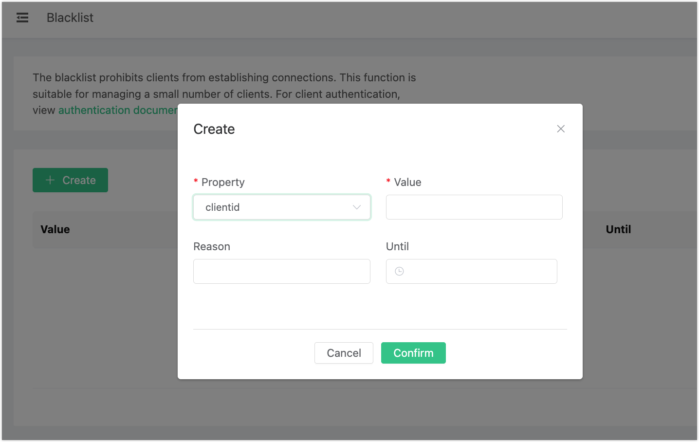

# Blacklist and Flapping Detection

## Blacklist

EMQX provides a blacklist feature that allows you to deny access to specified clients. In addition to blocking by client identifier, you can also block by username or IP address.

Banning can also be applied using rules, including:

- Matching client IDs and usernames with regular expressions.

  ::: tip

  Banning via regular expressions does not take effect on clients that are already connected.

  :::

- Matching source IP addresses using CIDR ranges.

::: tip

Note that a large number of matching rules may negatively impact performance. This is because the system must check every connecting client against all rules, which is more resource-intensive than direct bans.

:::

For details on the HTTP API, see [HTTP API - Blacklist](http-api.md#endpoint-banned).

::: tip
The blacklist is only suitable for banning a small number of clients. If you need to manage authentication for a large number of clients, use the [Authentication](./auth.md) feature instead.
:::

## Create a Blacklist Entry

1. In the EMQX Dashboard, click **General** -> **Blacklist** in the left navigation menu. Click **Create**.
2. In the **Create** dialog, configure the following:
   - **Property**: Select the method for banning the client from the drop-down list. You can specify `clientid`, `username`, or `peerhost`, then provide the corresponding **Value**.
   - **Reason** (optional): Describe the reason for adding this entry to the blacklist.
   - **Until** (optional): Set an expiration time for the ban.
3. Click **Confirm** to complete the configuration.



## Remove a Blacklist Entry

To remove a single banned client record, click the **Delete** button in the **Actions** column.

## Flapping Detection

EMQX can automatically ban clients detected as repeatedly connecting and disconnecting in a short period, blocking their logins for a set duration. This prevents such clients from consuming excessive server resources and affecting other clients.

Note that the automatic ban only applies to the client identifier, not the username or IP address. The client can continue to connect by using a different client identifier.

This feature is disabled by default. To enable it, set `enable_flapping_detect` to `on` in the `emqx.conf` configuration file:

```bash
zone.external.enable_flapping_detect = off
```

You can adjust the trigger threshold and ban duration using the following configuration item:

```bash
flapping_detect_policy = 30, 1m, 5m
```

The value is comma-separated and represents, in order: the number of disconnections, the detection time window, and the ban duration. The default configuration above means that if a client disconnects 30 times within 1 minute, its client identifier will be banned for 5 minutes. Other time units such as seconds and hours are also supported. For details, see [Configuration](../getting-started/config.md#).
