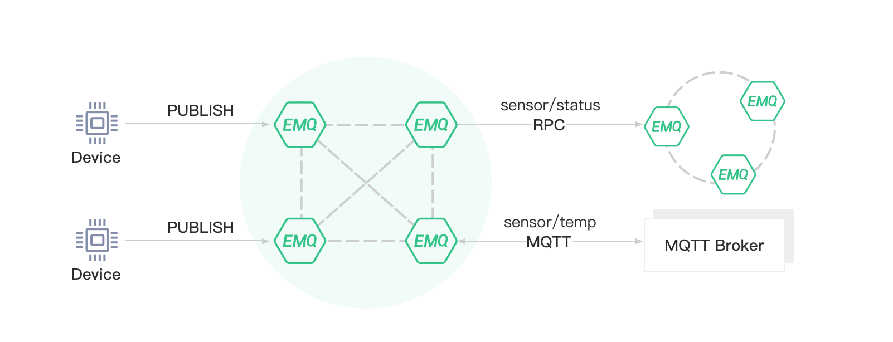

---
# 标题
title: 消息桥接
# 编写日期
date: 2020-02-26 17:00:52
# 作者 Github 名称
author: turtle, terry-xiaoyu
# 关键字
keywords:
# 描述
description:
# 分类
category:
# 引用
ref: undefined
---

# Bridge
EMQ X Broker supports two bridging methods:

- -RPC bridging: A bridge method that uses Erlang RPC protocol, only available between EMQ X Broker
- MQTT Bridging: A bridge method that uses the MQTT protocol as a client to connect to a remote broker, and can bridge to other MQTT brokers and EMQ X Broker

The concept is shown in the following figure:



Publishers can publish messages to remote brokers via bridging:


EMQ X Broker distinguishes different bridges based on different names. Bridge can be added in `etc/plugins/emqx_bridge_mqtt.conf` :

```bash
bridge.mqtt.aws.address = 211.182.34.1:1883

bridge.mqtt.huawei.address = 54.33.120.8:1883
```

This configuration declares two bridges with the name of `aws` and ` huawei`, which respectively point to the responding service address using MQTT bridging method.

If the value of this configuration is the node name of another EMQ X Broker, the RPC bridging method is used:
```bash
bridge.mqtt.emqx2.address = emqx2@57.122.76.34
```
To use the bridge function, you need to enable the emqx_bridge_mqtt plugin:

```bash
$ emqx_ctl plugins load emqx_bridge_mqtt

ok
```

## Advantages and disadvantages of RPC bridging
The advantage of RPC bridging is that it does not involve the MQTT protocol codec and is more efficient than MQTT bridging.

The disadvantage of RPC bridging

- RPC bridging can only bridge two EMQ X Brokers together (the version must be the same), and cannot bridge EMQ X Broker to other MQTT Brokers
- RPC bridging can only forward local messages to remote bridge nodes, and cannot synchronize messages from remote bridge nodes to local nodes

## RPC bridging example 
Suppose there are two emqx nodes:

| Name |        Node        | MQTT Port |
| ----- | ------------------- | --------- |
| emqx1 | <emqx1@192.168.1.1> | 1883      |
| emqx2 | <emqx2@192.168.1.2> | 1883      |

Now, we are going to bridge `emqx1` to ` emqx2`. First we need to add the Bridge configuration in the  configuration file `etc/plugins/emqx_bridge_mqtt.conf`  of emqx1 and point to emqx2:

```bash
bridge.mqtt.emqx2.address = emqx2@192.168.1.2
```

Next, we will define the `forwards` rule, so that messages sent by this node to ` sensor1 / # `and` sensor2 / # ` will be forwarded to ` emqx2`:

```bash
bridge.mqtt.emqx2.forwards = sensor1/#,sensor2/#
```

If you want to add specific prefix to the topics before forwarding the message to `emqx2` , you can set the mount point:

```bash
bridge.mqtt.emqx2.mountpoint = bridge/emqx2/${node}/
```

The mount point is good for `emqx2` to distinguish between bridged messages and local messages. For example, in the above configuration, the message with the original topic of `sensor1/hello` that will change into  `bridge/emqx2/emqx1@192.168.1.1/sensor1/hello` after being forwarded to ` emqx2`. 

## MQTT bridging example  
For MQTT bridging, it makes EMQ X Broker connect as a MQTT client to a remote MQTT broker.

First you need to configure the MQTT client parameters:

Remote Broker Address:

```bash
bridge.mqtt.aws.address = 211.182.34.1:1883
```

MQTT protocol version, which can be one of  `mqttv3`, ` mqttv4`  or  `mqttv5`:

```bash
bridge.mqtt.aws.proto_ver = mqttv4
```

The clientid of the MQTT client:

```bash
bridge.mqtt.aws.clientid = bridge_emq
```

The username field of the MQTT client:

```bash
bridge.mqtt.aws.username = user
```

The password field of the MQTT client:

```bash
bridge.mqtt.aws.password = passwd
```

Keepalive configuration:

```bash
bridge.mqtt.aws.keepalive = 60s
```

The client's clean_start field. Some IoT Hubs require that the clean_start (or clean_session) field must be `true`:

```bash
bridge.mqtt.aws.clean_start = true
```

The reconnection interval can be set:

```bash
bridge.mqtt.aws.reconnect_interval = 30s
```

If TLS connection is used, you can set `bridge.mqtt.aws.ssl = on` and set the TLS certificate:

```bash
bridge.mqtt.aws.ssl = off
bridge.mqtt.aws.cacertfile = etc/certs/cacert.pem
bridge.mqtt.aws.certfile = etc/certs/client-cert.pem
bridge.mqtt.aws.keyfile = etc/certs/client-key.pem
bridge.mqtt.aws.ciphers = ECDHE-ECDSA-AES256-GCM-SHA384,ECDHE-RSA-AES256-GCM-SHA384
bridge.mqtt.aws.tls_versions = tlsv1.2,tlsv1.1,tlsv1
```

Next, we define the `forwards` rule, so that messages sent by this node to ` sensor1/# `and ` sensor2/# `will be forwarded to the remote broker:

```bash
bridge.mqtt.aws.forwards = sensor1/#,sensor2/#
```

You can also specify the retry interval for QoS1 and QoS2 messages and the number of packet sent in bulk:

```bash
bridge.mqtt.aws.retry_interval = 20s
bridge.mqtt.aws.max_inflight_batches = 32
```

If you want to add a specific prefix to the topic forwarding the message to `aws` , you can set the mount point. For details, see the  [RPC Bridge Example](#rpc-bridge-example) section:

```bash
bridge.mqtt.aws.mountpoint = bridge/aws/${node}/
```

If you want your local broker to "pull" messages from remote brokers, you can subscribe to certain topics from remote brokers:

```bash
bridge.mqtt.aws.subscription.1.topic = cmd/topic1
bridge.mqtt.aws.subscription.1.qos = 1
```

### EMQ X Broker's bridge cache configuration 
EMQ X Broker's Bridge has a message cache mechanism. When the Bridge is disconnected, the message of the forwards topic is cached. When the bridge is restored, the message is re-forwarded to the remote node. The caching mechanism applies to both RPC and MQTT bridges.

Set the total cache queue size:

```bash
bridge.mqtt.aws.queue.max_total_size = 5GB
```

Cache messages to a certain path to the disk (Only cache to memory if not set):

```bash
bridge.mqtt.emqx2.queue.replayq_dir = data/emqx_emqx2_bridge/
```

Set the size of a single cache file. If it exceeds, a new file will be created to store the message queue:

```bash
bridge.mqtt.emqx2.queue.replayq_seg_bytes = 10MB
```
