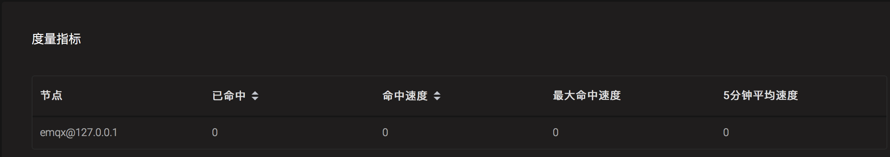
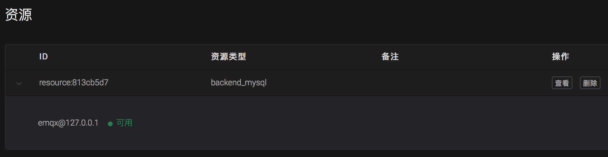

---
# 编写日期
date: 2020-02-07 17:15:26
# 作者 Github 名称
author: wivwiv
# 关键字
keywords:
# 描述
description:
# 分类
category:
# 引用
ref: undefined
---

# Command line interface

EMQX Broker provides the management command line of `./bin/emqx_ctl` for users to manage, configure and query EMQX Broker.

## status command

Query the running status of EMQX Broker:

```bash
$ ./bin/emqx_ctl status
Node 'emqx@127.0.0.1' is started
emqx v4.0.0 is running
```

## mgmt command

The mgmt command can query the application.

| Command                            | Description                                             |
| ---------------------------------- | ------------------------------------------------------- |
| `mgmt list                       ` | List application                                        |
| `mgmt insert <AppId> <Name>   `    | Add an application that can access to the HTTP API      |
| `mgmt update <AppId> <status>`     | Update applications that can access to the HTTP API     |
| `mgmt lookup <AppId>         `     | Get application details that can access to the HTTP API |
| `mgmt delete <AppId>           `   | Remove applications that can access to the HTTP API     |

### mgmt list

List application

```bash
$ ./bin/emqx_ctl mgmt list
app_id: 901abdba8eb8c, secret: MjgzMzQ5MjM1MzUzMTc4MjgyMjE3NzU4ODcwMDg0NjQ4OTG, name: hello, desc: , status: true, expired: undefined
```

### mgmt insert \<AppId> \<Name>

Add the HTTP API application:

```bash
$ ./bin/emqx_ctl mgmt insert dbcb6e023370b world
AppSecret: MjgzMzQ5MjYyMTY3ODk4MjA5NzMwODExODMxMDM1NDk0NDA
```

### mgmt update \<AppId> \<status>

Update the HTTP API application:

```bash
$ ./bin/emqx_ctl mgmt update dbcb6e023370b stop
update successfully.
```

### mgmt lookup \<AppId>

Get application details of the HTTP API:

```bash
$ ./bin/emqx_ctl mgmt lookup dbcb6e023370b
app_id: dbcb6e023370b
secret: MjgzMzQ5MjYyMTY3ODk4MjA5NzMwODExODMxMDM1NDk0NDA
name: world
desc: Application user
status: stop
expired: undefined
```

### mgmt delete \<AppId>

Remove the HTTP API application:

```bash
$ ./bin/emqx_ctl mgmt delete dbcb6e023370b
ok
```

## broker command

The broker command queries basic server information, startup time, statistics data and performance data.

| Command          | Description                                                   |
| ---------------- | ------------------------------------------------------------- |
| `broker`         | Query EMQX Broker description, version, start time           |
| `broker stats`   | Statistics of Connection, Session, Topic, Subscription, Route |
| `broker metrics` | Query MQTT Packet and Message Statistics                      |

Query basic information of EMQX Broker, including version, startup time, etc .:

```bash
$ ./bin/emqx_ctl broker
sysdescr  : EMQX Broker
version   : 4.0.0
uptime    : 4 minutes, 52 seconds
datetime  : 2020-02-21 09:39:58
```

### broker stats

Query statistics of connections, topics, subscriptions, routes between server and client :

```bash
$ ./bin/emqx_ctl broker stats
actions.count                 : 5
actions.max                   : 5
channels.count                : 0
channels.max                  : 0
connections.count             : 0
connections.max               : 0
resources.count               : 0
resources.max                 : 0
retained.count                : 3
retained.max                  : 3
routes.count                  : 0
routes.max                    : 0
rules.count                   : 0
rules.max                     : 0
sessions.count                : 0
sessions.max                  : 0
suboptions.count              : 0
suboptions.max                : 0
subscribers.count             : 0
subscribers.max               : 0
subscriptions.count           : 0
subscriptions.max             : 0
subscriptions.shared.count    : 0
subscriptions.shared.max      : 0
topics.count                  : 0
topics.max                    : 0
```

### broker metrics

Query server traffic (Bytes), MQTT Packets, messages sending and receiving statistics:

```bash
$ ./bin/emqx_ctl broker metrics
actions.success               : 0
bytes.received                : 0
bytes.sent                    : 0
client.auth.anonymous         : 0
client.authenticate           : 0
client.check_acl              : 0
client.connack                : 0
client.connect                : 0
client.connected              : 0
client.disconnected           : 0
client.subscribe              : 0
client.unsubscribe            : 0
delivery.dropped              : 0
delivery.dropped.expired      : 0
delivery.dropped.no_local     : 0
delivery.dropped.qos0_msg     : 0
delivery.dropped.queue_full   : 0
delivery.dropped.too_large    : 0
messages.acked                : 0
messages.delayed              : 0
messages.delivered            : 0
messages.dropped              : 0
messages.dropped.expired      : 0
messages.dropped.no_subscriber: 0
messages.forward              : 0
messages.publish              : 0
messages.qos0.received        : 0
messages.qos0.sent            : 0
messages.qos1.received        : 0
messages.qos1.sent            : 0
messages.qos2.received        : 0
messages.qos2.sent            : 0
messages.received             : 0
messages.retained             : 3
messages.sent                 : 0
packets.auth.received         : 0
packets.auth.sent             : 0
packets.connack.auth_error    : 0
packets.connack.error         : 0
packets.connack.sent          : 0
packets.connect.received      : 0
packets.disconnect.received   : 0
packets.disconnect.sent       : 0
packets.pingreq.received      : 0
packets.pingresp.sent         : 0
packets.puback.inuse          : 0
packets.puback.missed         : 0
packets.puback.received       : 0
packets.puback.sent           : 0
packets.pubcomp.inuse         : 0
packets.pubcomp.missed        : 0
packets.pubcomp.received      : 0
packets.pubcomp.sent          : 0
packets.publish.auth_error    : 0
packets.publish.dropped       : 0
packets.publish.error         : 0
packets.publish.received      : 0
packets.publish.sent          : 0
packets.pubrec.inuse          : 0
packets.pubrec.missed         : 0
packets.pubrec.received       : 0
packets.pubrec.sent           : 0
packets.pubrel.missed         : 0
packets.pubrel.received       : 0
packets.pubrel.sent           : 0
packets.received              : 0
packets.sent                  : 0
packets.suback.sent           : 0
packets.subscribe.auth_error  : 0
packets.subscribe.error       : 0
packets.subscribe.received    : 0
packets.unsuback.sent         : 0
packets.unsubscribe.error     : 0
packets.unsubscribe.received  : 0
rules.matched                 : 0
session.created               : 0
session.discarded             : 0
session.resumed               : 0
session.takeovered            : 0
session.terminated            : 0
```

## cluster command

The cluster command is used to manage a cluster of multiple EMQX Broker nodes (processes):

| Command                       | Description                   |
| ----------------------------- | ----------------------------- |
| `cluster join <Node>        ` | Join the cluster              |
| `cluster leave              ` | Leave the cluster             |
| `cluster force-leave <Node> ` | Remove nodes from the cluster |
| `cluster status             ` | Query cluster status          |

Example:

To demonstrate the cluster command in a better way, we can firstly start a two-node cluster on the local machine, which is called pseudo-distributed starting mode. Since we need to start two nodes on one machine, we must adjust the listening port of the other node to avoid the port conflicts.

The basic process is to copy another emqx folder and name it emqx2. After that, we let all the listening ports of the original emqx to be added by an offset as the listening ports of the emqx2 node. For example, we can change the MQTT/TCP listening port from the default 1883 to 2883 as the MQTT/TCP listening port for emqx2. Please refer to [Cluster Script](https://github.com/terry-xiaoyu/one_more_emqx) regarding to the above operations and also refer to [Configuration Instructions](../getting-started/config.md) and  [Configuration Items](../configuration/configuration.md) for details.

Start emqx1 :

```bash
$ cd emqx1 && ./bin/emqx start
```

Start emqx2 :

```bash
$ cd emqx2 && ./bin/emqx start
```

Use `cluster join <Node>` to combine two nodes into one cluster:

```bash
$ cd emqx2 && ./bin/emqx_ctl cluster join emqx1@127.0.0.1

Join the cluster successfully.
Cluster status: [{running_nodes,['emqx1@127.0.0.1','emqx2@127.0.0.1']}]
```

Query the cluster status in any node directory:

```bash
$ ./bin/emqx_ctl cluster status
Cluster status: [{running_nodes,['emqx2@127.0.0.1','emqx1@127.0.0.1']}]
```

Cluster message routing test:
The MQTT command line tool uses the  [emqtt](https://github.com/emqx/emqtt/releases) client developed by the EMQX team.

```bash
# emqx1 node (port 1883) subscribed topic x
$ ./bin/emqtt sub -t x -q 1 -p 1883
Client emqtt-a7de8fffbe2fbeb2fadb sent CONNECT
Client emqtt-a7de8fffbe2fbeb2fadb subscribed to x

# Published message to emqx2 node (port 2883)
$ ./bin/emqtt pub -t x -q 1 -p 2883 --payload hello
Client emqtt-0898fa447676e17479a5 sent CONNECT
Client emqtt-0898fa447676e17479a5 sent PUBLISH (Q1, R0, D0, Topic=x, Payload=...(5 bytes))
Client emqtt-0898fa447676e17479a5 sent DISCONNECT

# received a message by emqx1 node (port 1883)
$ ./bin/emqtt sub -t x -q 1 -p 1883
hello
```

emqx2 nodes leave the cluster:

```bash
$ cd emqx2 && ./bin/emqx_ctl cluster leave
```

emqx2 node is forced to leave the cluster, and you need to perform operations on nodes other than the target node under the cluster:

```bash
$ cd emqx1 && ./bin/emqx_ctl cluster force-leave emqx2@127.0.0.1
```

It is Noted that EMQX Broker does not support joining a node that is already in a cluster to another cluster. That is because this will cause the data of the two clusters to be inconsistent. However, it supports nodes that have joined the cluster to join another cluster after leaving the cluster.

## acl command

Since v4.1 the command `modules` has been introduced and we reload the ACLs using the following command:

```bash
$ ./bin/emqx_ctl modules reload emqx_mod_acl_internal
Module emqx_mod_acl_internal reloaded successfully.
```

Prior to v4.1, still use:

```bash
$ ./bin/emqx_ctl acl reload
ok
```

### acl cache-clean

After v4.3, the command to clean up the ACL cache has been introduced:

| Commads                     | Description                       |
| --------------------------- | --------------------------------- |
| acl cache-clean all         | Clears acl cache on all nodes     |
| acl cache-clean node \<Node> | Clears acl cache on given node    |
| acl cache-clean \<ClientId>  | Clears acl cache for given client |


## clients command

The clients command can query the connected MQTT clients.

| Command                   | Description                                                                                                  |
| ------------------------- | ------------------------------------------------------------------------------------------------------------ |
| `clients list           ` | List all client connections                                                                                  |
| `clients show <ClientId>` | Query the client with the specified ClientId                                                                 |
| `clients kick <ClientId>` | Kick out the client with the specified ClientId, and the connection and session will be terminated together. |

### clients list

List all client connections:

```bash
$ ./bin/emqx_ctl clients list
Client (mosqsub/43832-airlee.lo, username=test1, peername=127.0.0.1:62135, clean_start=true, keepalive=60, session_expiry_interval=0, subscriptions=0, inflight=0, awaiting_rel=0, delivered_msgs=0, enqueued_msgs=0, dropped_msgs=0, connected=true, created_at=1582249657, connected_at=1582249657)
Client (mosqsub/44011-airlee.lo, username=test2, peername=127.0.0.1:64961, clean_start=true, keepalive=60, session_expiry_interval=0, subscriptions=0, inflight=0, awaiting_rel=0, delivered_msgs=0, enqueued_msgs=0, dropped_msgs=0, connected=true, created_at=1582249657, connected_at=1582249657, disconnected_at=1582249702)
    ...
```

Return the properties of the Client object:

| Name                      | Description                                                                                 |
| ------------------------- | ------------------------------------------------------------------------------------------- |
| username                  | Username                                                                                    |
| peername                  | Client IP and port                                                                          |
| clean\_start              | MQTT Clean Start                                                                            |
| keepalive                 | MQTT KeepAlive                                                                              |
| session\_expiry\_interval | Session expiration interval                                                                 |
| subscriptions             | Current subscriptions                                                                       |
| inflight                  | Total number of QoS 1 and QoS 2 messages currently being issued                             |
| awaiting\_rel             | Number of QoS2 messages waiting for the client to send PUBREL                               |
| delivered\_msgs           | Number of messages forwarded by EMQX Broker to this client (including retransmissions)     |
| enqueued\_msgs            | Current length of message queue                                                             |
| dropped\_msgs             | Number of messages dropped after the message queue reached the maximum length               |
| connected                 | Whether online                                                                              |
| created\_at               | Session creation timestamp                                                                  |
| connected\_at             | Client connection timestamp                                                                 |
| disconnected_at           | Client disconnection timestamp (appears only if the disconnection also retains the session) |

### clients show \<ClientId>

Query the client with the specified ClientId:

```bash
$ ./bin/emqx_ctl clients show "mosqsub/43832-airlee.lo"
Client (mosqsub/43832-airlee.lo, username=test1, peername=127.0.0.1:62747, clean_start=false, keepalive=60, session_expiry_interval=7200, subscriptions=0, inflight=0, awaiting_rel=0, delivered_msgs=0, enqueued_msgs=0, dropped_msgs=0, connected=true, created_at=1576479557, connected_at=1576479557)
```

### clients kick \<ClientId>

Kick out the client with the specified ClientId:

```bash
$ ./bin/emqx_ctl clients kick "clientid"
ok
```

## routes command

The routes command is used to query routing information.

In EMQX Broker, route refers to the mapping of topics to nodes, which is used to route messages between multiple nodes.

| Command               | Description                            |
| --------------------- | -------------------------------------- |
| `routes list        ` | List all routes                        |
| `routes show <Topic>` | Query the route of the specified topic |

### routes list

List all routes:

```bash
$ ./bin/emqx_ctl routes list
t2/# -> emqx2@127.0.0.1
t/+/x -> emqx2@127.0.0.1,emqx@127.0.0.1
```

### routes show \<Topic>

Query the route with the specified topic:

```bash
$ ./bin/emqx_ctl routes show t/+/x
t/+/x -> emqx2@127.0.0.1,emqx@127.0.0.1
```

## subscriptions command

The subscriptions command queries the subscription table of the message server.

| Command                                      | Description                                             |
| -------------------------------------------- | ------------------------------------------------------- |
| `subscriptions list                        ` | List all subscriptions                                  |
| `subscriptions show <ClientId>             ` | Query the subscription of the specified ClientId client |
| `subscriptions add <ClientId> <Topic> <QoS>` | Add static subscriptions manually                       |
| `subscriptions del <ClientId> <Topic>      ` | Delete static subscriptions manually                    |

### subscriptions list

List all subscriptions:

```bash
$ ./bin/emqx_ctl subscriptions list
mosqsub/91042-airlee.lo -> t/y:1
mosqsub/90475-airlee.lo -> t/+/x:2
```

### subscriptions show \<ClientId>

Query certain client's subscription:

```bash
$ ./bin/emqx_ctl subscriptions show 'mosqsub/90475-airlee.lo'
mosqsub/90475-airlee.lo -> t/+/x:2
```

### subscriptions add \<ClientId> \<Topic> \<QoS>

Add subscription relationship manually:

```bash
$ ./bin/emqx_ctl subscriptions add 'mosqsub/90475-airlee.lo' '/world' 1
ok
```

### subscriptions del \<ClientId> \<Topic>

Delete subscription relationship manually:

```bash
$ ./bin/emqx_ctl subscriptions del 'mosqsub/90475-airlee.lo' '/world'
ok
```

## plugins command

The plugins command is used to load, unload, and query plugin applications. EMQX Broker extends authentication and customization through plugins. The plugin configuration is located in the directory of `etc/plugins/` .

| Command                    | Description      |
| -------------------------- | ---------------- |
| `plugins list            ` | List all plugins |
| `plugins load <Plugin>   ` | Load plugins     |
| `plugins unload <Plugin> ` | Unload plugins   |
| `plugins reload <Plugin> ` | Reload plugins   |

When the configuration file changesand it needs to take effect immediately, you can execute the `emqx_ctl reload <Plugin \>` command, even if the plugin is not running when the configuration is modified. You should use this command instead of `emqx_ctl load <Plugin\>` . Because `emqx_ctl load <Plugin \>` does not compile the new configuration file.

### plugins list

List all plugins:

```bash
$ ./bin/emqx_ctl plugins list
...
Plugin(emqx_auth_http, description=EMQX Authentication/ACL with HTTP API, active=false)
Plugin(emqx_auth_jwt, description=EMQX Authentication with JWT, active=false)
Plugin(emqx_auth_ldap, description=EMQX Authentication/ACL with LDAP, active=false)
...
```

Plugin properties:

| Name        | Description        |
| ----------- | ------------------ |
| version     | Plugin version     |
| description | Plugin description |
| active      | Whether loaded     |

### plugins load \<Plugin> {#load_plugin}

Load plugin:

```bash
$ ./bin/emqx_ctl plugins load emqx_lua_hook
Plugin emqx_lua_hook loaded successfully.
```

### plugins unload \<Plugin>

Unload plugin:

```bash
$ ./bin/emqx_ctl plugins unload emqx_lua_hook
Plugin emqx_lua_hook unloaded successfully.
```

### plugins reload \<Plugin>

Reload plugin:

```bash
$ ./bin/emqx_ctl plugins reload emqx_lua_hook
Plugin emqx_lua_hook reloaded successfully.
```

## modules command

Since v4.1 we have introduced the `modules` command to manage EMQX's built-in modules at runtime.

| Command                    | Description               |
| -------------------------- | ------------------------- |
| `modules list            ` | List all modules          |
| `modules load   <Module> ` | Load a module             |
| `modules unload <Module> ` | Unload a module           |
| `modules reload <Module> ` | Reload a module           |

### modules list

Lists all built-in modules, including those that have not been started:

```bash
$ ./bin/emqx_ctl modules list
Module(emqx_mod_delayed, description=EMQX Delayed Publish Module, active=false)
Module(emqx_mod_topic_metrics, description=EMQX Topic Metrics Module, active=false)
Module(emqx_mod_subscription, description=EMQX Subscription Module, active=false)
Module(emqx_mod_acl_internal, description=EMQX Internal ACL Module, active=true)
Module(emqx_mod_rewrite, description=EMQX Topic Rewrite Module, active=false)
Module(emqx_mod_presence, description=EMQX Presence Module, active=true)
```

### modules load

Load a module:

```bash
$ ./bin/emqx_ctl modules load emqx_mod_delayed
Module emqx_mod_delayed loaded successfully.
```

### modules unload

Unload a module:

```bash
$ ./bin/emqx_ctl modules unload emqx_mod_delayed
Module emqx_mod_delayed unloaded successfully.
```

### modules reload

Reload a module:

```bash
$ ./bin/emqx_ctl modules reload emqx_mod_acl_internal
Module emqx_mod_acl_internal reloaded successfully.
```

## vm command

The vm command is used to query information of Erlang virtual machine load, memory, process, and IO.

| Command      | Description                             |
| ------------ | --------------------------------------- |
| `vm        ` | Equivalent to vm all                    |
| `vm all    ` | Query all VM information                |
| `vm load   ` | Query VM load                           |
| `vm memory ` | Query VM memory                         |
| `vm process` | Query the number of VM Erlang processes |
| `vm io     ` | Query maximum file handle of VM io      |
| `vm ports  ` | Query the port of a VM                  |

### vm all

Query all VM information, including load, memory, number of Erlang processes, etc .:

```bash
$ ./bin/emqx_ctl vm all
cpu/load1               : 4.22
cpu/load5               : 3.29
cpu/load15              : 3.16
memory/total            : 99995208
memory/processes        : 38998248
memory/processes_used   : 38938520
memory/system           : 60996960
memory/atom             : 1189073
memory/atom_used        : 1173808
memory/binary           : 100336
memory/code             : 25439961
memory/ets              : 7161128
process/limit           : 2097152
process/count           : 315
io/max_fds              : 10240
io/active_fds           : 0
ports/count             : 18
ports/limit             : 1048576
```

### vm load

Query VM load:

```bash
$ ./bin/emqx_ctl vm load
cpu/load1               : 2.21
cpu/load5               : 2.60
cpu/load15              : 2.36
```

### vm memory

Query VM memory:

```bash
$ ./bin/emqx_ctl vm memory
memory/total            : 23967736
memory/processes        : 3594216
memory/processes_used   : 3593112
memory/system           : 20373520
memory/atom             : 512601
memory/atom_used        : 491955
memory/binary           : 51432
memory/code             : 13401565
memory/ets              : 1082848
```

### vm process

Query the number of Erlang processes and their limits:

```bash
$ ./bin/emqx_ctl vm process
process/limit           : 2097152
process/count           : 314
```

### vm io

Query the number of file descriptors and their limits:

```bash
$ ./bin/emqx_ctl vm io
io/max_fds              : 10240
io/active_fds           : 0
```

### vm ports

Query the number of occupied ports and their limits:

```bash
$ ./bin/emqx_ctl vm ports
ports/count           : 18
ports/limit           : 1048576
```

## mnesia command

Query the mnesia database system status.

## log command

The log command is used to set the log level. Visit [Documentation of logger](http://erlang.org/doc/apps/kernel/logger_chapter.html) for more information in detail.

| Command                                      | Description                                           |
| -------------------------------------------- | ----------------------------------------------------- |
| `log set-level <Level>                     ` | Set the primary log level and all Handlers log levels |
| `log primary-level                         ` | Check the primary log level                           |
| `log primary-lelvel <Level>                ` | Set the primary log level                             |
| `log handlers list                         ` | View all Hanlders currently installed                 |
| `log handlers set-level <HandlerId> <Level>` | Set the log level with the specified Hanlder          |

The levels of the logs from low to high are: `debug | info | notice | warning | error | critical | alert | emergency`. The lower the log level, the more logs the system outputs, and the more system resources it consumes. To improve system performance, the default primary log level is error.

### log set-level \<Level>

Set the primary log level and all Handlers log levels

```bash
$ ./bin/emqx_ctl log set-level debug
debug
```

### log primary-level

View the primary log level:

```bash
$ ./bin/emqx_ctl log primary-level
debug
```

### log primary-level \<Level>

Set the primary log level:

```bash
$ ./bin/emqx_ctl log primary-level info
info
```

### log handlers list

View all Hanlders currently installed:

```bash
$ ./bin/emqx_ctl log handlers list
LogHandler (id=emqx_logger_handler, level=debug, destination=unknown)
LogHandler (id=file, level=debug, destination=log/emqx.log)
LogHandler (id=default, level=debug, destination=console)
```

### log handlers set-level \<HandlerId> \<Level>

Set the log level with the specified Hanlder:

```bash
$ ./bin/emqx_ctl log handlers set-level emqx_logger_handler error
error
```

## trace command

The trace command is used to trace a client or topic, and print log information to a file. For details, see [Log and Trace](../getting-started/log.md).

| Command                                          | Description                                                    |
| ------------------------------------------------ | -------------------------------------------------------------- |
| `trace list                                    ` | List all started traces                                        |
| `trace start client <ClientId> <File> [<Level>]` | Start client trace and store logs of specified level to a file |
| `trace stop client <ClientId>                  ` | Stop Client trace                                              |
| `trace start topic <Topic> <File> [<Level>]    ` | Start Topic trace and store logs of specified level to a file  |
| `trace stop topic <Topic>                      ` | Stop Topic trace                                               |

### trace start client \<ClientId> \<File> [ \<Level> ]

Start client trace:

```bash
$ ./bin/emqx_ctl log primary-level debug
debug
 
$ ./bin/emqx_ctl trace start client clientid log/clientid_trace.log
trace clientid clientid successfully

$ ./bin/emqx_ctl trace start client clientid2 log/clientid2_trace.log error
trace clientid clientid2 successfully
```

### trace stop client \<ClientId>

Stop client trace:

```bash
$ ./bin/emqx_ctl trace stop client clientid
stop tracing clientid clientid successfully
```

### trace start topic \<Topic> \<File> [ \<Level> ]

Start Topic trace:

```bash
$ ./bin/emqx_ctl log primary-level debug
debug

$ ./bin/emqx_ctl trace start topic topic log/topic_trace.log
trace topic topic successfully

$ ./bin/emqx_ctl trace start topic topic2 log/topic2_trace.log error
trace topic topic2 successfully
```

### trace stop topic \<Topic>

Stop Topic trace:

```bash
$ ./bin/emqx_ctl trace topic topic off
stop tracing topic topic successfully
```

### trace list

List all started traces:

```bash
$ ./bin/emqx_ctl trace list
Trace (clientid=clientid2, level=error, destination="log/clientid2_trace.log")
Trace (topic=topic2, level=error, destination="log/topic2_trace.log")
```

## listeners

The listeners command is used to query the active TCP service listeners.

| Command                          | Description          |
| -------------------------------- | -------------------- |
| listeners                        | # List listeners     |
| listeners stop    \<Identifier>   | # Stop a listener    |
| listeners stop    \<Proto> \<Port> | # Stop a listener    |
| listeners restart \<Identifier>   | # Restart a listener |

### listeners list

Query the active TCP service listeners

```bash
$ ./bin/emqx_ctl listeners
mqtt:ssl:external
  listen_on       : 0.0.0.0:8883
  acceptors       : 16
  max_conns       : 102400
  current_conn    : 0
  shutdown_count  : []
mqtt:tcp:external
  listen_on       : 0.0.0.0:1883
  acceptors       : 8
  max_conns       : 1024000
  current_conn    : 0
  shutdown_count  : []
mqtt:tcp:internal
  listen_on       : 127.0.0.1:11883
  acceptors       : 4
  max_conns       : 1024000
  current_conn    : 0
  shutdown_count  : []
http:dashboard
  listen_on       : 0.0.0.0:18083
  acceptors       : 4
  max_conns       : 512
  current_conn    : 0
  shutdown_count  : []
http:management
  listen_on       : 0.0.0.0:8081
  acceptors       : 2
  max_conns       : 512
  current_conn    : 0
  shutdown_count  : []
mqtt:ws:external
  listen_on       : 0.0.0.0:8083
  acceptors       : 4
  max_conns       : 102400
  current_conn    : 0
  shutdown_count  : []
mqtt:wss:external
  listen_on       : 0.0.0.0:8084
  acceptors       : 4
  max_conns       : 16
  current_conn    : 0
  shutdown_count  : []
```

listener parameter description:

| Name            | Description                               |
| --------------- | ----------------------------------------- |
| acceptors       | TCP Acceptor pool                         |
| max\_conns      | Maximum allowed connections               |
| current\_conns  | Current connections                       |
| shutdown\_count | Statistics of connection shutdown reasons |

### listeners stop \<Identifier>

Stop listener:

```bash
$ ./bin/emqx_ctl listeners stop mqtt:tcp:external
Stop listener mqtt:tcp:external successfully.
```

### listeners restart \<Identifier>


### listeners restart

```bash
$ ./bin/emqx_ctl listeners restart http:dashboard
Stop http:dashboard listener on 0.0.0.0:18083 successfully.
Start http:dashboard listener on 0.0.0.0:18083 successfully.

```

## recon command

The recon command of EMQX Broker is based on the Erlang Recon library, which is used to help DevOps staff to diagnose problems in the production node, and ordinary users do not need to care. The recon command will consume some performance, so, please use it with caution.

| Command                    | Description                                                                                                  |
| -------------------------- | ------------------------------------------------------------------------------------------------------------ |
| `recon memory            ` | [recon\_alloc:memory/2](http://ferd.github.io/recon/recon_alloc.html#memory-2)                               |
| `recon allocated         ` | [recon\_alloc:memory (allocated\_types, current/max)](http://ferd.github.io/recon/recon_alloc.html#memory-2) |
| `recon bin_leak         `  | [recon:bin\_leak (100)](http://ferd.github.io/recon/recon.html#bin_leak-1)                                   |
| `recon node_stats       `  | [recon:node\_stats_print(10, 1000)](http://ferd.github.io/recon/recon.html#node_stats_print-2)               |
| `recon remote_load Mod  `  | [recon:remote\_load (Mod)](http://ferd.github.io/recon/recon.html#remote_load-1)                             |
| `recon proc_count Attr N ` | [recon:proc_count(Attr, N)](http://ferd.github.io/recon/recon.html#proc_count-2)                             |

Visit [Documentation for recon](http://ferd.github.io/recon/) for more information.

## retainer command

| Command                  | Description                                              |
| ------------------------ | -------------------------------------------------------- |
| `retainer info         ` | Show the number of retained messages                     |
| `retainer topics       ` | Display all topics of currently stored retained messages |
| `retainer clean        ` | Clean all retained messages                              |
| `retainer clean <Topic>` | Clean retained messages with the specified topic         |

### retainer info

Show the number of retained messages:

```bash
$ ./bin/emqx_ctl retainer info
retained/total: 3
```

### retainer topics

Show all topics of currently stored retained messages:

```bash
$ ./bin/emqx_ctl retainer topics
$SYS/brokers/emqx@127.0.0.1/version
$SYS/brokers/emqx@127.0.0.1/sysdescr
$SYS/brokers
```

### retainer clean

Clear all retained messages:

```bash
$ ./bin/emqx_ctl retainer clean
Cleaned 3 retained messages
```

### retainer clean \<Topic>

Clear the retained messages with the specified topic:

```bash
$ ./bin/emqx_ctl retainer clean topic
Cleaned 1 retained messages
```

## admins command

It is used to create and delete administrator's accounts and reset the administrator's password.

| Command                                    | Description          |
| ------------------------------------------ | -------------------- |
| `admins add <Username> <Password> <Tags> ` | Create admin account |
| `admins passwd <Username> <Password>     ` | Reset admin password |
| `admins del <Username>                   ` | Delete admin account |

### admins add \<Username> \<Password> \<Tags>

Create admin account:

```bash
$ ./bin/emqx_ctl admins add root public test
ok
```

### admins passwd \<Username> \<Password>

Reset admin password:

```bash
$ ./bin/emqx_ctl admins passwd root private
ok
```

### admins del \<Username>

Delete admin account:

```bash
$ ./bin/emqx_ctl admins del root
ok
```

## Rule engine command

### rules command

| Command                                       | Description    |
| --------------------------------------------- | -------------- |
| `rules list`                                  | List all rules |
| `rules show <RuleId>`                         | Show a rule    |
| `rules create <sql> <actions> [-d [<descr>]]` | Create a rule  |
| `rules delete <RuleId>`                       | Delete a rule  |

#### rules create

Create a new rule with the following parameter:

- *`<sql>`*: rule SQL
- *`<actions>`*: Action list in JSON format
- *`-d <descr>`*: Optional, rule description

Example
```bash
## Create a test rule to simply print the content of all messages sent to the 't / a' topic
$ ./bin/emqx_ctl rules create \
    'select * from "t/a"' \
    '[{"name":"inspect", "params": {"a": 1}}]' \
    -d 'Rule for debug'

Rule rule:9a6a725d created
```
The above example creates a rule with the ID `rule:9a6a725d`. There is only one action in the action list with the name inspect, and the action parameters are `{" a ": 1}`.

#### rules list

List all current rules:
```bash
$ ./bin/emqx_ctl rules list
 
rule(id='rule:9a6a725d', for='['t/a']', rawsql='select * from "t/a"', actions=[{"metrics":...,"name":"inspect","params":...}], metrics=..., enabled='true', description='Rule for debug')
```
#### rules show

Query rules:
```bash
## Query rule with RuleID 'rule:9a6a725d'
$ ./bin/emqx_ctl rules show 'rule:9a6a725d'
 
rule(id='rule:9a6a725d', for='['t/a']', rawsql='select * from "t/a"', actions=[{"metrics":...,"name":"inspect","params":...}], metrics=..., enabled='true', description='Rule for debug')
```
#### rules delete

Delete rule:
```bash
## Delete rule with RuleID 'rule:9a6a725d'
$ ./bin/emqx_ctl rules delete 'rule:9a6a725d'
 
ok
```
### rule-actions command

| Command                        | Description        |
| ------------------------------ | ------------------ |
| `rule-actions list`            | List actions       |
| `rule-actions show <ActionId>` | Show a rule action |

::: tip
Actions can be built-in by EMQX Broker (called system built-in actions) or be written by EMQX Broker plugins, but cannot be added or removed through the CLI/API.
:::

#### rule-actions show

Query action:
```bash
## Query action named 'inspect'
$ ./bin/emqx_ctl rule-actions show 'inspect'

action(name='inspect', app='emqx_rule_engine', types=[], title ='Inspect (debug)', description='Inspect the details of action params for debug purpose')
```
#### rule-actions list

List eligible actions:
```bash
## List all current actions
$ ./bin/emqx_ctl rule-actions list

action(name='data_to_rabbit', app='emqx_bridge_rabbit', types=[bridge_rabbit], title ='Data bridge to RabbitMQ', description='Store Data to Kafka')
action(name='data_to_timescaledb', app='emqx_backend_pgsql', types=[timescaledb], title ='Data to TimescaleDB', description='Store data to TimescaleDB')
...
```
### resources command

| Command                                                  | Description       |
| -------------------------------------------------------- | ----------------- |
| `resources create <type> [-c [<config>]] [-d [<descr>]]` | Create a resource |
| `resources list [-t <ResourceType>]`                     | List resources    |
| `resources show <ResourceId>`                            | Show a resource   |
| `resources delete <ResourceId>`                          | Delete a resource |

#### resources create

Create a new resource with the following parameters:

- type: resource type
- \-c config: Configuration in JSON format
- \-d descr: Optional, description of the resource

    $ ./bin/emqx_ctl resources create 'web_hook' -c '{"url": "http://host-name/chats"}' -d 'forward msgs to host-name/chats'

    Resource resource:a7a38187 created

#### resources list

List all current resources:
```bash
$ ./bin/emqx_ctl resources list

resource(id='resource:a7a38187', type='web_hook', config=#{<<"url">> => <<"http://host-name/chats">>}, status=#{is_alive => false}, description='forward msgs to host-name/chats')
```
List resources of a certain type:
```bash
$ ./bin/emqx_ctl resources list --type='web_hook'
 
resource(id='resource:a7a38187', type='web_hook', config=#{<<"url">> => <<"http://host-name/chats">>}, status=#{is_alive => false}, description='forward msgs to host-name/chats')
```
#### resources show

Query resource:
```bash
$ ./bin/emqx_ctl resources show 'resource:a7a38187'
 
resource(id='resource:a7a38187', type='web_hook', config=#{<<"url">> => <<"http://host-name/chats">>}, status=#{is_alive => false}, description='forward msgs to host-name/chats')
```
#### resources delete

Delete resource:
```bash
$ ./bin/emqx_ctl resources delete 'resource:a7a38187'
 
ok
```
### resource-types command

| Command                      | Description             |
| ---------------------------- | ----------------------- |
| resource-types list          | List all resource-types |
| resource-types show `<Type>` | Show a resource-type    |

::: tip
Resource type can be built-in by EMQX Broker (called system built-in resource type) or be written by EMQX Broker plugins, but cannot be added or removed through the CLI/API
:::

#### resource-types list

List all current resource types:
```bash
./bin/emqx_ctl resource-types list
 
resource_type(name='backend_mongo_rs', provider='emqx_backend_mongo', title ='MongoDB Replica Set Mode', description='MongoDB Replica Set Mode')
resource_type(name='backend_cassa', provider='emqx_backend_cassa', title ='Cassandra', description='Cassandra Database')
...
```
#### resource-types show

Query resource type:
```bash
$ ./bin/emqx_ctl resource-types show backend_mysql
 
resource_type(name='backend_mysql', provider='emqx_backend_mysql', title ='MySQL', description='MySQL Database')
```
## Status, statistical indicators and alerts related to the rules engine

### Rule status and statistical indicators



- Hits: number of rule hits (match succeed for rule SQL),
- Hit Speed: Speed of rule hits (times/second)
- Maximum hit speed: Peak value of hit speed (times/second)
- 5 minute average speed: Average hit speed in 5 minutes (times/second)

### Action status and statistical indicators


- Success: Number of successful actions
- Failure: Number of failed actions

### Resource status and alerts


- Available: Resources available
- Unavailable: resources unavailable (e.g. database connection shutdown)

## EMQX Internal DB Auth/ACL

This command will only take effect when the emqx_auth_mnesia plug-in is turned on

### clientid command

| Command                      | Description            |
| ---------------------------- | ----------------------- |
| clientid list                | List clientid auth rules |
| clientid add `<ClientID>` `<Password>` | Add clientid auth rule |
| clientid update `<ClientID>` `<Password>` | Update clientid auth rule |
| clientid del `<ClientID>` `<Password>` | Delete clientid auth rule |

#### clientid list

List clientid auth rules

```bash
./bin/emqx_ctl clientid list
emqx
```

#### clientid add `<ClientID>` `<Password>`

Add clientid auth rule

```bash
./bin/emqx_ctl clientid add emqx public
ok
```

#### clientid update `<ClientID>` `<Password>`

Update clientid auth rule

```bash
./bin/emqx_ctl clientid update emqx new_password
ok
```

#### clientid del `<ClientID>` `<Password>`

Delete clientid auth rule

```bash
./bin/emqx_ctl clientid del emqx new_password
ok
```

### user command

| Command                      | Description            |
| ---------------------------- | ----------------------- |
| user list                    | List username auth rules |
| user add `<Username>` `<Password>` | Add username auth rule |
| user update `<Username>` `<Password>` | Update username auth rule |
| user del `<Username>` `<Password>` | Delete username auth rule |

#### user list

List username auth rules

```bash
./bin/emqx_ctl user list
emqx
```

#### user add `<Username>` `<Password>`

Add username auth rule

```bash
./bin/emqx_ctl user add emqx public
ok
```

#### user update `<Username>` `<Password>`

Update username auth rule

```bash
./bin/emqx_ctl user update emqx new_password
ok
```

#### user del `<Username>` `<Password>`

Delete username auth rule

```bash
./bin/emqx_ctl user del emqx new_password
ok
```

### acl command

| Command                      | Description            |
| ---------------------------- | ----------------------- |
| acl list clientid                                    | List clientid acls|
| acl list username                                    | List username acls|
| acl list _all                                        | List $all acls|
| acl show clientid \<Clientid>                         | Lookup clientid acl detail|
| acl show username \<Username>                         | Lookup username acl detail|
| acl aad clientid \<Clientid> \<Topic> \<Action> \<Access>| Add clientid acl|
| acl add Username \<Username> \<Topic> \<Action> \<Access>| Add username acl|
| acl add _all \<Topic> \<Action> \<Access>               | Add $all acl|
| acl del clientid \<Clientid> \<Topic>                  | Delete clientid acl|
| acl del username \<Username> \<Topic>                  | Delete username acl|
| acl del _all \<Topic>                                 | Delete $all acl|

#### acl list

+ acl list clientid

  List clientid acls

  ```bash
  ./bin/emqx_ctl acl list clientid
  Acl(clientid = <<"emqx_clientid">> topic = <<"Topic/A">> action = pub access = allow)
  ```

+ acl list username

  List username acls

  ```bash
  ./bin/emqx_ctl acl list username
  Acl(username = <<"emqx_username">> topic = <<"Topic/B">> action = sub access = deny)
  ```

+ acl list _all

  List $all acls

  ```bash
  ./bin/emqx_ctl acl list _all
  Acl($all topic = <<"Topic/C">> action = pubsub access = allow)
  ```

#### acl show

+ acl show clientid `<Clientid>`

  Lookup clientid acl detail

  ```bash
  ./bin/emqx_ctl acl show clientid emqx_clientid
  Acl(clientid = <<"emqx_clientid">> topic = <<"Topic/A">> action = pub access = allow)
  ```

+ acl show username `<Username>`

  Lookup username acl detail

  ```bash
  ./bin/emqx_ctl acl show username emqx_username
  Acl(username = <<"emqx_username">> topic = <<"Topic/B">> action = sub access = deny)
  ```

#### acl add

+ acl aad clientid `<Clientid>` `<Topic>` `<Action>` `<Access>`

  Add clientid acl

  ```bash
  ./bin/emqx_ctl acl add clientid emqx_clientid Topic/A pub allow
  ok
  ```

+ acl aad username `<Username>` `<Topic>` `<Action>` `<Access>`

  Add username acl

  ```bash
  ./bin/emqx_ctl acl add username emqx_username Topic/B sub deny
  ok
  ```

+ acl aad _all `<Topic>` `<Action>` `<Access>`

  Add $all acl

  ```bash
  ./bin/emqx_ctl acl add _all Topic/C pubsub allow
  ok
  ```

#### acl del

+ acl del clientid `<Clientid>` `<Topic>`

  Delete clientid acl

  ```bash
  ./bin/emqx_ctl acl del clientid emqx_clientid Topic/A
  ok
  ```

+ acl del username `<Username>` `<Topic>`

  Delete username acl

  ```bash
  ./bin/emqx_ctl acl del clientid emqx_username Topic/B
  ok
  ```

+ acl del _all `<Topic>`

  Delete $all acl

  ```bash
  ./bin/emqx_ctl acl del _all Topic/C
  ok
  ```