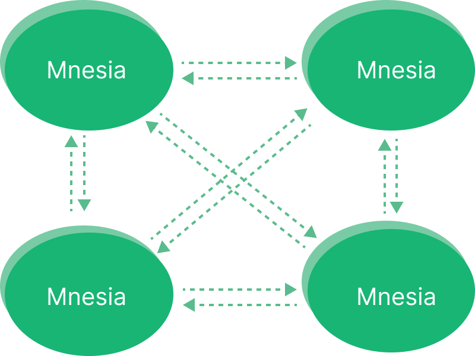

# Clustering

Besides working with a single EMQX node, EMQX also provides the cluster feature for high availability, better scalability, data security, and centralized management, which is why clustering is recommended for larger or mission-critical applications.

## Reasons for Clustering

EMQX clusters bring the users the following benefits.

1. **Scalability**: EMQX can be easily scaled horizontally by adding more nodes to the cluster, allowing it to handle an increasing number of MQTT messages and clients.
2. **High Availability**: Running in a cluster provides high availability, as the cluster can continue to function even if one or more nodes fail. EMQX uses a distributed architecture that ensures no single point of failure.
3. **Load Balancing**: EMQX nodes in the cluster can be configured to distribute the load of handling MQTT messages, which helps to avoid overload of a single node and allows for better use of available resources.
4. **Centralized Management**: EMQX can be managed centrally, as all nodes in the cluster can be monitored and controlled from a single management console. This makes it easy to manage a large number of devices and messages.
5. **Data consistency**: The cluster replicates data across all nodes in the cluster, which helps to ensure data consistency.

## How Clustering in EMQX Works

The basic function of a distributed EMQX cluster is to forward and publish messages to different subscribers. EMQX utilizes Erlang/OTP's built-in database, Mnesia, to store MQTT session states. The database replication channel is powered by the "Erlang distribution" protocol, enabling each node to function as both a client and server. 



## Key Features

EMQX clusters provide features like auto-discovery of EMQX nodes, auto cluster, network partition auto-heal, and cluster node auto-clean.

### Node Discovery and Automatic Clustering

EMQX Broker supports Autocluster based on Ekka library. Ekka is a cluster management library developed for Erlang / OTP applications. It supports Service Discovery, Autocluster, Network Partition Autoheal, and Autoclean of  Erlang node.

EMQX supports multiple node discovery strategies:

| strategy | Description                       |
| -------- | --------------------------------- |
| manual   | Creating a cluster manually       |
| static   | Autocluster of static node lists  |
| dns      | Autocluster DNS A record          |
| etcd     | Autocluster by etcd               |
| k8s      | Autocluster of Kubernetes service |

Note: mcast discovery strategy has been deprecated and will be removed in future releases.

### Network Partition Autoheal 

*EMQX* supports Network Partition Autoheal, which can be configured in `etc/emqx.conf`:

```bash
cluster.autoheal = on
```

Network Partition Autoheal Process:

1. The node performs Network Partition confirmation 3 seconds after receiving the `inconsistent_database` event from Mnesia;
2. After the node confirms that the Network Partition has occurred, it reports the message to the Leader node (the earliest start node in the cluster);
3. After the Leader node delays for a period of time, it creates a SplitView when all nodes are online;
4. The Leader node selects the self-healing Coordinator node in the majority partition;
5. The Coordinator node restarts the minority partition node to restore the cluster.

### Autoclean of Cluster Nodes 

*EMQX* supports Autoclean for cluster, which can be configured in `etc/emqx.conf` :

```bash
cluster.autoclean = 5m
```


## Further Reading 

### Distributed Erlang

Erlang / OTP was originally a programming language platform designed by Ericsson for the development of telecommunication equipment systems. Telecommunication equipment (routers, access gateways) is typically a distributed system that connects the main control board and multiple business boards through the backplane.

#### Nodes and distributed Erlang

The distributed programs of the Erlang / OTP language platform are composed of distributed interconnected Erlang runtime systems. Each Erlang runtime system is called a node. Nodes are interconnected by TCP to form a network structure.

Erlang nodes are identified by a unique node name, which consists of two parts separated by `@`:

```bash
<name>@<ip-address>
```

Communication between nodes is addressed by node name. For example, start four shell terminals locally, and then use the `-name` parameter to start four Erlang nodes respectively:

```bash
erl -name node1@127.0.0.1 -setcookie my_nodes
erl -name node2@127.0.0.1 -setcookie my_nodes
erl -name node3@127.0.0.1 -setcookie my_nodes
erl -name node4@127.0.0.1 -setcookie my_nodes
```

 `node ().` can be used to view the name of this node, and `nodes ().` can be used to view other nodes that have established a connection with the current node. We now go to the console of 'node1@127.0.0.1' and check the current node name and connected nodes:

```bash
(node1@127.0.0.1) 4> node().
'node1@127.0.0.1'

(node1@127.0.0.1) 4> nodes().
[]
```

Then we let node1 initiate connections with other nodes:

```bash
(node1@127.0.0.1) 1> net_kernel:connect_node('node2@127.0.0.1').
true
(node1@127.0.0.1) 2> net_kernel:connect_node('node3@127.0.0.1').
true
(node1@127.0.0.1) 3> net_kernel:connect_node('node4@127.0.0.1').
true
```

Now we can check other nodes that are already connected to node1:

```bash
(node1@127.0.0.1) 4> nodes().
['node2@127.0.0.1','node3@127.0.0.1','node4@127.0.0.1']
```

We can see that node2, node3, and node4 have established a distributed connection with node1, and these four nodes form a cluster. Note that whenever a new node joins the cluster, it will establish a TCP connection with all the nodes in the cluster. At this point, the four nodes have completed a mesh structure.

### EMQX Distributed Cluster Design

The basic function of EMQX Broker distribution is to forward and publish messages to subscribers on each node. To achieve this, EMQX Broker maintains several data structures related to it: subscription tables, routing tables, and topic trees.

#### Subscription Table: Topics-Subscribers

When an MQTT client subscribes to a topic, EMQX Broker maintains a **Subscription Table** for the Topic-\> Subscriber mapping. The subscription table only exists on the EMQX Broker node where the subscriber is located, for example:

```bash
node1:

    topic1 -> client1, client2
    topic2 -> client3

node2:

    topic1 -> client4
```

#### Route Table: Topic-Node

All nodes in the same cluster will **copy** a topic-to-> node mapping table, for example:

```bash
topic1 -> node1, node2
topic2 -> node3
topic3 -> node2, node4
```

#### Topic tree: topic matching with wildcards

In addition to the routing table, each node in the EMQX Broker cluster also maintains a backup of the **Topic Trie.**

The following topic-subscription relationship is an example:

| Client | Node | Subscribed topic |
| ----- | --- | ------- |
| client1 | node1 | t/+/x, t/+/y |
| client2 | node2 | t/# |
| client3 | node3 | t/+/x, t/a |

When all subscriptions are completed, EMQX Broker maintains the following Topic Trie and Route Table:


#### Data Partition and Sharing

EMQX Broker's subscription table is partitioned in the cluster, while the topic tree and routing table are replicated.

#### Message Distribution Process

When an MQTT client publishes a message, the node where it is located retrieves the route table and forwards the message to the relevant node according to the message topic, and then the relevant node retrieves the local subscription table and sends the message to the relevant subscriber.

For example, when client1 publishes a message to topic `t/a`. The routing and distribution of the message between nodes are as follows:

1. client1 publishes a message with the topic `t/a` to the node1
2. By querying the topic tree, node1 learns that `t/a` can match the two existing topics of ` t/a` and `t/#`.
3. By querying the route table, node1 learns that topic `t/a` has subscribers only on node3, and topic ` t/# `has subscribers only on node2. So node1 forwards the message to node2 and node3.
4. After node2 receives the forwarded  `t/a` message, it queries the local subscription table to obtain the subscribers who have subscribed to ` t/# ` on this node and distributes the message to them.
5. After node3 receives the forwarded  `t/a` message, it queries the local subscription table to obtain the subscribers who have subscribed to ` t/a ` on this node and distributes the message to them.
6. Message forwarding and distribution are finished.

