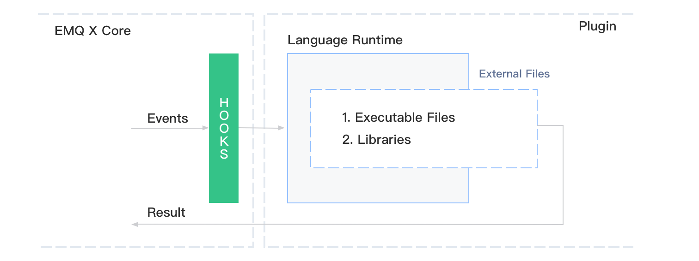

---
# 标题
title: 多语言支持
# 编写日期
date: 2020-02-21 09:28:26
# 作者 Github 名称
author: hjianbo
# 关键字
keywords:
# 描述
description:
# 分类
category: 
# 引用
ref: undefined
---


# Cross language

In the EMQ X Broker distribution, some [plugins](plugins.md) are provided for multiple language support. It allows you to extend the behavior of EMQ X Broker with other programming languages, and the architecture in the system is:



- Multiple language support appears as a plug-in, which is based on the [hook](hooks.md) feature provided by the [emqx](https://github.com/emqx/emqx) core project to  get the Events/messages of EMQ X Broker.
- For different language environments, different language support plugins are required.
- This support plugin embeds all the environments of the language runtime.
- The user only needs to write a script or library file in this language for the plugin to be called.

This is the basic logic for implementing multiple language support. When using this kind of plugin, please make sure you have some knowledge of [hooks](hooks.md) and [plugins](plugins.md) .

## Lua 
Support of Lua is achieved by [emqx_lua_hook](https://github.com/emqx/emqx-lua-hook)  which includes:

- A set of Lua runtime environment, implemented by [luerl](https://github.com/rvirding/luerl)
- Some control commands to manage the load and unload of Lua.

### Example

In the EMQ X Broker distribution, user-defined Lua script files should be placed in `data/script/`.

Take the sending content of the control message as an example, and add the file `data/script/test.lua`:

```lua
function on_message_publish(clientid, username, topic, payload, qos, retain)
    return topic, "hello", qos, retain
end

function register_hook()
    return "on_message_publish"
end
```

The script shows:

- Implemented a callback function `on_message_publish` and changed the ` payload` field of all published messages to `hello`.
- Use `register_hook` to tell ` emqx_lua_hook` the name list of callback function that need to be registered.

It is worth noting that the names, parameters, data types, and number of these callback functions are fixed and must be consistent with the examples provided.

After the script is written, you need to manually load it into the `emqx_lua_hook` plugin:

The `emqx_lua_hook` plugin is enabled at first:

```bash
./bin/emqx_ctl plugins load emqx_lua_hook
```

Load `test.lua` into ` emqx_lua_hook`:

```bash
./bin/emqx_ctl luahook load test.lua
```

When the execution succeeds, it means that the script has been successfully loaded. Otherwise, check whether the syntax of the source file is correct.

After completion, you can start two MQTT clients, one to subscribe to any topic, and the other to publish any message to the topic that you just subscribed to. It can be found that the message content received by the subscriber is `hello` which proves that the `test.lua` script has taken effect.

### Callback function

Supported callback functions and parameter type: [emqx-web-hook - README.md](https://github.com/emqx/emqx-lua-hook/tree/develop#hook-api)

Example: [examples.lua](https://github.com/emqx/emqx-lua-hook/blob/develop/examples.lua)

### Command

Load the specified Lua script:

```bash
## Script: Script file name
luahook load <Script>
```

Unload the specified Lua script:
```bash
luahook unload <Script>
```

Reload the specified Lua script:
```bash
luahook reload <Script>
```

Load the specified Lua script and set it to start with `emqx_lua_hook`:
```bash
luahook enable <Script>
```

Unload the specified Lua script and cancel it to start with `emqx_lua_hook`:
```bash
luahook disable <Script>
```

