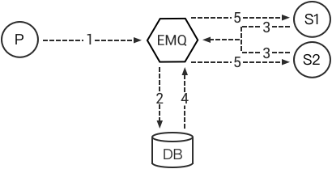

# Backends



::: tip
Data storage is an exclusive feature of EMQ X Enterprise.
:::



## MQTT Message Persistence

### One-to-one message Persistence

1. PUB publishes a message;
2. Backend records this message in DB;
3. SUB subscribes to a topic;
4. Backend retrieves the messages of this topic from DB;
5. Messages are sent to SUB;
6. Once the SUB acknowledged / received the message, backend removes
    the message from DB.

### Many-to-many message Persistence

1. PUB publishes a message;
2. Backend records the message in DB;
3. SUB1 and SUB2 subscribe to a topic;
4. Backend retrieves the messages of this topic;
5. Messages are sent to SUB1 and SUB2;
6. Backend records the read position of SUB1 and SUB2, the next
    message’s retrieval starts from this position.

### Client Connection State

EMQ X supports retaining the client's connection state in Redis or DB.

### Client Subscription by Broker

EMQ X Persistence supports subscription by broker. When a client goes
online, the persistence module loads the subscriptions of the client
from Redis or Databases.

### List of Persistence Plugins

EMQ X allowes storing messages in Redis, MySQL, PostgreSQL, MongoDB,
Cassandra, DynamoDB, InfluxDB, OpenTSDB and
Timescale:

| Persistence Plugins      | Config File                   | Description                    |
| ------------------------ | ----------------------------- | ------------------------------ |
| emqx\_backend\_redis     | emqx\_backend\_redis.conf     | Redis Message Persistence      |
| emqx\_backend\_mysql     | emqx\_backend\_mysql.conf     | MySQL Message Persistence      |
| emqx\_backend\_pgsql     | emqx\_backend\_pgsql.conf     | PostgreSQL Message Persistence |
| emqx\_backend\_mongo     | emqx\_backend\_mongo.conf     | MongoDB Message Persistence    |
| emqx\_backend\_cassa     | emqx\_backend\_cassa.conf     | Cassandra Message Persistence  |
| emqx\_backend\_dynamo    | emqx\_backend\_dynamo.conf    | DynamoDB Message Persistence   |
| emqx\_backend\_influxdb  | emqx\_backend\_influxdb.conf  | InfluxDB Message Persistence   |
| emqx\_backend\_opentsdb  | emqx\_backend\_opentsdb.conf  | OpenTSDB Message Persistence   |
| emqx\_backend\_timescale | emqx\_backend\_timescale.conf | Timescale Message Persistence  |
