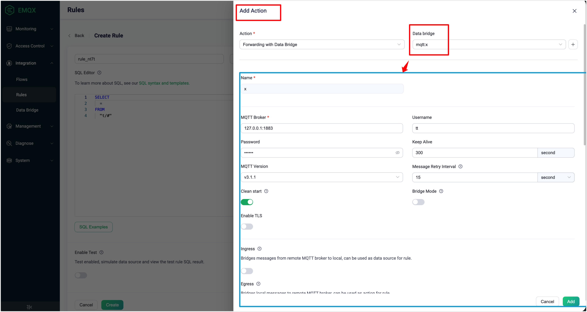
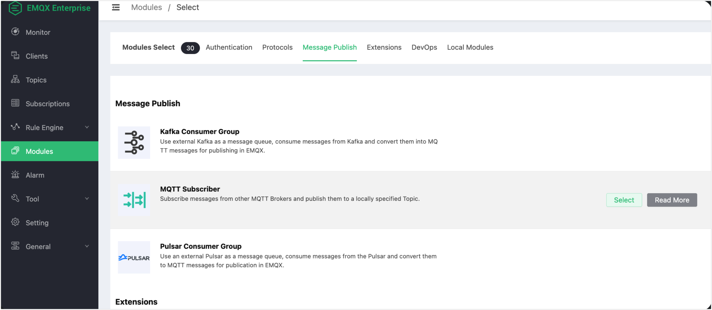
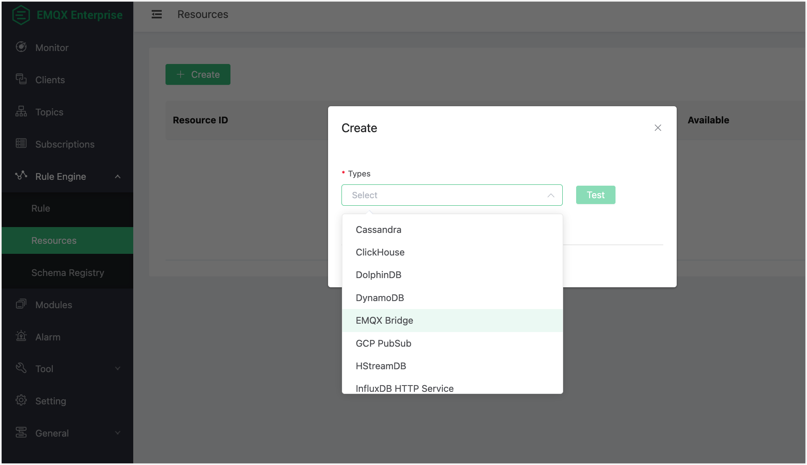

# Data Integration Incompatibility Between EMQX 5.1 and EMQX 4.4

The whole concept of Data Integration was upgraded in EMQX 5.1.

- The previous **Rule** -> **Action** -> **Resources** process is changed to **Rules** -> **Data Bridge**. 

   In EMQX 5.1, when adding an action for a certain rule, you must first create a data bridge and modify the bridge's SQL template to adapt the rule output. But in EMQX 4.4, there was a configuration entity for Action.

   Configure the Action(Bridge) for a Rule in EMQX 5.1:

   

- The **Modules** -> **Message Publish** is moved into the **Data Bridge**.

   The Message Publish Module in EMQX 4.4:

   

- [Save Offline Message](https://docs.emqx.com/en/enterprise/v4.4/rule/offline_msg_to_redis.html) features in EMQX 4.4 are removed.

- [Get Subscriptions](https://docs.emqx.com/en/enterprise/v4.4/rule/get_subs_from_redis.html) features in EMQX 4.4 are removed.

- Tablestore, DolphinDB, Lindorm, and SAP Event Mesh data bridges are not supported, but SAP Event Mesh is in the product roadmap.

- `EMQX Bridge` as a resource type is no longer supported.

  

## Common Incompatibility Changes

- All SSL-related configuration options (`ssl`, `cafile`, `keyfile`, `certfile`, `verify`) are changed to a unified structure and name. For example, `ssl.cacertfile`, `ssl.certfile`, `ssl.keyfile`, `ssl.verify`, and etc.
- There is no equivalent functionality as the feature of saving offline messages to an external database and retrieving them when a client subscribes to topics (through the `$events/session_subscribed` event and bridge rule action).

## Incompatibility in Functionality and Configuration Items

This section lists the functionality and configuration items changes for each data bridge.

### Cassandra

The configuration name `nodes` is changed to `servers`.

### Kafka Producer

- Changed configuration items: 
  - `servers` to `bootstrap_hosts`
  - `authentication_mechanism` to `authentication`
  - `sync_timeout` to `sync_query_timeout`
  - `send_buffer` to `socket_opts.sndbuf`
  - `tcp_keepalive` to `socket.tcp_keepalive`
  - `strategy` to `partition_strategy`
  - `cache_mode` to `kafka.buffer.mode`
  - Buffer mode enum `memory+disk` to `hybrid`
  - `highmem_drop` to `kafka.buffer.memory_overload_protection`
- No equivalent in EMQX 5.1
  - `query_api_versions`
  - `kafka_ext_headers`
- Nested `replayq` related options (e.g.: `max_batch_bytes`) under `kafka` key 
- Now, message key is templatable, whereas before it could be only a few option.

### Kafka Consumer

- Changed configuration items:
  - `servers` to `bootstrap_hosts`
  - `max_bytes` to `kafka.max_batch_bytes`
  - `offset_reset_policy `enum: `{reset_to_latest, reset_by_subscriber}` to `{latest, earliest}`
- There’s no `pool_size` in EMQX 5.1: the number of workers is set automatically by the lib depending on the number of partitions in the topic(s).
- In EMQX 4.4, only plain SASL was supported for authentication.  In EMQX 5.1, the same mechanisms as Kafka Producer is supported.

### Pulsar Consumer

There is no Pulsar Consumer in EMQX 5.1.0.

### Pulsar Producer

- In EMQX 5.1, the bridge only produces messages using the driver’s async API, without an option for sync API.
- Now, there is a template for the message key. Before, there are only a few options.
- Changed configuration items:
  - Buffer mode enum `memory+disk` to `hybrid`
  - `max_total_bytes` to `buffer.per_partition_limit`
  - `segment_bytes` to `buffer.segment_bytes`

### Redis

The configuration item `cmd` is changed to `command_template` (common to all 3 Redis Modes).

Changes for "Cluster" mode:

- There is no `database` field in EMQX 5.1.
- There is no equivalent for `ttl `(offline messages from EMQX 4.4) in EMQX 5.1.

### Postgres

- No differences in connector.
- The batching configuration has moved to `resource_opts.*` in the Action configuration.
  - `enable_batch = true` (EMQX 4.4) to `resource_opts.batch_size > 1` (EMQX 5.1)
  - `batch_time` is hidden and defaults to `0` in EMQX 5.1.
  - `sql ` to `prepare_statement`.

### MySQL

- `user` is changed to `username`.
- The batching configuration has moved to `resource_opts.*` in the Action configuration.
  - `enable_batch = true` (EMQX 4.4) to `resource_opts.batch_size > 1` (EMQX 5.1)
  - `batch_time` is hidden and defaults to `0` in EMQX 5.1.
  - `sql ` to `prepare_statement`.

### MQTT

- Changed configuration items:
  - `address` to `server`
  - `pool_size` to `{egress,ingress}.pool_size`
  - `reconnect_interval` to `resource_opts.health_check_interval`
- No equivalent in EMQX 5.1:
  - `append`
  - `mountpoint`
- `disk_cache = on` (in EMQX 4.4) can be considered somewhat equivalent to setting `resource_opts.buffer_mode =  volatile_offload`, but the latter is a hidden configuration option that defaults to `memory_only`.
- There is no RPC MQTT bridge equivalent in EMQX 5.1.
- Changed configuration items in Actions:
  - `forward_topic` to `egress.remote.topic`
  - `payload_tmpl` to `payload`

### InfluxDB

The following changes are common to both API v1 and API v2.

- Changed bridge configuration items:
  - `host` and `port` are changed to `server`.
  - `https_enabled` and ssl options like `tls_version` are changed to `ssl`.

- Changed configurations in Actions:
  - There is no equivalent for `int_suffix` in EMQX 5.1; the type is directly specified in `write_syntax`.
  - `measurement`, `timestamp`, `fields`, `tags` are changed to `write_syntax`.

### Tablestore, DolphinDB, Lindorm, SAP Event Mesh

There are no equivalent data bridges in EMQX 5.1.

### Clickhouse

Changed configuration items:
- `server` to `url`
- `user` to `username`
- `key` to `password`

### Dynamo

- No equivalent for `region` in EMQX 5.1.
- Now there is `payload_template`.

### HStreamDB

- The configuration item `server` is changed to `url`.
- The following items have no equivalents in EMQX 5.1:
  - `grpc_timeout`
  - `partition_key`
  - `grpc_flush_timeout`

### IoTDB

Changed configuration items:
- `host`, `rest_port` to `base_url`
- `request_timeout` to `resource_opts.request_ttl`

### MongoDB

Changed configuration items:
- `login` to `username`
- `connectTimeoutMS` to `connect_timeout_ms`
- `rs_set_name` to `replica_set_name`
- `payload_tmpl` to `payload_template`

### OpenTSDB

`sync` is changed to `resource_opts.query_mode = sync`.

### Oracle

`user` is changed to `username`.

## SQLServer

No incompatibilities were found.

### TDengine

Changed configuration items:
- `host`, `port` to `server`
- `dbname` to `database`

### GCP PubSub Producer

Deprecated configuration items:
- `flush_mode`
- `flush_period_ms`

### RabbitMQ Producer

- Changed configuration items:
  - `server` to `host` and `port`
  - `payload_tmpl` to `payload_template`
  - `durable`  to `delivery_mode`
- `exchange_type` has no equivalent in EMQX 5.1.

### RocketMQ

- The following configuration items have no equivalents in EMQX 5.1:
  - `namespace`
  - `strategy`
  - `key`
- Changed configuration items:
  - `type` to `resource_opts.query_mode`
  - `payload_tmpl` to `payload_template`