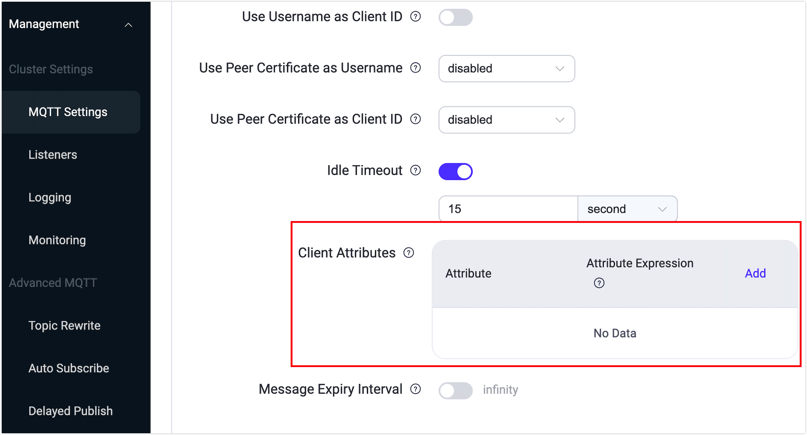

# MQTT Client Attributes

Client attributes in EMQX provide a mechanism that allows developers to define and set additional attributes for MQTT clients based on the requirements of different application scenarios. These attributes are integral to enhancing authentication, authorization, data integration, and MQTT extension functionalities within EMQX, thereby facilitating flexible development. By leveraging client metadata, this feature also supports flexible templating for MQTT client identification, which is essential for personalized client configurations and streamlined authentication processes, enhancing the adaptability and efficiency of development efforts.

## Workflow

The process of setting, storing, and using client attributes is as follows:

**1. Set Client Attributes**

When a client successfully connects to EMQX, EMQX triggers connection and authentication events, and during this process, [client attributes are set](#set-client-attributes) based on predefined configurations.

**2. Store and Destroy Client Attributes**

Once set, the attributes are stored as key-value pairs in the `client_attrs` field of the client session. When the client session ends, these attributes are deleted.

For persistent sessions, when a client takes over, it will replace and overwrite the client attributes in the session. Besides this, there is no way to modify or delete client attributes.

**3. Use Client Attributes**

Other functionalities of EMQX allow the use of the `${client_attrs.NAME}` placeholder in related configuration items, dynamically extracting attribute values to be used as part of their configuration or data.

## Set Client Attributes

When a client successfully connects to EMQX, EMQX triggers connection and authentication events and sets client attributes based on predefined configurations. Currently, the following 2 methods are supported:

- Extracting from client metadata
- Setting during the client authentication process

### Extract from Client Metadata

Through preset configurations, substrings are extracted and processed from client connection metadata such as usernames and client IDs and set as client attributes. This extraction happens before the authentication process, ensuring that the attributes are ready to be used in subsequent steps, such as used in the HTTP request body template or SQL template for composing authentication and authorization requests. 

You can configure the client attribute functionality via the configuration file or Dashboard. To configure the attribute extraction via the Dashboard, click **Management** -> **MQTT Settings**. At **Client Attributes**, click **Add** to add the attribute name and attribute expression.



Where, 

- **Attribute** is the name of the attribute. 
- **Attribute Expression** is the configuration for extracting the attribute.

The attribute expression upports using [Variform expressions](../configuration/configuration.md#variform-expressions) and [predefined functions](../configuration/configuration.md#pre-defined-functions) to dynamically process values. For example:

- To extract the prefix of a client ID delimited by a dot: `nth(1, tokens(clientid, '.'))`
- To truncate part of the username: `substr(username, 0, 5)`

The corresponding configuration file is as follows:

```bash
mqtt {
    client_attrs_init = [
        {
            expression = "nth(1, tokens(clientid, '.'))"
            set_as_attr = clientid_prefix
        },
        {
            expression = "substr(username, 0, 5)"
            set_as_attr = sub_username
        }
    ]
}
```

The attribute expression supports the configuration of the following values:

- `clientid`: Client ID

- `username`: Username

- `cn`: CN field of the TLS certificate

- `dn`: DN field of the TLS certificate

- `user_property.*`: Extracts attribute values from User-Property in the MQTT CONNECT packet, e.g., `user_property.foo`

- `zone`: The zone name inherited from MQTT listener

For detailed information about the client attributes configurations, see [EMQX Open Source Configuration Manual](https://docs.emqx.com/en/emqx/v@CE_VERSION@/hocon/) and [EMQX Enterprise Configuration Manual](https://docs.emqx.com/en/enterprise/v@EE_VERSION@/hocon/).

### Set During the Client Authentication Process

During the client authentication process, client attributes can be set based on information returned by the authenticator, currently supported:

- [JWT Authentication](../access-control/authn/jwt.md): Set client attributes in the `client_attrs` field in the Token payload when issuing a Token.
- [HTTP Authentication](../access-control/authn/http.md): Set client attributes in the `client_attrs` field in the successful HTTP response.

The key and value of the attributes must be string. This method allows for dynamic setting of attributes based on the results of authentication, adding flexibility in use.

### Merge Authentication Data

When setting client attributes through both methods or using multiple authenticators, EMQX merges the attributes based on the attribute names and the order of settings:

- Attributes extracted from client metadata are overwritten by attributes set by the authenticators.
- When multiple authenticators set attributes in the authentication chain, later set attributes overwrite earlier ones.

## Application of Client Attributes

In other EMQX functionalities, client attributes can be extracted using the `${client_attrs.NAME}` placeholder and used as part of the configuration or data. Currently, it is only supported for client authentication and authorization, with more features to be opened in the future.

### Client Authentication

Use [authentication placeholders](../access-control/authn/authn.md#authentication-placeholders) for SQL statements, query commands, or HTTP request bodies as dynamic parameters, for example:

```sql
# MySQL/PostgreSQL - Authentication query SQL
SELECT password_hash, salt, is_superuser FROM mqtt_user WHERE sn = ${client_attrs.sn} LIMIT 1

# HTTP - Authentication request Body
{ 
 "sn": "${client_attrs.sn}",
 "password": "${password}"
}
```

For specific usage, refer to the documentation for each authenticator.

::: tip

Client authentication can only use attributes set from client metadata.

:::

### Client Authorization

Use [data query placeholders](../access-control/authz/authz.md#placeholders-in-data-queries) and [topic placeholders](../access-control/authz/authz.md#topic-placeholders) for SQL statements, query commands, and topics.

#### Example Scenario:

Client attributes such as `role`, `productId`, `deviceId` are set for each client. These attributes are used for authorization checks:

- **role**: Used to restrict client access rights, only allowing clients with the `admin` role to subscribe and publish management messages, such as topics matching `admin/#`.
- **productId**: Used to restrict clients to only subscribe to OTA messages applicable to the current product, like `OTA/{productId}`.
- **deviceId**: Used to restrict clients to only publish and subscribe to messages on topics belonging to themselves:
  - Publish: `up/{productId}/{deviceId}`
  - Subscribe: `down/{productId}/{deviceId}`

Use [Authorization - Built-in Database](../access-control/authz/mnesia.md) to configure the following rules to implement:

| Permission | Operation           | Topic                                                     |
| ---------- | ------------------- | --------------------------------------------------------- |
| Allow      | Subscribe & Publish | `${client_attrs.role}/#`                                  |
| Allow      | Subscribe           | `OTA/${client_attrs.productId}`                           |
| Allow      | Publish             | `up/${client_attrs.productId}/${client_attrs.deviceId}`   |
| Allow      | Subscribe           | `down/${client_attrs.productId}/${client_attrs.deviceId}` |

Compared to directly using static properties like client ID, this approach more flexibly manages client authorization. This flexibility allows for granular control of client access rights based on different roles, products, and devices.
