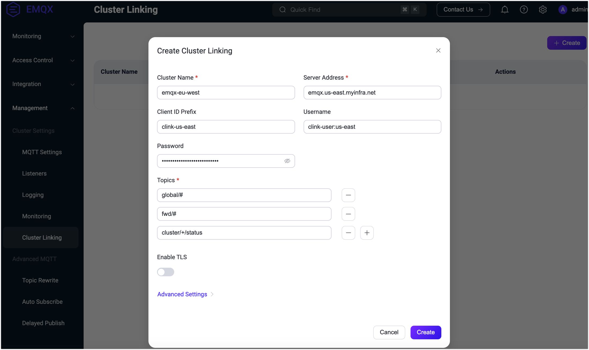

# Configure Cluster Linking

This page provides guidelines for configuring and managing the Cluster Linking feature through the EMQX Dashboard, configuration file, and REST API.

## Configure and Manage Cluster Linking via Dashboard

Go to the EMQX Dashboard and click **Management** -> **Cluster Linking** from the left menu. On the **Cluster Linking** page, click **Create** at the upper right corner to start creating cluster linking.



On the pop-up dialog, fill in the following fields:

- **Cluster Name**: Enter the name of the remote cluster.
- **Server Address**: Provide the MQTT listener endpoint of the remote cluster.
- **Client ID Prefix**: Define a prefix for ClientIDs used by MQTT connections to the remote cluster. For more information, see [Configure MQTT Connections](#configure-mqtt-connections).
- **Username**: Username for authentication to the remote cluster, if required.
- **Password**: Password for authentication to the remote cluster, if required.
- **Topics**: List of MQTT topic filters that specify which messages the local cluster will receive from the remote cluster. For more information, see [Configure Topics](#configure-topics).
- **Enable TLS**: Enable this option if communication between clusters requires TLS encryption. Configure the settings such as SSL certificates.
- **Advanced Settings**: Configure additional settings such as MQTT protocol parameters.

Click **Create** after you complete the setting. 

On the Cluster Linking page, the new entry will appear and be enabled by default. The cluster linking list displays the details, such as cluster name, server address, topics, and enable status. You can modify the settings or delete an entry by clicking the **Settings** or **Delete** buttons in the **Actions** column.

Clicking the cluster name takes you to the **Overview** tab, where you can monitor message transmission statistics and the execution status of the cluster linking.  To permanently remove the cluster linking entry, click the delete icon at the upper right corner of the page. Alternatively, you can temporarily disable the cluster linking by toggling the switch, which will retain your configuration for future use.

## Configure Cluster Linking via Configuration File

You can set up one or more links between clusters by populating the `cluster.links` list in the EMQX configuration. Each link must have a unique remote cluster name and can be enabled or disabled individually.

Maintaining consistent cluster names across each link is important to ensure proper functionality. In the example below, the remote cluster name should be `emqx-eu-west` in its corresponding configuration file.

```bash
cluster {
  name = "emqx-us-east"
  links = [
    {
      name = "emqx-eu-west"
      server = "emqx.us-east.myinfra.net"
      username = "clink-user:us-east"
      password = "clink-password-no-one-knows"
      clientid = "clink-us-east"
      topics = ["global/#", "fwd/#", "cluster/+/status", ...]
      ssl {
        enable = true
        verify = verify_peer
        certfile = "etc/certs/client/emqx-us-east.pem"
        ...
      }
    }
    ...
  ]
}
```

Ensure that the remote `emqx-eu-west` cluster has a similarly configured link to `emqx-us-east` in its configuration file for the link to function properly.

### Enable and Disable Links

A configured link is enabled by default. You can disable it by setting the `enable` parameter to `false`.

Disabling a link will prevent EMQX from communicating with the remote cluster. However, this action does not automatically stop the remote cluster from communicating with this cluster, which can result in warnings and raised alarms on the remote cluster's side. To avoid these issues, always ensure that the link is disabled on both sides.

### Configure Topics

The `topics` parameter is a list of MQTT topic filters that specify which topics the local cluster is interested in. The local cluster expects to receive messages published to these topics from the remote cluster. This list can be empty, meaning the local cluster will not receive any messages from the remote cluster if no topics are specified.

### Configure MQTT Connections

Cluster Linking uses standard MQTT as the underlying protocol, requiring you to specify the remote cluster's MQTT listener endpoint as `server`. 

Depending on the cluster size and configuration, multiple MQTT client connections may be established to the remote cluster, and each client must have a unique ClientID. You can control how these ClientIDs are allocated by setting the `clientid` parameter, which serves as a *ClientID prefix* for these connections. 

Other MQTT protocol aspects, such as authentication and authorization parameters (`username`, `password`), are also configurable. The remote cluster must be able to [authenticate](../access-control/authn/authn.md) these connections and [authorize](../access-control/authz/authz.md) them to publish messages to the specific MQTT topics designated for inter-cluster communication by the Cluster Linking setup. For example, with the configuration above, the remote cluster can have the following [ACL rule](../access-control/authz/file.md) to function correctly:

```erlang
%% Allow Cluster Linking MQTT clients to operate with "$LINK/#" topics
{allow, {clientid, {re, "^clink-us-east"}}, all, ["$LINK/#"]}.
...
```

This rule allows MQTT clients with ClientIDs that match the regex pattern `^clink-us-east` to publish and subscribe to any topic that starts with `$LINK/`. The `$LINK/` is the control topic prefix used for Cluster Linking-related messages. This ensures that the subscribing entity receives all relevant messages under the `$LINK/` namespace, which are necessary for maintaining and managing the cluster link.

Cluster Linking supports [TLS connections](../network/overview.md). If you plan to have clusters communicate over the public internet, or any other untrusted network in general, TLS is a must. EMQX also supports mutual TLS authentication, ensuring that communication is secure, confidential, and trusted.

## Manage Cluster Linking via REST API

Cluster Linking in EMQX includes a REST API for managing links between clusters, allowing you to perform configuration tasks and monitor link statuses. The API provides both basic and advanced operations, ensuring flexibility for different management needs.

### Basic REST API Operations

For simpler use cases, EMQX supports basic REST API operations using the following endpoints:

- **Configure a Cluster Link**:
  - **Endpoint**: `PUT /cluster/links`
  - **Function**: This operation allows you to update or create a new cluster link by providing the necessary configuration parameters in a single request. It is suitable for straightforward, hot configuration scenarios.
- **Retrieve Cluster Link Information**:
  - **Endpoint**: `GET /cluster/links`
  - **Function**: This operation returns the current configuration and status of all existing cluster links. It is a quick way to verify and review the active links between clusters.

### Advanced CRUD API Operations

For more granular control over Cluster Linking, the following CRUD (Create, Read, Update, Delete) operations are available:

| **Operation**                        | **Endpoint**                   | **Function**                                                 |
| ------------------------------------ | ------------------------------ | ------------------------------------------------------------ |
| **Create a Cluster Link**            | `POST /cluster/links`          | Establishes a new link between clusters, providing the initial configuration. |
| **Retrieve a Specific Cluster Link** | `GET /cluster/links/{name}`    | Retrieves detailed information about a specific cluster link identified by its name. |
| **Update a Cluster Link**            | `PUT /cluster/links/{name}`    | Modifies the settings of an existing cluster link, allowing you to update configuration details such as topics, server addresses, or authentication credentials. |
| **Delete a Cluster Link**            | `DELETE /cluster/links/{name}` | Removes a cluster link, terminating the connection between the specified clusters. |

### Monitor Cluster Link Status and Metrics

In addition to configuration tasks, the API provides endpoints for monitoring the status and performance of cluster links:

**Retrieve Cluster Link Status**:

- **Endpoint**: `GET /cluster/links` or `GET /cluster/links/{name}`

- **Function**: These endpoints return the status of all cluster links or a specific link. The response includes the overall status (`running`, `stopped`, etc.) and detailed node status information.

- **Response sample**:

  ```json
  {
    ...
    "server": "broker.emqx.io:1883",
    "topics": ["t/#"],
    "status": "running",
    "node_status": [
      {"node": "emqx@127.0.0.1", "status": "running"}
    ]
  }
  ```

**Retrieve Cluster Link Metrics**:

- **Endpoint**: `GET /cluster/links/{name}/metrics`

- **Description**: Provides metrics related to the cluster link, such as the number of active routes (gauge type), which can help you assess the link's current load and performance.

- **Response sample**:

  ```json
  {
    "metrics": {"routers": 10240},
    "node_metrics": [{}]
  }
  ```
