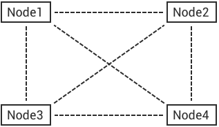

# Clustering 

## Distributed Erlang/OTP 

Erlang/OTP is a concurrent, fault-tolerant, distributed programming platform. A distributed Erlang/OTP system consists of a number of Erlang runtime systems called 'node'. Nodes connect to each other with TCP/IP sockets and communicate by Message Passing. 

### Node 

An erlang runtime system called 'node' is identified by a unique name like email address. Erlang nodes communicate with each other by the name. 

Suppose we start four Erlang nodes on localhost: 
    
    
    erl -name node1@127.0.0.1
    erl -name node2@127.0.0.1
    erl -name node3@127.0.0.1
    erl -name node4@127.0.0.1

connect all the nodes: 
    
    
    (node1@127.0.0.1)1> net_kernel:connect_node('node2@127.0.0.1').
    true
    (node1@127.0.0.1)2> net_kernel:connect_node('node3@127.0.0.1').
    true
    (node1@127.0.0.1)3> net_kernel:connect_node('node4@127.0.0.1').
    true
    (node1@127.0.0.1)4> nodes().
    ['node2@127.0.0.1','node3@127.0.0.1','node4@127.0.0.1']

### epmd 

epmd(Erlang Port Mapper Daemon) is a daemon service that is responsible for mapping node names to machine addresses(TCP sockets). The daemon is started automatically on every host where an Erlang node started. 
    
    
    (node1@127.0.0.1)6> net_adm:names().
    {ok,[{"node1",62740},
         {"node2",62746},
         {"node3",62877},
         {"node4",62895}]}

### Cookie 

Erlang nodes authenticate each other by a magic cookie when communicating. The cookie could be configured by: 
    
    
    1. $HOME/.erlang.cookie
    
    2. erl -setcookie \<Cookie>

::: tip Tip
Content of this chapter is from: [ http://erlang.org/doc/reference_manual/distributed.html ](http://erlang.org/doc/reference_manual/distributed.html)
:::

### Distribution Protocol 

Erlang nodes can be connected via different distributed protocols including TCPv4, TCPv6 and TLS. 
    
    
    ## Specify the erlang distributed protocol.
    ##
    ## Value: Enum
    ##  - inet_tcp: the default; handles TCP streams with IPv4 addressing.
    ##  - inet6_tcp: handles TCP with IPv6 addressing.
    ##  - inet_tls: using TLS for Erlang Distribution.
    ##
    ## vm.args: -proto_dist inet_tcp
    node.proto_dist = inet_tcp
    
    ## Specify SSL Options in the file if using SSL for Erlang Distribution.
    ##
    ## Value: File
    ##
    ## vm.args: -ssl_dist_optfile \<File>
    ## node.ssl_dist_optfile = {{ platform_etc_dir }}/ssl_dist.conf

## Cluster Design 

The cluster architecture of *EMQ X* broker is based on distributed Erlang/OTP and Mnesia database. 

The cluster design could be summarized by the following two rules: 

  1. When a MQTT client SUBSCRIBE a Topic on a node, the node will tell all the other nodes in the cluster: I have a client subscribed to a Topic. 
  2. When a MQTT Client PUBLISH a message to a node, the node will lookup the Topic table and forward the message to nodes that subscribed to the Topic. 

Finally there will be a global route table(Topic -> Node) that is replicated to all nodes in the cluster: 
    
    
    topic1 -> node1, node2
    topic2 -> node3
    topic3 -> node2, node4

### Topic Trie and Route Table 

Every node in the cluster will store a topic trie and route table in mnesia database. 

Suppose that we create following subscriptions: 

Client  |  Node  |  Topics       
--------|--------|---------------
client1 |  node1 |  t/+/x, t/+/y 
client2 |  node2 |  t/#          
client3 |  node3 |  t/+/x, t/a   

The topic trie and route table in the cluster will be: 

### Message Route and Deliver 

The brokers in the cluster route messages by topic trie and route table, deliver messages to MQTT clients by subscriptions. Subscriptions are mapping from topic to subscribers, are stored only in the local node, will not be replicated to other nodes. 

Suppose client1 PUBLISH a message to the topic 't/a', the message Route and Deliver process: 
    
    
    title: Message Route and Deliver
    
    client1 -> node1: Publish[t/a]
        node1 --> node2: Route[t/#]
            node2 --> client2: Deliver[t/#]
        node1 --> node3: Route[t/a]
            node3 --> client3: Deliver[t/a]

## Cluster Setup 

Suppose we deploy two nodes cluster on s1.emqx.io, s2.emqx.io: 

Node                                 |  Host(FQDN) | IP and Port                                         
-------------------------------------|-------------|--------------------
emqx@s1.emqx.io or emqx@192.168.0.10 |  s1.emqx.io |  192.168.0.10:1883 
emqx@s2.emqx.io or emqx@192.168.0.20 |  s2.emqx.io |  192.168.0.20:1883 

::: tip Tip
The node name is Name@Host , where Host is IP address or the fully qualified host name.
::: 

### emqx@s1.emqx.io config 

etc/emqx.conf: 
    
    
    node.name = emqx@s1.emqx.io
    
    or
    
    node.name = emqx@192.168.0.10

::: warning Warning
The name cannot be changed after node joined the cluster. 
:::

### emqx@s2.emqx.io config 

etc/emqx.conf: 
    
    
    node.name = emqx@s2.emqx.io
    
    or
    
    node.name = emqx@192.168.0.20

### Join the cluster 

Start the two broker nodes, and 'cluster join ' on emqx@s2.emqx.io : 
    
    
    $ ./bin/emqx_ctl cluster join emqx@s1.emqx.io
    
    Join the cluster successfully.
    Cluster status: [{running_nodes,['emqx@s1.emqx.io','emqx@s2.emqx.io']}]

Or 'cluster join' on emqx@s1.emqx.io : 
    
    
    $ ./bin/emqx_ctl cluster join emqx@s2.emqx.io
    
    Join the cluster successfully.
    Cluster status: [{running_nodes,['emqx@s1.emqx.io','emqx@s2.emqx.io']}]

Query the cluster status: 
    
    
    $ ./bin/emqx_ctl cluster status
    
    Cluster status: [{running_nodes,['emqx@s1.emqx.io','emqx@s2.emqx.io']}]

### Leave the cluster 

Two ways to leave the cluster: 

  1. leave: this node leaves the cluster 
  2. remove: remove other nodes from the cluster 

emqx@s2.emqx.io node tries to leave the cluster: 
    
    
    $ ./bin/emqx_ctl cluster leave

Or remove emqx@s2.emqx.io node from the cluster on emqx@s1.emqx.io : 
    
    
    $ ./bin/emqx_ctl cluster remove emqx@s2.emqx.io

## Node Discovery and Autocluster 

*EMQ X* 3.0 supports node discovery and autocluster with various strategies: 

Strategy |  Description                     
---------|----------------------------------
static   |  Autocluster by static node list 
mcast    |  Autocluster by UDP Multicast    
dns      |  Autocluster by DNS A Record     
etcd     |  Autocluster using etcd          
k8s      |  Autocluster on Kubernetes       

### Autocluster by static node list 
    
    
    cluster.discovery = static
    
    ##--------------------------------------------------------------------
    ## Cluster with static node list
    
    cluster.static.seeds = emq1@127.0.0.1,ekka2@127.0.0.1

### Autocluster by IP Multicast 
    
    
    cluster.discovery = mcast
    
    ##--------------------------------------------------------------------
    ## Cluster with multicast
    
    cluster.mcast.addr = 239.192.0.1
    
    cluster.mcast.ports = 4369,4370
    
    cluster.mcast.iface = 0.0.0.0
    
    cluster.mcast.ttl = 255
    
    cluster.mcast.loop = on

### Autocluster by DNS A Record 
    
    
    cluster.discovery = dns
    
    ##--------------------------------------------------------------------
    ## Cluster with DNS
    
    cluster.dns.name = localhost
    
    cluster.dns.app  = ekka

### Autocluster using etcd 
    
    
    cluster.discovery = etcd
    
    ##--------------------------------------------------------------------
    ## Cluster with Etcd
    
    cluster.etcd.server = http://127.0.0.1:2379
    
    cluster.etcd.prefix = emqcl
    
    cluster.etcd.node_ttl = 1m

### Autocluster on Kubernetes 
    
    
    cluster.discovery = k8s
    
    ##--------------------------------------------------------------------
    ## Cluster with k8s
    
    cluster.k8s.apiserver = http://10.110.111.204:8080
    
    cluster.k8s.service_name = ekka
    
    ## Address Type: ip | dns
    cluster.k8s.address_type = ip
    
    ## The Erlang application name
    cluster.k8s.app_name = ekka

## Network Partition and Autoheal 

Enable autoheal of Network Partition: 
    
    
    cluster.autoheal = on

When network partition occurs, the following steps are performed to heal the cluster if autoheal is enabled: 

  1. Node reports the partitions to a leader node which has the oldest guid. 
  2. Leader node create a global netsplit view and choose one node in the majority as coordinator. 
  3. Leader node requests the coordinator to autoheal the network partition. 
  4. Coordinator node reboots all the nodes in the minority side. 

## Node down and Autoclean 

A down node will be removed from the cluster if autoclean is enabled: 
    
    
    cluster.autoclean = 5m

## Session across Nodes 

The persistent MQTT sessions (clean session = false) are across nodes in the cluster. 

If a persistent MQTT client connected to node1 first, then disconnected and connects to node2, the MQTT connection and session will be located on different nodes: 

## The Firewall 

If the nodes need to go through a Firewall, TCP port  4369  must be allowed for  epmd  , as well as a sequential range of TCP ports for communication between the distributed nodes. 

That range of ports for erlang distribution is configured in  etc/emqx.conf  , defaults to `6369-7369`: 
    
    
    ## Distributed node port range
    node.dist_listen_min = 6369
    node.dist_listen_max = 7369
    ...

So by default, make sure TCP ports  4369  and  6369-7369  are allowed by your Firewall roles. 

## Consistent Hash and DHT 

Consistent Hash and DHT are popular in the design of NoSQL databases. Cluster of *EMQ X* broker could support 10 million size of global routing table now. We could use the Consistent Hash or DHT to partition the routing table, and evolve the cluster to larger size. 
